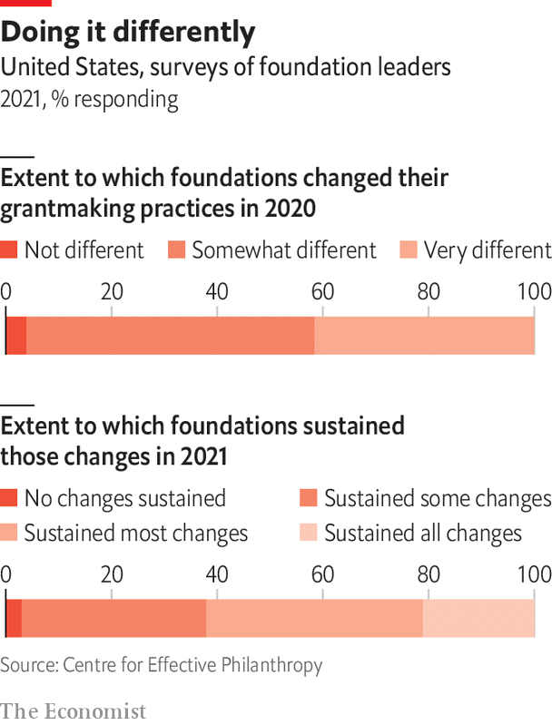
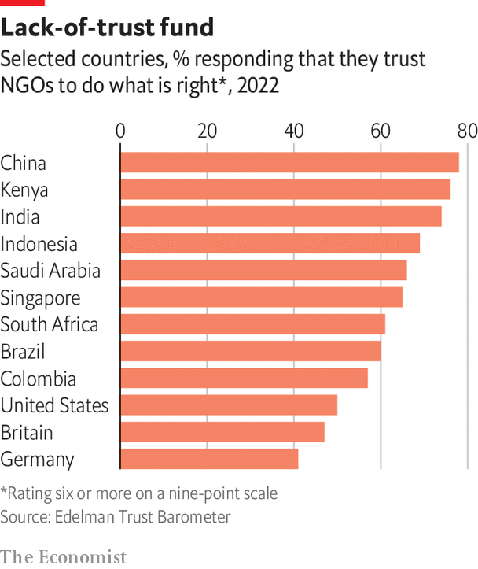

###### Power to the people

# No-strings philanthropy is giving charities more decision-making power 

##### Organisations on the ground know best how money should be spent 

 

> Jan 10th 2024 

Yukabeth Kidenda, chief executive of Teach for Kenya, a non-profit group that trains bright young graduates to teach in low-income schools, has seen her fair share of controlling philanthropists. One donor asked for a hard copy of the name, identity document and signature of each of the 750 teachers trained that year. To Ms Kidenda it is a reflection of a general suspicion among donors, who worry their funds will be misspent or stolen. 

Recently, Ms Kidenda has seen a few philanthropists experimenting with the very different no-strings approach. The Segal Family Foundation (sff), a big American donor focused on east Africa, has contributed unrestricted funds to Teach for Kenya and attempted to reduce the administrative burden on the charity. It asks Ms Kidenda to fill out a short form online every year with straightforward data, like the number of teachers trained. That, she believes, is a much better way to do philanthropy. “If you want to give, give,” she says. “Don’t give and then act like you feel bad about it or mistrust.”

For generations, philanthropy has been characterised by mistrust of the charity sector and a general attitude of paternalism. Non-profit organisations have had to write lengthy applications for grants. Those lucky enough to get funding have received money ring-fenced for specific projects. An onerous process of monitoring and evaluation has followed, which has meant recipients spending a lot of time and money assembling impact assessments and budgets, all in the specific format that each donor prescribes. 

This top-down approach has sometimes caused problems for the charity sector. It can result in a pattern known in the industry as the “non-profit starvation cycle”. The cycle begins with funders who have unrealistic expectations of how much it costs to run an ngo. Under pressure to keep costs low, non-profit bosses cut back on operational costs, like hiring staff, training them, setting up data-collection systems and investing in it. As a result of scrimping and saving, the budgets and impact assessments that ngos send to donors are patchy at best, misleading at worst, and the cycle continues. 

 


No-strings giving is still not yet as widespread in poorer countries such as Kenya as it is in America. In a survey of American foundation leaders in 2021 by the Centre for Effective Philanthropy (cep), a research organisation, almost every respondent said they had changed the way they work during the pandemic (see chart). More than three-quarters reported changing their application processes to reduce the burden on recipients. The same share said they had made the reporting process less cumbersome. Over 60% were providing more money in the form of unrestricted grants.

In part, no-strings giving is about making fundraising less time-consuming and less painful for recipients. Some big foundations are now running two-tier application processes, whereby non-profit organisations submit a short proposal and only those that make the cut fill in a full application. That saves groups from wasting time on unsuccessful bids. The Skoll Foundation, started by Jeff Skoll, formerly boss of eBay, is still asking recipients for progress reports but no longer prescribes what goes in them. “It’s all stuff the non-profit community has been begging for, for decades,” says Fred Blackwell, head of the San Francisco Foundation, a big funder.

By making unrestricted gifts, no-strings donors are handing non-profit organisations the power to decide for themselves how funds are best spent. Jennifer Steele is head of Meals on Wheels San Francisco, a charity that received money from both MacKenzie Scott and Jack Dorsey in 2020. “I can’t tell you how freeing it was,” she says, “to feel trusted and to feel respected.”


To understand what they do with the money, consider Ms Scott’s big gifts. In 2022 the cep (which itself received $10m from her) surveyed over 270 groups that received Ms Scott’s money. It was clear these organisations had been suffering from what cep analysts call a “scarcity mindset” and desperately needed to invest in their own organisations. 

Some 90% of respondents said they were using or planning to use some of the money to improve financial stability by, for instance, paying for fundraising activities or building up financial reserves. Over 70% said they would spend on hiring and almost 60% on it infrastructure.

It is no bad thing that recipients are spending more on overheads. In the past, many philanthropists have been willing to pay for a charity to roll out projects, such as building a new school or handing out food. But few have been willing to fund the staff who plan those projects, their training or their laptops. Academic research has shown that groups that spend more on overheads often deliver better results. Plus, as Nancy Lindborg, chief executive of the David and Lucile Packard Foundation, says, unrestricted grants allow non-profit organisations with experience on the ground to craft projects where they see need, rather than simply rolling out projects that donors dream up. “Sometimes they have had to contort themselves to meet donor objectives,” Ms Lindborg adds.

There is reason to worry, however, about large sums of money landing in a charity’s bank account with little warning. An article in the  entitled “Riding the Wave of Abundance” identifies two big risks. The first is “performance failure”, where an organisation does not “put the additional funds to good use, account for them, stay responsive to funders and beneficiaries”. The second is “sustainability”, where a recipient flounders as soon as the additional funding runs out. New staff need to be paid every month. High-end tech needs maintenance. 

A lot of that, according to Degan Ali of Adeso, a humanitarian group based in Kenya, comes down to proper planning by charity bosses. When Adeso received $5m from Ms Scott in 2021, a huge sum for a group with an annual budget of $2m at the time, Ms Ali set about building an endowment by investing in apartments around Nairobi, the Kenyan capital, and land in Somalia. (So far, fortunately, both have appreciated in value.) Of groups that are caught off guard when a one-off gift runs out, she says, “I guess they have never been hungry.”

On the donors’ end, the initial reaction among old-school givers to handing over large sums of money with few conditions or checks can be alarm. Unrestricted gifts can lead to scarce funding being misspent. Done well, however, a no-strings approach to giving does not mean “spray and pray”. “Trust-based philanthropy starts with doing your due diligence on an organisation,” says Nicole Taylor, head of the Silicon Valley Community Foundation. “You understand what they are doing, who they are supporting, and the impact they make. If that resonates, then you fund them.” 

 


Ms Scott’s giving during the pandemic, for example, was carefully considered. She hired the Bridgespan Group, a non-profit consulting firm spun out of Bain &amp; Company, to help her develop a strategy and do due diligence on ngos working on the topics she cares about, such as race relations and women’s empowerment. It was like contracting the work done by foundation staff to experienced outsiders. 

For her next round, Ms Scott is working with Lever for Change, a group that is helping to run an open call to find 250 “community-led, community-focused” organisations in America and hand them $1m each. By taking applications rather than selecting recipients, the process is open to smaller, less well-known groups. 

According to the cep survey, 44% of non-profit leaders who received funding from Ms Scott were interviewed in advance and 28% were asked for financial reports. Though that may not sound like a high percentage, there are lots of ways to check up on charities today. Recipients of Ms Scott’s funds have mostly been well-known groups that other big donors had checked, funded and received reports from for years. Besides, as Heather Grady of Rockefeller Philanthropy Advisors points out, many big charities publish annual strategy documents and budgets online, so donors don’t need to bother them for personalised reports. “Trust-based giving,” she says, “is something that tends to come in more with organisations that already have a track record.”

That might be the real flaw in no-strings giving. If it is based upon trusting the recipient, lesser-known groups may lose out. Teach for Kenya and Adeso are rare examples of organisations based in poorer countries that have received big no-strings grants. It helps that both groups are led by women who speak good English, know how the cogs of Western philanthropy turn and how to work a room. 

Adeso had received funding from the Gates Foundation and the Ford Foundation before Ms Scott came knocking. Ms Kidenda worries that organisations based in the developing world are often the least trusted, simply because they are far away and unknown. “Almost every process is made more difficult for us,” she adds. 

Think global, act local

If “trust-based” giving is a buzzword among donors, there is another word, too: “localisation”. Big-ticket donors have long made large grants to international organisations they know well, relying on them to re-grant money to smaller groups doing good work on the ground. The problem with that strategy is twofold. First, it is expensive. Middle-men take a cut of the funding. Hiring staff and paying for offices in the rich world means international non-profit groups are expensive contractors, too. 

Second, it does not do much in the way of capacity building. In many poorer countries, like India or Kenya, there is now a vibrant civil society. And non-profit organisations on the ground want to work directly with big Western donors, to figure out their processes and build expertise in areas such as finance and compliance, so they can win grants directly.

Now, as part of a broader effort to get closer to the problems they want to fix, donors are trying to hand money directly to local groups. By the cep’s estimates, 43% of those Ms Scott has funded describe their geographic scale as local, and 35% describe it as national. Many recipients are community-led organisations in America. Western donors often struggle to identify groups doing good work on the ground in poor countries. Doing due diligence on them can be tricky, too.

The Mastercard Foundation is leading the way. In 2018 it set a target that by 2030 three-quarters of all its programme partners would be African. By mid-2023, 65% were, as well as 60% of the group’s funding, totalling around $3.6bn. Spotting those organisations would be difficult for a donor whose programme officers all sit in an office in Toronto. That is why 80% of the Mastercard Foundation’s staff, including its chief executive, Reeta Roy, are now based in Africa. 

No-strings giving is, in part, about recognising that non-profit organisations know better than wealthy donors how money is best utilised. Localisation goes one step further, recognising that organisations based in a community and led by locals know best. Both strategies sound warm and fuzzy. In fact, their goal is to make grant-making more effective and more sustainable. “We are not doing it to be nice,” says Ms Roy. ■

