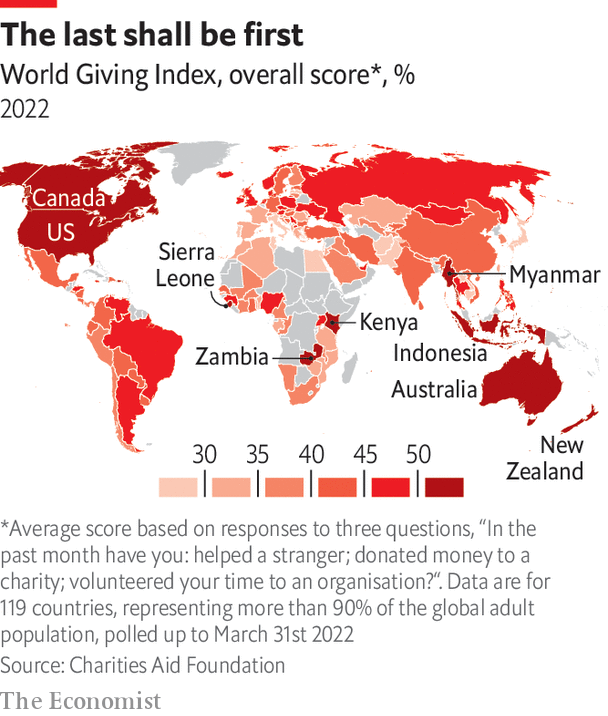

###### Asian values

# Philanthropy in Asia is becoming more professional 

##### But that is not making it more like giving in the West 

 

> Jan 10th 2024 

Within global philanthropy, the spotlight generally falls on the wealthy West. It is tycoons from the rich world who are lauded for giving away vast sums. The most talked-about trends in giving are set in America, in particular. But with rapid economic growth, a new generation of wealthy donors is emerging in the developing world, too, and nowhere more so than in Asia. 

 


Philanthropy in Asia is very different from its Western counterpart. As in all societies, there is an age-old culture of generosity across the region. Most research into philanthropy defines it as formal financial gifts to registered charities and, by that definition, America is the most generous nation on Earth. But a lot of philanthropy in Asia, and the rest of the developing world, is informal. The Charities Aid Foundation, a British group, runs surveys to find the world’s most generous countries. It measures a combination of whether people donate money (in whatever quantity), spend time volunteering with organisations and lend strangers a helping hand. By that broader definition of giving, Indonesia is the world’s most generous country. Myanmar is in the top ten, too (as are several African countries and the United States). 

Such small-scale, informal generosity continues to provide vital assistance within poor communities across the region. But an economic boom has now created a new class of super-rich. There are 896 billionaires in Asia, more than any other part of the world (America has 746), with a combined $3.4trn in assets. They have started to give in a much more formal way, and a younger generation is starting to shake things up, too. 

Playing catch-up

A more strategic sort of giving, involving philanthropy professionals, a long-term lens and big ambitions of transforming society is gradually emerging. It differs, of course, between countries. Giving in India and much of South-East Asia, where there is a vibrant civil society, is different from China, where a communist state has long been expected to solve social ills and has left little room for independent philanthropy. 

By any measure, however, organised philanthropy across Asia is on a much smaller scale than in the West. There are no comparable data on different countries. But one report by Bain &amp; Company, a consultancy, and Dasra, a Mumbai-based ngo, estimates total private giving in India came to about $13bn in the 2022 financial year. Researchers at the Chinese Academy of Social Sciences put total giving in China at about $21bn in 2020. By contrast, in America, researchers at Indiana University estimate that, even after a post-covid decline, total giving came to almost $500bn in 2022. 

In Asia the lines between doing business, contributing through one’s company to social causes and donating in a personal capacity are blurred. Where tycoons set up foundations, they often put a friend or relative at the helm. A general mistrust of non-profit groups—made worse by a string of high-profile scandals and poor marketing by cash-strapped charities—means donors prefer to execute projects themselves. The little grant-making that happens often involves gifts to non-profit groups that friends and business contacts recommend, and usually takes place within the local community. 


Beyond the regional financial hubs of Hong Kong and Singapore, which are fairly well-off societies with vast diaspora communities, Asian donors do not do much international philanthropy. Recent research, funded in part by the Gates Foundation, suggests that the percentage of total giving that is cross-border remains in single digits even in developed Asian markets, like Japan and South Korea. In India and China it is negligible. In the West, by contrast, many donate to the needy overseas. 

Whereas many American philanthropists use their giving to hold the government to account, Asian donors often use gifts to curry favour. China is the most extreme example. Research by Harvard University shows that well-known funders give generously to government-affiliated foundations and align their giving with the Communist Party’s policies. In the midst of a state crackdown on the technology sector in recent years, Alibaba, an e-commerce group, Tencent, the world’s biggest gaming company, and other Chinese tech giants have dedicated billions of dollars to the party’s “common prosperity” agenda.

That has led to giving in the region that Laurence Lien, co-founder of Asia Philanthropy Circle, a donors’ group, describes as “too slow and too safe”. In India, estimates from Bain and Dasra suggest the rich put 55% of their giving into education and health care, which are generally uncontroversial topics. There is a lot of bricks-and-mortar philanthropy, too. Over the years the Tata family, perhaps India’s best-known philanthropists, have built hospitals, universities and vocational training centres. Shiv Nadar, an it billionaire and India’s top donor, has built universities in Chennai and Delhi named after himself. 

Now, though, a new generation wants to do things differently. A lot of Asian wealth is new money. A booming technology sector has minted first-generation billionaires. Some of the richest people in India, for example, started it-services giants, like Infosys and hcl Technologies. 

There is also old money in new hands. Atop the rich list in Indonesia, Thailand and Philippines are siblings—the Hartono, Chearavanont and Sy families, respectively—who have inherited sprawling conglomerates and are likely to pass them on to their children. Many in that younger generation have worked or studied abroad. They are returning home with new ideas about giving and an interest in causes, like women’s rights and climate change, that their parents neglected.

Maryanna Abdo at the Centre for Evidence and Implementation, a research outfit with offices in Singapore, describes it as a move away from charity, a reactive sort of giving focused on meeting short-term need, and towards philanthropy, a more proactive giving that tries to find solutions to underlying problems. The new generation is up for giving more and hiring professionals who know about philanthropy to help them. One-off handouts to the needy on the doorstep are out. Strategic giving is in.

Donors are upping the pressure on each other to give more. In India, Nithin and Nikhil Kamath, two brothers behind Zerodha, a financial-services group, have committed $100m to their Bangalore-based Rainmatter Foundation, which focuses on climate change. They have joined the Young India Philanthropic Pledge, which calls on Indians under 45 with a net worth of over 10bn rupees ($120m) to commit to giving away a quarter of their wealth.

Governments are doing their part to encourage giving, too. In Singapore, a financial hub where many well-off Asians store their wealth, the government has used a series of tax incentives to promote the city-state as a centre for philanthropy. In India, big companies are legally required to spend at least 2% of after-tax profits on corporate social responsibility (csr). 

A lot of that spending is unambitious; car manufacturers giving to road safety and it-services groups paying for digital-literacy programmes. But just last year, csr was responsible for 262bn rupees from 20,800 companies being channelled into worthy causes of all kinds, a small but growing sum. 

Asian fusion

A formal giving industry is gradually emerging. There are a handful of conferences on Asian philanthropy, and various annual reports that pick apart trends in the region. Funders’ groups, like the Asia Philanthropy Circle and avpn, bring donors together to discuss their giving and share due diligence on potential recipients. 

The Grassroots, Resilience, Ownership and Wellness (grow) Fund, led by EdelGive Foundation, the philanthropic arm of a Mumbai-based financial-services group, is being talked about as a model by donors across the world. It has raised money from big American donors, like the Gates Foundation and the MacArthur Foundation, as well as local funders. And, rather than dishing out sizeable chunks to well-known non-profit groups, it is identifying relatively small grassroots organisations to re-grant to, like the Dehradun-based Latika Roy Foundation, which works with people with developmental and other disabilities, and Nagpur-based Slum Soccer, which uses the beautiful game to keep street children in shape and out of trouble. 

None of this is to say that giving in Asia is becoming Westernised. Trends that go in and out of fashion in the West have little influence in Asia. Donors in the region did not adopt the data-driven approach of philanthrocapitalism 20 years ago. The “no-strings” model America’s super-rich are experimenting with today is not catching on either. “Asians tend to do their own thing,” says Naina Subberwal Batra, head of avpn. 

In a survey of non-profit groups in the region by the Centre for Asian Philanthropy and Society in 2022, a third of respondents reported a decline in unrestricted funding, which has always been uncommon in the region anyway. Only 16% said they can consistently raise money to invest in their own organisations, rather than to fund specific projects. 

Nandan Nilekani, co-founder of Infosys, believes the desire of big Asian donors to work with, not against, the state will continue to be a crucial part of Asian philanthropy. It is the only way to scale up solutions in sprawling, populous countries, he says. His own experience serves to illustrate the point. Ekstep Foundation, a group he co-founded, developed the open-source infrastructure used by the Ministry of Education to promote inclusive learning at schools. It proved invaluable during covid lockdowns. Since stepping down from everyday operations at Infosys, Mr Nilekani worked for a few years as a cabinet-level official helping to digitise the Indian state. 

That should not surprise anyone. How a person makes their money shapes how they choose to give it away. Their everyday experiences matter, too. There is less room for philosophising about impact in a region like Asia, where there is still such stark income inequality. The super-rich do not have to look far to find social problems that they can help to solve. And they do not need Westerners to tell them how to do it. ■

