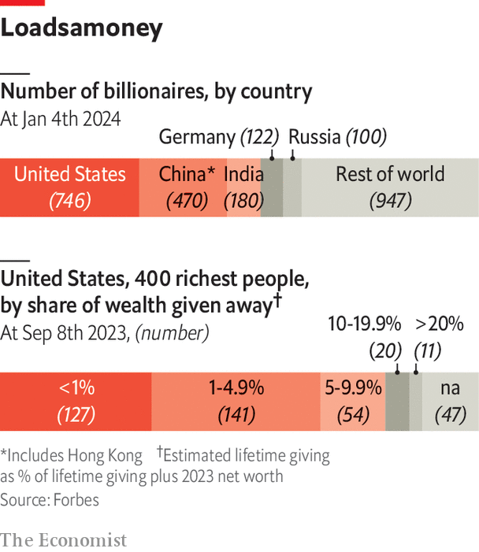

###### Move fast and mend things

# The super-rich are trying new approaches to philanthropy 

##### They are hoping to get money to the needy faster, says Avantika Chilkoti 

 

> Jan 10th 2024 

A NUDGE is not always enough to force change within an industry. Sometimes a series of forceful shoves is required. In the rarified world of Western philanthropy, the shoves began in 2020. The covid-19 pandemic, protests for racial justice across America that summer and the outflow of refugees from Ukraine starting in early 2022 created a new urgency around charitable giving and revealed failings in how it worked. Donors began to consider how they could disburse money faster and with more impact.

Just as the storm of global events was raging, a poster child for the new movement emerged. MacKenzie Scott received a 4% stake in Amazon when she and its founder, Jeff Bezos, divorced in 2019. It was worth $38bn. In the same year she announced that she would give the money away “until the safe is empty”. As global problems spread in 2020, Ms Scott started handing out big grants, to organisations in America and across the world, with no strings attached. Without making any big declaration or setting up a charitable foundation, the quiet billionaire has since shelled out $16.5bn. For comparison, Chuck Feeney, an American duty-free tycoon who was one of the most generous philanthropists of recent times, had given out $8bn by the time of his death in October. Andrew Carnegie, a 19th-century industrialist, gave away $350m, worth $6.2bn today. 

The reason Ms Scott could give so much so quickly is that she did away with the hoop-jumping and form-filling that have long defined philanthropy, especially for the past 20 years. There was no lengthy application process to receive a grant from her. She contracted an independent firm to help her with strategy, do due diligence to check up on the ngos, and then donate the money. Crucially, she decided not to police every decision recipients made in the name of monitoring and evaluation. 

This kind of “no-strings giving” is not completely new. The William and Flora Hewlett Foundation, set up by a tech tycoon, has long given “unrestricted” grants that do not specify how they must be used. Since 2015 the Ford Foundation has put $2bn into its Building Institutions and Networks (build) programme, which hands recipients five years of funding, including a chunk of money dedicated to investments in the organisations themselves. 

But Ms Scott is leading a group of new big-ticket donors applying the strategy at scale and transforming the relationship between wealthy donors and the charities they fund. Since 2020, Jack Dorsey, the co-founder of Twitter and Square, has put $1.5bn into his fund, Start Small, and dished out a big chunk of it, largely in unrestricted grants. Brian Acton and his wife, Tegan, who came into their wealth after Mr Acton co-founded WhatsApp, give out tens of millions of dollars every year with a similar no-strings approach through their group, Wildcard Giving. 

In many ways, this new no-strings approach is a reaction to the approach, known as “philanthrocapitalism”, that has dominated the giving industry since the turn of the millennium. It aimed to bring the discipline of the market and management practices from business to the non-profit sector. At that time, there was a hope that the rich were going to change the world. Bono and Bob Geldof, a pair of activist rock stars, were making philanthropy cool. The Gates Foundation, which now gives more money every year than many rich governments spend on foreign aid, had just been born. When the founders of Google took the firm public, they promised to put 1% of profits and 1% of equity into doing good.

Businesspeople promised to revolutionise the industry by approaching giving like for-profit investment. Foundations helped craft projects for ngos to deliver, pushing them to measure impact, whether counting mosquito nets or quantifying changed attitudes to women. The logical framework, or “logframe”, a grid managers use to plot a project, became a crucial planning tool, and “key performance indicators” the new measure for success.

By the mid-2000s the strategy had become the dominant approach within philanthropy. It developed its own scriptures, including a book by Matthew Bishop, a former reporter at this newspaper. The subtitle to its first edition was, “How the rich can save the world and why we should let them.” The new approach achieved much. The Bill &amp; Melinda Gates Foundation, for instance, developed a reputation for efficient, data-driven grant-making, and poured billions of dollars into eradicating diseases such as polio. Thanks, in large part, to its efforts, Africa was declared free of wild poliovirus in 2020. The foundation’s efforts to tackle malaria and improve sanitation have saved countless lives. 

Too much process

However, in its attempts to measure the good it was doing, philanthrocapitalism began to tie up charities in bureaucracy; it ended up not doing as much good as it had hoped. In the face of urgent global need, in the years before the pandemic a dissatisfaction emerged among the big foundations handing out money, the ngos receiving it and many experts looking on. 

Andrew Serazin, head of Templeton World Charity Foundation, a big donor, says there is an obsession with process, paperwork and generally putting a number on everything, and the whole industry has a severe case of “logframe-itis”. Rob Reich at Stanford University says philanthropic funds are a sort of “risk capital” and when philanthropists make their giving about risk-reward ratios, they “undercut the distinctive thing philanthropic assets are able to bring to society”. Rohini Nilekani, an Indian philanthropist, believes recipients, not funders, are best placed to decide how funds are spent.“I don’t see how you can sit in your plush foundation office and think you understand what is needed in a local context.”

Many former supporters have now accepted that making the world a better place differs greatly from the business of making money. In the market, self-interest focuses minds, competition means bad ideas do not thrive, and resources are naturally drawn where the pay-offs are largest. 

But, in philanthropy, donors rarely operate on the basis of rational judgment. People who see a problem up close have ideas about how it might be solved. They may have personal experience of it or personal attachment to the cause. They often work together, rather than in competition. And ngos do not operate in an efficient market. There is no single metric for a charity’s success comparable to profit in business. Charities rarely go under. “This is an environment that fundamentally differs from the market-based economy,” says Harvey Fineberg, president of the Gordon and Betty Moore Foundation, set up in 2000 by the co-founder of Intel and his wife. “It is based on partnership, rather than rivalry.” 


On top of that, the surge in giving that the philanthrocapitalists foresaw never emerged, either among the wealthy or ordinary givers. The rich are disproportionately important in philanthropy. In America “micro” donors, who give $100 or less, make up over 60% of all givers but only 3% of charitable dollars, according to the Fundraising Effectiveness Project, a data provider. Big donors, who give $50,000 or more, make up just 0.2% of all donors but they contribute over 47% by value. 

Over the past two decades, the rich have grown richer. A booming tech sector, in particular, has minted billionaires in their 20s and 30s across the world. As of January 4th 2024 there were 2,562 billionaires worldwide, including 746 in America, 470 in China and 180 in India. The total wealth of the 400 richest Americans, according to Forbes, a business magazine, rose from $955bn in 2003 (worth $1.6trn today) to $4.5trn in 2023. 

 


Yet global giving remains tiny. Citigroup, a bank, estimates the value of assets held by the philanthropic sector to be $2.4trn, set against $112trn in assets under management in wider capital markets. The share of ordinary Americans giving to charity dropped from two-thirds in 2000 to half in 2018, the latest year for which data are available. Among the super-rich, the pace of giving has not kept up with wealth creation. Forbes estimates that those 400 richest Americans in 2023 have given away less than 6% of their combined current net worth. Just 11 of the 400 have given more than 20% of their wealth (see chart)—including Ms Scott, George Soros, a financier, and Jeff Skoll, former boss of eBay—and 127 have given less than 1%. In 2020 those figures were 10 and 127. 

Even among those who plan to do good, the same pattern holds. The Institute for Policy Studies, an American think-tank, led one study of people who have signed the Giving Pledge, a promise to give away the majority of their fortunes in their lifetimes. It found that the combined assets held by the 73 living pledgers who were billionaires in 2010 rose from $348bn to $828bn in 2022. 

Now, the hope is that the new no-strings approach—which some call “trust-based philanthropy”—could increase the pace and efficacy of giving in a way that philanthrocapitalism did not. Its aim is to do that by getting money out the door faster, and shifting decision-making power from donors to charities. 

This special report looks at a variety of alternative approaches to giving that are now emerging, and not just in the Western world. Chief among them is the no-strings grant-making that took off during the pandemic. The culture has already begun to change. The new canonical text is by Anand Giridharadas, an American author, entitled “Winners Take All: The Elite Charade of Changing the World” in which he calls the old way of giving a “paradox of elite change-making that somehow seems to keep things the same”. When Ms Acton was asked how to set about giving money away over a short period of time, she summed up the new zeitgeist, “You just start writing cheques, man.” ■

