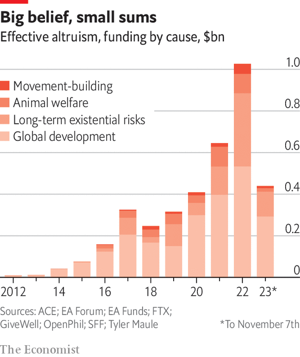
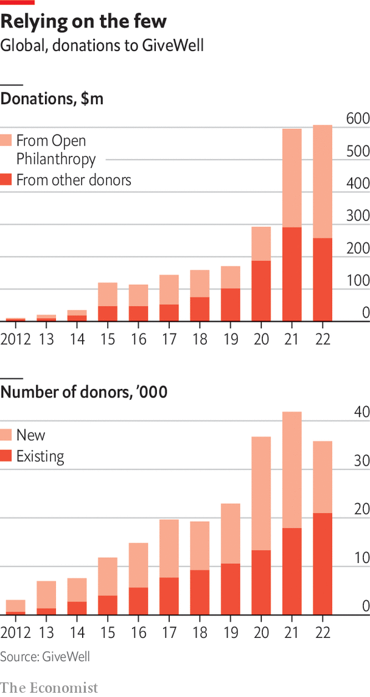

###### Nerds and cool kids

# The “effective altruism” movement is louder than it is large 

##### And there are big questions about whether it will continue 

 

> Jan 10th 2024 

Giving to others is often prompted by emotion, compassion or personal connection. But one newish strand of Western philanthropy has made a name for itself by trying to do away with the emotional side of giving. “Effective altruism” is characterised by a particular reliance on data and logic. 

The movement is the creation of three types of mega-nerd: Oxford University philosophers who came up with the name in 2011, New York hedge-fund analysts and Silicon Valley tech bros, who together refer to themselves as eas. Before his arrest and conviction, Sam Bankman-Fried, the founder of ftx, a cryptocurrency exchange, was seen as the eas’ model, embodying its credo of “earning to give”—choosing a lucrative career only to donate much of your income. Facebook’s co-founder Dustin Moskovitz is also a big backer. 

 


Data, long important to philanthrocapitalism, are even more so for the eas, who see themselves as a hyper-rational movement, not driven by emotion but by facts. Whereas large foundations might choose to focus on fighting malaria and then do a cost-benefit study, eas would do the study before choosing what to focus on, to see where engagement has the highest chance of success. 

The movement has not imploded with Mr Bankman-Fried. The Centre for Effective Altruism (cea), a think-tank, runs conferences and online forums that still buzz with chatter. 80,000 Hours, a recruitment website run by the cea recommending “high-impact” careers, has not seen visitor numbers drop. Devotees remain devoted. In a large survey by Rethink Priorities, a research group, at the end of 2022, 84% said they are still likely to be involved in the movement in three years’ time. Many said they thought the community’s leaders had responded well to the scandal.

There has been soul-searching within the movement since well before the ftx scandal. It has focused on three main areas of fragility. First, the community has never been very big. It has probably never had more than 10,000 active members, mostly young, white men, many from elite universities. Alexander Berger, head of Open Philanthropy, the group that hands out money on behalf of Mr Moskovitz, says the effective-altruisim community is still “marginal”. 

 


Second, it has always relied on a few big financial backers. According to rough estimates on the 80,000 hours blog, over one-third of the hypothetical $46bn committed in 2021 was down to Mr Bankman-Fried and his team at ftx. Almost half was attributable to Mr Moskovitz, who is now playing an even bigger role. Take GiveWell, an organisation that researches charities and recommends the most cost-effective ones. Its donor pool shrank in 2022, according to the group’s own data. But total donations still ticked up that year, thanks to large gifts from Open Philanthropy.


There is a third thing, too. There are broader divisions about strategy, with some supporters determined to focus on improving lives today, while others are looking more at the long term and arguing for putting money into tackling far-flung risks. Even the most devoted eas recognise the limits of data. “In a math problem you can see whether or not the answer is right,” acknowledges Elie Hassenfeld, co-founder of GiveWell. “In what we’re doing, some of it is quantification but a lot of it is judgment.”

Yet still, with big donors locked in debate over alternative approaches to giving, the movement has shown that novice philanthropists can mix and match. They apply data-driven analysis to maximising impact on issues like tackling malaria, just as the philanthrocapitalists do. But they also take pride in giving recipients decision-making power and getting money out the door fast, in line with the newer “no-strings” model. 

It is not clear yet whether the movement will continue to grow or fade into insignificance. Perhaps its biggest contribution might be its adherents’ willingness to ask big questions and challenge conventional approaches. That is exactly what the giving industry needs.■

