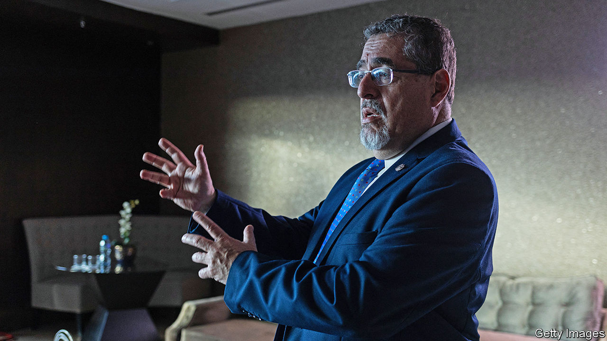

###### A new model for Central America?

# Guatemala’s new president promises a better sort of government 

##### But Bernardo Arévalo has an uphill task 

 

> Jan 11th 2024 

Central America is a laboratory for systems of government, few of them good. The likes of Costa Rica and Panama have real if messy democracies. Nicaragua suffers under Daniel Ortega, a dictator, and El Salvador is becoming more autocratic under a populist strongman, Nayib Bukele. Honduras and Guatemala have been deeply corrupt. Hence the enthusiasm for Bernardo Arévalo, a bona fide democrat, who is to be sworn in as Guatemala’s president on January 14th.

A 65-year-old former academic and ambassador to Spain, Mr Arévalo pledges to restore democracy, which has long been ailing in Central America’s most populous country. Mr Arévalo and his party, Semilla, have made a range of promises that broadly fall into two baskets: cleaning up the state to make it more democratic and inclusive; and improving services, such as education, health care and infrastructure. 

Many pundits hope that Guatemala can set a new trend, in contrast to the likes of Mr Bukele, who is easily Latin America’s most popular politician and role model. Mr Arévalo has had an outpouring of support, both at home and abroad. Civil society, led by the country’s large indigenous population, took to the streets in the face of attempts by a political, military and judicial cabal known as “the pact of the corrupt” to stop Mr Arévalo from taking office. 

To prove himself Mr Arévalo will need to “go beyond good intentions”, says Edgar Gutíerrez, a former foreign minister. “Our objective is to make the democratic model sufficiently attractive,” says Samuel Pérez, a Semilla lawmaker. “That means results to improve people’s lives.” But within his party some disagree over how much to compromise its ideals to get things done.

Mr Arévalo will have to be pragmatic. Semilla won only 23 of 160 seats in Congress and will eschew corrupt practices of the past, such as handing lucrative contracts to its supporters. Álvaro Arzú, an opposition congressman, says there is room for negotiation to pass laws, for instance on health services. But many lawmakers will refuse to co-operate. 

Things in Guatemala are so dire that even small changes should make a difference. “Think filling in potholes rather than building a double-decker road,” suggests Edgar Ortiz of the Liberty and Development Foundation, a local think-tank. Alejandro Giammattei, the departing president, has strengthened presidential power, so Mr Arévalo can lean on executive fiat. He may need to be showy. Mr Pérez points to the popularity of a new library in El Salvador—paid for by China. Such things get noticed. 

Mr Arévalo is unlikely to match Mr Bukele’s popularity. His win in Guatemala was “a glitch in the matrix”, says Mr Ortiz. He was lucky in the second-round vote to run against a candidate who had failed in three previous bids. The United States’ support may be limited to anti-corruption. Mobilising the street will be harder once in office. “We are not 100% behind Arévalo,“ says Luis Pacheco, an indigenous leader. “The idea was to defend our democracy and elections.” Lester Ramírez, a Honduran researcher, says: “Guatemala’s democratic resilience is impressive. But there’s a social fatigue after the vote.” He reckons that people see election day as the moment to embrace democracy. But afterwards they just want results, however achieved, and thus often prefer a strongman.■

