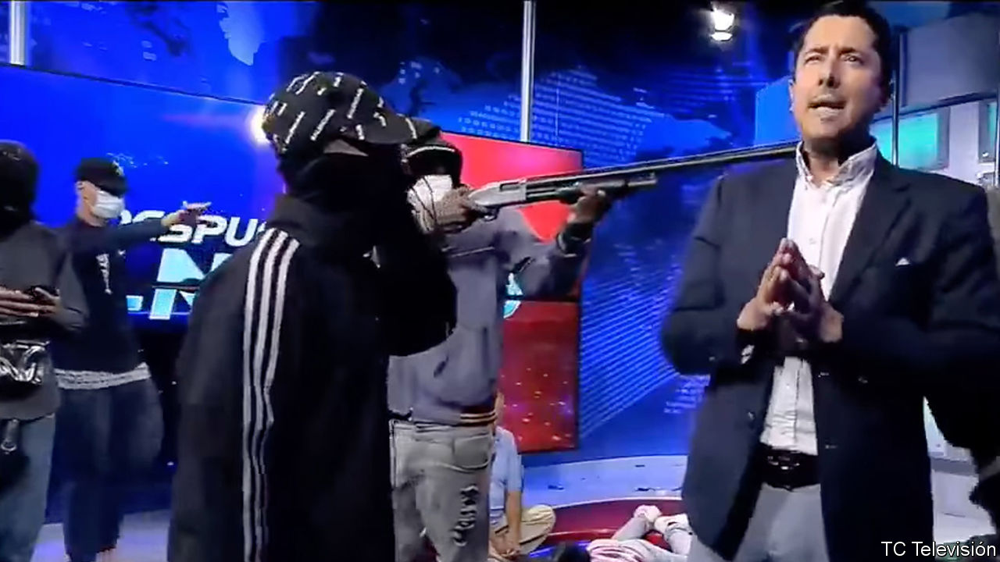
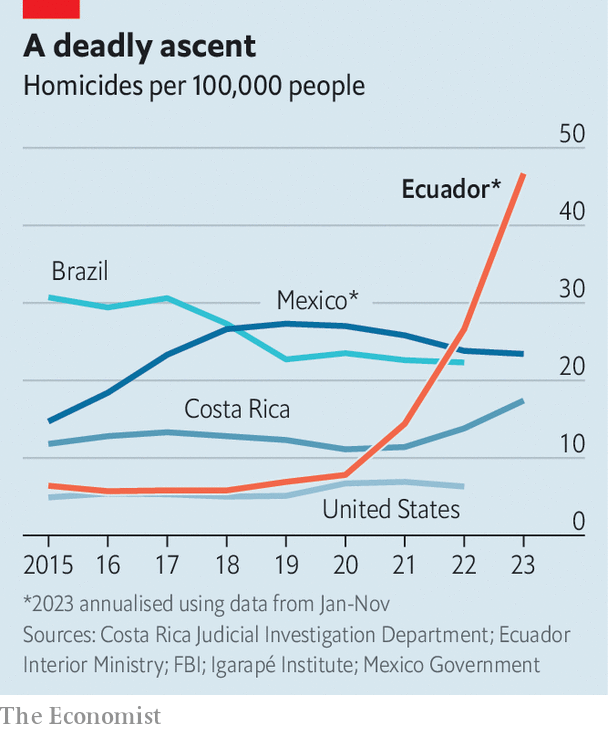

###### Cocaine-fuelled chaos

# How Ecuador became Latin America’s deadliest country 

##### Forty-eight hours of mayhem as gangsters murder prison guards and raid a TV station 

 

> Jan 10th 2024 

ONE OF ECUADOR’S most-watched news programmes, was broadcasting live when gunmen stormed the studio. Cameras rolled as hooded gangsters pistol-whipped staff to the floor. They strutted on air for 15 minutes, flicking gang signs to stunned viewers and taking selfies while waving machetes, dynamite and machineguns. 

This thuggery, beamed across the country on the afternoon of January 9th by a state-owned channel, TC Televisión (see video below), shocked Ecuadoreans as mayhem seized the country this week. It is the latest, most dramatic episode in Ecuador’s four-year slide into the grip of drug gangs. 

In 2019 it was one of the safest countries in Latin America, with a homicide rate of 6.7 per 100,000, comparable to that in the United States (see chart). Some Ecuadorean sources estimate that by 2023 the homicide rate had grown more than six-fold, to 45 per 100,000. This would make Ecuador the deadliest country in mainland Latin America. Its gangsters have adopted spectacularly gory tactics, including public hangings, decapitations and immolation. 

 


The events were set in motion on the morning of January 7th. Guards at La Regional prison in Guayaquil, Ecuador’s largest city, discovered that Adolfo Macías, boss of Los Choneros, a drug gang, was not in his cell. He had been serving a 34-year sentence for murder and drug-trafficking. Gang members in prisons across the country began rioting as news of his escape spread. Videos circulated on social media of gangsters taking prison guards hostage and shooting them. Some guards were hanged. 

The next day Daniel Noboa, Ecuador’s president, declared a state of emergency that is set to last until early March, and imposed a nightly curfew. He sent the army in to take control of the prisons, from which many gangs direct operations. Gangsters fought back on the streets of cities across Ecuador, detonating bombs, burning cars and kidnapping policemen. On the same day that hooded men stormed TC Televisión, another armed group raided Guayaquil University, taking students hostage and exchanging fire with police. Mr Noboa responded on January 9th by declaring an “internal armed conflict” and ordering the army to “neutralise” some 22 organised crime groups, including Los Choneros. 


By January 10th, as published this story, armoured vehicles and soldiers roamed the streets. The gunmen who stormed the TV station had been arrested, but at least ten people had already been killed in the violence. Ecuador is in lockdown. 

The making of Mr Macías

The roots of this violence start in Colombia. Ecuador, and particularly the port at Guayaquil, became a more important hub by which Peruvian and Colombian cocaine is moved to the United States and Europe after Colombian ports tightened their security in 2009. Trade had previously been monopolised by the FARC, a powerful Colombian guerrilla group, which kept violence to a minimum. But when the FARC signed a peace deal with the Colombian government in 2016, most of its members demobilised. Local, regional and international gangs have poured in to fill the power vacuum. Mexican gangs funded Ecuadorean ones. The Albanian mafia expanded its presence in Ecuador. A rapid influx of international organised crime was facilitated by Ecuador’s dollarised economy, and lax visa requirements for foreigners (until 2020). 

Politicians have made things worse. In the name of anti-imperialism Rafael Correa, a populist left-wing president who ruled from 2007 to 2017, closed an American military base on the coast, reduced co-operation with the United States Drug Enforcement Administration and broke up an elite anti-narcotics police unit which had been trained by the United States’ agents. 

Small-time Ecuadorean gangsters like Mr Macías have become kingpins. Los Choneros seems to have gained first-mover advantage by being one of the earliest Ecuadorean groups to establish relations with Mexico’s Sinaloa gang. It and other local gangs are thought to have armed themselves with weapons obtained from their Mexican patrons in exchange for cocaine shipments. They now possess machineguns, rifles and grenades that allow them to take on Ecuador’s poorly trained armed forces.

Ecuadorean gangs have generated cashflow by establishing a lucrative foothold in Europe, where cocaine consumption is expanding. On January 5th the mayor of Amsterdam warned that the Netherlands could become a “narco-state”. The busiest cocaine-trafficking route in the world today runs from Guayaquil to the port of Antwerp in Belgium, according to Chris Dalby of World of Crime, an investigative outfit based in the Netherlands. Much of this cocaine is packed in shipping containers containing bananas, one of Ecuador’s biggest exports. Europe’s demand “has turned Ecuadorean ports into one of the most valuable pieces of infrastructure you can control if you are a drug-trafficking group in Latin America,” says Will Freeman of the Council on Foreign Relations in New York (Mr Freeman has written for  in the past).

That helps gangs buy off prison guards. Mr Macías and other gang leaders have turned perhaps a quarter of Ecuador’s 36 prisons into their headquarters, from which they organise attacks and recruit new members. Mr Macías escaped just before he was due to be transferred to a more secure unit in the prison complex. He must have been tipped off by corrupt officials.

Corruption of that sort is rife. In 2023 police began investigating several government officials for links with the Albanian mafia. Months later, the main suspect was found dead. In 2022 25 air-force officials were punished for sabotaging radar equipment that was monitoring the activity of drug gangs in Ecuadorean airspace. 

Anyone who stands up to the drug gangs and their corrupt networks is at risk. Last August Fernando Villavicencio, a presidential candidate and former investigative journalist, was assassinated 11 days before the election after he threatened to take down the gangs. On January 5th Fabricio Colón Pico, a leader of Los Lobos, a rival gang to Los Choneros, was arrested for allegedly plotting to assassinate Diana Salazar, the attorney-general. Ms Salazar had been investigating links between drug-traffickers and bureaucrats. In December she ordered the arrest of 31 people, including judges, prosecutors, police officers and the president of the Judiciary Council. Mr Colón Pico managed to escape from jail just four days after his arrest. 

After campaigning on less controversial issues, Mr Noboa, who took office in November, has taken an iron fist to the gangs. He has announced that two new maximum security prisons will be built; declared gangs to be terrorist organisations; and warned that officials who collaborate with them will be brought to justice. Like his predecessor, he is sending the army onto the streets and into the prisons. And he has called for a referendum in coming weeks that would legalise extradition and enable the assets of suspected criminals to be seized.

Some of these tactics appear to copy those of Nayib Bukele, the president of El Salvador, who has put some 2% of the adult population behind bars and become one of the most popular presidents in the world in the process. Yet the challenges faced by the two leaders are different. The Ecuadorean gangs are far more sophisticated than those in El Salvador. And Mr Noboa, who must seek re-election in 18 months, is far weaker than Mr Bukele. Despite Mr Bukele’s success so far, the strongman approach to Latin American drug gangs has usually failed.

Mr Noboa must make a cleverer plan. He should urge his officials to share data with counterparts elsewhere in the region, which does not happen at the moment, says Mr Dalby. He should set up a register of guns, rebuild the country’s feeble anti-narcotics units and strengthen co-operation with the United States, which has offered to help. And he must bolster the state’s presence along the border with Colombia and in Guayaquil. Without all this, going to war with Ecuador’s newly empowered gangs is likely to prove futile. ■

