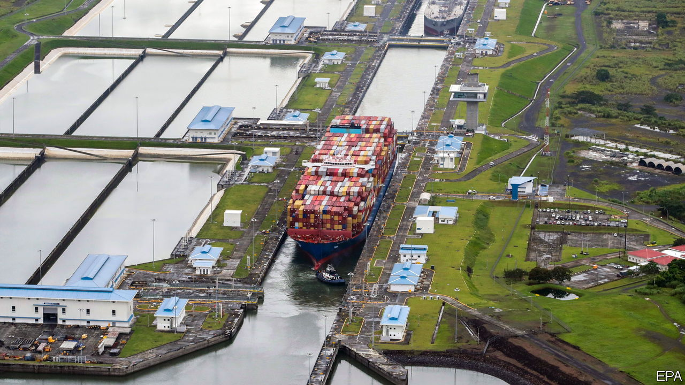
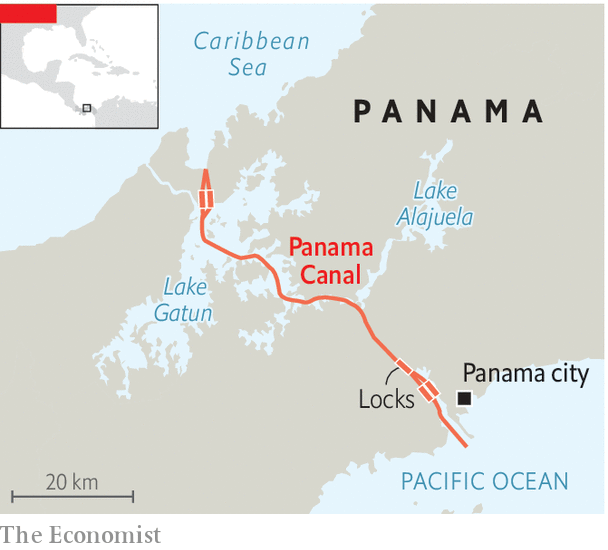

###### Dire straits

# The dwindling of the Panama Canal boosts rival trade routes 

##### But they may end up more complementary than competitive 

 

> Jan 9th 2024 

IT HAS BEEN an unhappy new year in the world’s busiest shipping lanes. Houthi rebels began attacking vessels passing into the Red Sea through the Bab al-Mandab Strait in early December. Trade volumes through the Suez Canal dropped by 40% as ships diverted around southern Africa. Trade through the Panama Canal, the second-busiest man-made shipping lane, has also dipped by 30% since November.

But while the Suez’s , those in Panama are climatic. The lakes that feed the canal are drying up, thanks to annual droughts that may be worsening as the climate warms. The series of locks connecting the Atlantic Ocean to the Pacific via Gatun Lake are close to the point of being too shallow to let the largest container ships through. 

 


Other Latin American governments spy opportunity. In normal times the canal carries about 5% of global maritime trade. And it is lucrative, generating $2.5bn for the Panamanian treasury in the 2022-23 financial year, about 3% of gdp. Politicians in several other countries with both Pacific and Atlantic coastlines are either building or mulling infrastructure projects that might lure traffic and revenue away from Panama. The most viable alternatives are by land, with containers unloaded from ships onto trains or lorries at one port and carried cross-country before being reloaded onto a ship on the other side. 

Mexico’s Interoceanic Corridor (CIIT) is the closest to completion. It has been discussed for decades but is finally being built as part of President Andrés Manuel López Obrador’s infrastructure plan. Its main challenge is to modernise a 300km railway that runs across southern Mexico, from the Pacific to the Atlantic coast. The ports at either end—Coatzacoalcos and Salina Cruz—are being revamped. Most of the railway has been built; passenger services have begun. Work on the ports has not been finished, delaying the start of coast-to-coast freight travel. Mexico’s government plans to launch the CIIT’s second and third rail lines later this year.

Other competition against Panama is more of a dream. Colombia’s president, Gustavo Petro, wants to run a railway through the northern province of Chocó, connecting the Pacific port of Buenaventura to the Caribbean. The country’s National Infrastructure Agency is working on the scheme, but there is scant detail beyond a map with a line connecting both coasts, posted on the president’s X (formerly Twitter) account. On the Caribbean side it is unclear at which port the railway will end. 

The other big projects are roads. The Capricorn Bioceanic Corridor is a dual-carriage highway through Bolivia, Brazil, Argentina, Paraguay and Chile, roughly on the Tropic of Capricorn. Though at 2,250km it is too long to compete directly with the Panama Canal for global shipping, it may be a useful alternative for Latin American trade with Asia. The corridor is already partly built, thanks to multilateral funds. Sergio Díaz-Granados, the head of CAF, a regional development bank, is confident it will be completed, calling it one of today’s greatest opportunities for trade and services in Latin America.

Several maritime alternatives to the Panama Canal have also been mooted. They are more speculative than land routes. Nicaragua wants to build its own canal, despite huge costs and complexity; an earlier attempt backed by a Hong Kong construction firm failed. The same warming climate that is making the Panama Canal less viable is also melting ice in the Canadian Arctic. So the Northwest Passage—a sea route skirting Canada’s Arctic coast—might become viable.

 


Land-based alternatives may be more realistic. They are cheaper, less risky and easier to finance. But projects like CIIT may still struggle to entice cargo away from the Panama Canal. The largest vessels that go through it can carry 14,000 containers. Mexico’s government accurately reckons that the coast-to-coast rail journey will be quicker than passing through the canal. But it neglects to mention that the trains’ capacity and the speed at which they can be loaded and unloaded mean that the overall rate of goods’ transit between the two oceans will be much slower than the canal.

Moreover, Niels Rasmussen, chief shipping analyst at Bimco, an industry association, says that carrying cargo by train or road has big snags. Most shippers would prefer to rack up extra miles on other maritime routes than to deal with the hassle of unloading and reloading. And if push comes to shove, many would probably prefer existing routes across the United States to untested road alternatives in Latin America. 

That does not mean that ideas for new routes should be ignored. The Capricorn Bioceanic Corridor will bring a much-needed upgrade to South America’s road networks and should spur exports, especially intra-regional trade, which is often pitifully thin. Mexico’s plans may also gain a boost from nearshoring, as it is well placed to take advantage of efforts to shorten supply chains and move them away from China. 

As for global trade, new land routes may end up complementing rather than competing with the Panama Canal. Circumstances may occasionally clog up the Suez and Panama Canals, as tension rises in the Middle East and drought worsens in Panama. In this “perfect storm”, says Mr Rasmussen, imperfect alternative land routes would be a lot better than nothing at all. ■

