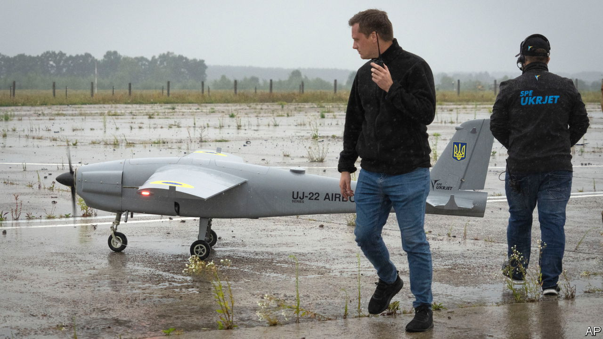

###### The Economist explains

# Can Ukrainian drone attacks hurt Russia? 

##### The country is stepping up its strikes on enemy bases, and on Crimea 

 

> Jan 5th 2024 

THE GROUND war in Ukraine seems to have reached a stalemate. Ukraine’s counter-offensive has petered out. A Russian winter offensive, though violent and bloody, has yet to produce a significant breakthrough. The focus has now turned to the skies. Russia is pummelling Ukraine, as it did last winter. But this time, Ukraine has some capacity to strike back. Can it hit hard enough to make a difference?

In its aerial assaults Russia uses ballistic and cruise missiles, usually in combination. But it most commonly attacks with Shahed drones, a cheap Iranian model that can carry around 50kg of explosives, reportedly with a range of over 1,000km. Russia can send as many as 90 per night. They often clear the route for other weapons, as they did on December 29th, when Russia launched its most intense aerial attack since the outbreak of war, firing at least 110 missiles at numerous cities, including Kyiv, the capital. At least 32 Ukrainians died and more than 100 were injured. Russia seems to have been trying to reduce Ukraine’s aerial-strike capacity: it hit several defence facilities, including ones making drones and missiles. 

Ukraine has mastered the production of short-range drones, which both sides have used extensively throughout the war. Now Ukraine is stepping up the development of drones that can strike more distant targets in Russia, Crimea and the Black Sea. These attacks typically involve around a dozen drones, often accompanying cruise missiles. Since December Ukraine has carried out some attacks with 30 or more drones, but the problem is producing large enough numbers of these weapons to hit hard. 

The country’s long-range drone efforts started with Soviet-era spy drones converted into suicide bombers and Chinese Mugin-5 commercial drones assembled from kits. Both had limitations: Ukraine had only a tiny number of the Soviet drones, and the Chinese model was not optimised for military use. These have been joined by at least a dozen indigenous long-range attack drones. The Bober (“Beaver”) was developed in 2022 by Ukraine’s Defence Intelligence Agency with the help of online crowd-funding: it has a reported range of 800km and is believed to have been used in an attack on Russia’s economic ministry in Moscow in August 2023. UKRJET, a Ukrainian drone startup, has developed its own jet-powered model, the UJ-22 Airborne, which has also been used. In November 2023, in an interview with , a Ukrainian media outlet, Herman Smetanin, the head of Ukroboronprom, the national armourer, said the company was producing attack drones with a range of 1,000km.

Production is building up. On January 5th Russia said it had intercepted 36 Ukrainian drones over Crimea, a bigger attack than many of those that had come before. A source in Ukraine’s general staff has told  that attacks on Crimea will increase over the winter. That is just the start. In December Oleksandr Kamyshin, Ukraine’s Minister of Strategic Industries, said that Ukraine would produce 10,000 long-range drones in 2024. 

Drones that can be easily mass-produced will play a big part. The AQ-400 Scythe, made by Terminal Autonomy, a Ukrainian startup, is among the most promising. It can carry a 43kg warhead and has a range of up to 900km, making it directly comparable to the Shahed. Its plywood body is produced by companies that normally make furniture and it is assembled by unskilled labourers with basic tools. Terminal Autonomy aims to produce 500 Scythes per month in the first quarter of 2024. 

As Ukraine increases its supply of drones, it will need to think carefully about how to use them. Early attacks targeted Moscow, allegedly even the Kremlin itself. That may have been a way to show off what Ukraine was newly able to do. The symbolism may have cheered beleaguered Ukrainians, but Russia, equipped with command bunkers designed for nuclear war, can easily shrug off small strikes. Such attacks may in fact harden Russian civilians against Ukraine, and spur return strikes that do more damage. Better, says Samuel Bendett, of CNA and CNAS, two American think-tanks, to use long-range drones to target Russian military sites, such as the main drone-production facility at Yelabuga. Ukraine now appears to be taking this approach: it recently attacked the Smolensk Aviation Plant, which makes Kh-59 cruise missiles, and Morozovsk Air Base, where Ukraine destroyed an Su-34 bomber. Strikes like these could make this winter’s war something closer to a fair fight. ■

