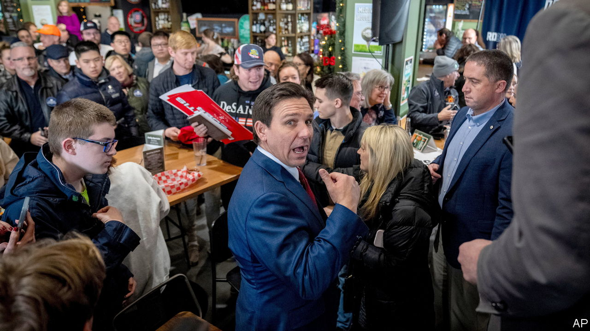
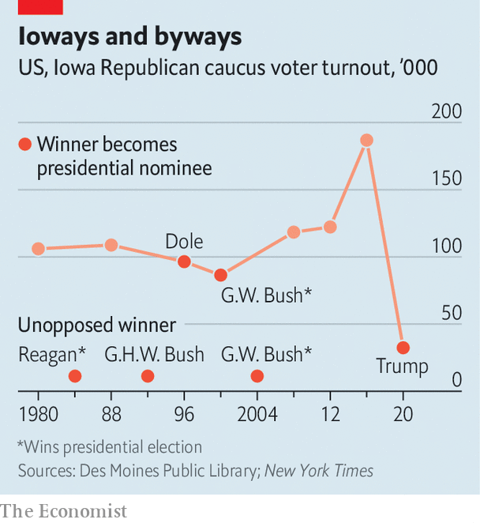

###### The Economist explains

# How the Iowa caucuses are changing in 2024 

##### Five decades of tradition have been overturned by the Democrats 

 

> Jan 10th 2024 

A SAYING IN Iowa has it that a candidate has to shake a voter’s hand seven times to win their support. Those competing in the 2024 Republican primaries have little time left for hand clasping. On January 15th registered Republican voters in the Hawkeye State will launch America’s primary season, picking the candidate they want to represent the party in the presidential election in November. Iowans have an unusual way of choosing: since the 1970s voters have gathered in town halls, school gymnasiums and church basements to make their selection, a process known as caucusing. But this year, for the first time, Democrats will choose by mail-in ballot over several weeks. They will announce results on March 5th, meaning Iowa’s caucuses will no longer be the party’s first contest. Across the country the Democrats are abandoning the traditional caucus: only Idaho and Wyoming are holding out. Republicans caucus in just six other states. 


How does the party’s system work in Iowa—and can it survive the modern age? The state, with its population of 3.2m, is divided into almost 1,700 precincts. Each holds a caucus, though several may share a single venue. The biggest draw hundreds of people; the smallest only a handful. “I’ve been to caucuses in people’s homes where there were 20 people and they served hot cider and homemade cookies,” says Steffen Schmidt of Iowa State University. Voters must attend in person. (There are a handful of exceptions, including some members of the armed forces.) Business begins at 7pm, and might last between one and three hours. Each campaign has a speaker who makes a last brief attempt to sway the audience. There is then a secret ballot. Each precinct elects delegates to a county convention, who are split between candidates based on the breakdown of the vote. They will elect delegates to a district convention, then in turn to the state convention, which finally produces Iowa’s 40 delegates to the Republican National Convention, where they make up 1.6% of the total. 

Iowans love their caucuses, believing they force politicians to connect personally with voters. It helps that Iowa is the first state to hold a vote (though now only for Republicans): candidates make frequent appearances. “It’s a cliché,” says Rachel Paine Caufield, of Drake University in Des Moines, “But you hear people say, ‘I haven’t decided yet. I’ve only met DeSantis five times.’” 

 


The system has downsides, however. Caucuses are costly for parties to run. And because taking part takes longer than simply casting a ballot, attendance is low (see chart). Iowa’s Republican caucuses in 2016, the party’s most recent truly competitive primary, drew 187,000 people—less than a third of registered Republican voters in the state. Extreme cold during Iowa’s fearsome winters can worsen the problem: this year a blizzard is forecast. (Several candidates have cancelled events due to the weather; Vivek Ramaswamy’s SUV got stuck in a snowy ditch.) Those that brave the weather tend to be more politically engaged than the average voter. That has made Iowa a poor predictor of eventual success in the primary, particularly for Republicans: the state has not backed the party’s eventual presidential nominee in a competitive cycle since George W. Bush in 2000.

The Democrats have been moving away from caucusing for years. Their system was always more complicated: rather than voting by secret ballot, caucus-goers expressed their preference for a candidate by standing in a designated part of the room. Any group with less than 15% of attendees was deemed unviable, and its members had to join another or leave. Caucus officials had training manuals and worksheets to help them calculate the points each candidate won, says Christopher Larimer, of the University of Northern Iowa. In 2017 a commission established by the national party to examine primary processes advised that caucuses be reformed to make them more transparent, and to allow absentee voting. 

That led to disaster in Iowa in 2020. An app designed to help caucus chairs with onerous new reporting requirements broke. The party’s back-up phone line was overwhelmed with calls, many from pranksters, forcing party officials to go to caucus chairs’ houses in the middle of the night to gather unreported numbers. The winner, Pete Buttigieg, was not announced until days later, causing his campaign to lose momentum.

The chaos ensured the demise of the Democrats’ in-person caucus. But Republicans in Iowa remain committed to their system. Other states may even take a leaf out of Iowa’s book. Colorado’s Republican Party has said that, if the Supreme Court bars Donald Trump from the state’s primary ballot under the 14th Amendment, it will hold a caucus so that voters can support him. Don’t count the caucus out yet. ■

