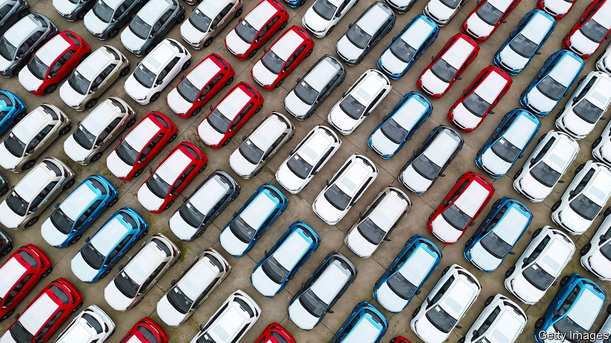
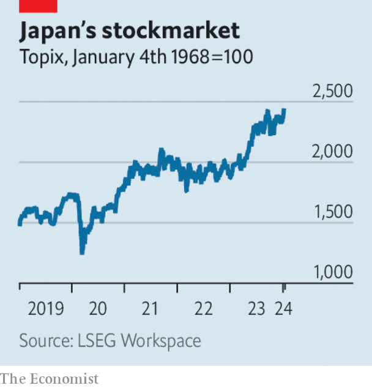

###### The world this week

# Business 

#####  

 

> Jan 11th 2024 

China became the  in 2023, according to the China Passenger Car Association. The association thinks that China exported nearly 5.3m vehicles last year, accelerating it past Japan, which is thought to have sold 4.3m vehicles abroad. Petrol-powered vehicles accounted for the bulk of the exports (notably to Russia), but electric vehicles are taking a growing share of China’s overseas market. The CPCA reckons that 6.1m full-electric vehicles were sold in China last year, up by 22% from 2022. 

Backseat driver

As Chinese carmakers move into top gear,  finds itself falling behind in China, which was once a source of ambitious growth for the German company. VW’s sales in China rose by just 1.6% in 2023 (the overall domestic market grew by 5.6%), though the country still accounts for a third of its global market. VW is also struggling to keep up with demand for EVs. It delivered 394,000 fully electric vehicles worldwide in 2023, far behind the 1.6m that were sold by BYD, China’s biggest electric-car maker. 

 chief executive, Dave Calhoun, promised that the aerospace company would be completely transparent in helping an investigation into an incident in which a panel came off a 737 Max 9 passenger jet that had just taken off from Portland. Nobody was injured on the Alaska Airlines flight, which returned to the airport with a gaping hole in its side. The Federal Aviation Administration grounded some 737 Max 9s while inspections were carried out. The investigation’s initial focus is on the bolts that secured the panel, which fell into a teacher’s garden in Portland. 

OpenAI responded in detail to a lawsuit lodged by the  that claims the startup used the newspaper’s content to create and train its , ChatGPT. In a blog post OpenAI said the lawsuit was “without merit”, and that the  was “not telling the full story”. 

Meanwhile, the European Union announced an initial probe into whether  huge investment in OpenAI falls foul of its law on mergers. Britain’s antitrust regulator opened a similar review in December. 

America’s Securities and Exchange Commission approved applications from some of the world’s biggest financial companies, such as BlackRock, to start offering  tied to bitcoin for the first time, a huge boost for advocates of cryptocurrencies. The day before the announcement the X account of the SEC was  by an attacker who posted a fake announcement that the regulator had already approved the ETFs, causing bitcoin’s price to rise briefly by more than $1,000. 

 agreed to buy  in a deal valued at $14bn. The acquisition will double HPE’s computer-networking business, and it also obtains Juniper’s artificial-intelligence unit, Mist AI, which uses machine learning to improve user access to wireless systems.

 


Stockmarkets in most countries may have had a patchy start to the year—with China’s CSI 300 index falling to a five-year low—but not in . The Nikkei and the Topix indices hit their highest levels since early 1990, boosted by investor cheer that the weaker yen is helping exports. 

 became embroiled in a spat with , a news website, after it claimed that his wife, Neri Oxman, had plagiarised some work in her doctoral dissertation at MIT in 2010 (Ms Oxman apologised for errors in four instances). Mr Ackman, one of America’s best-known activist investors, was a vocal critic of Claudine Gay, who resigned as Harvard’s president amid claims of plagiarism. Axel Springer, the website’s publisher, took the rare step of ordering a review into the “motivation and the process” behind the piece.

Overall losses from  around the world came to $250bn in 2023, about the same as 2022, according to Munich Re. An absence of mega-disasters in industrialised countries kept the figure down. The earthquakes in Turkey and Syria were the costliest disasters ($50bn in losses) followed by Typhoon Doksuri, which hit China ($25bn). Munich Re noted that 74,000 people died in natural disasters, far above the five-year average of 10,000. 

The great British bake off

, a purveyor of cheap and cheerful sandwiches and snacks in Britain, registered a 20% rise in sales in 2023 as it opened lots of new stores. The downmarket chain is often contrasted with the mid-market Pret a Manger, which operates in swankier areas. Academics from Sheffield Hallam University have even gone so far as to create a Greggs-Pret index using machine learning (what else) to assess if the number of Greggs shops in a town are a good measure of its “Northern-ness”. 

