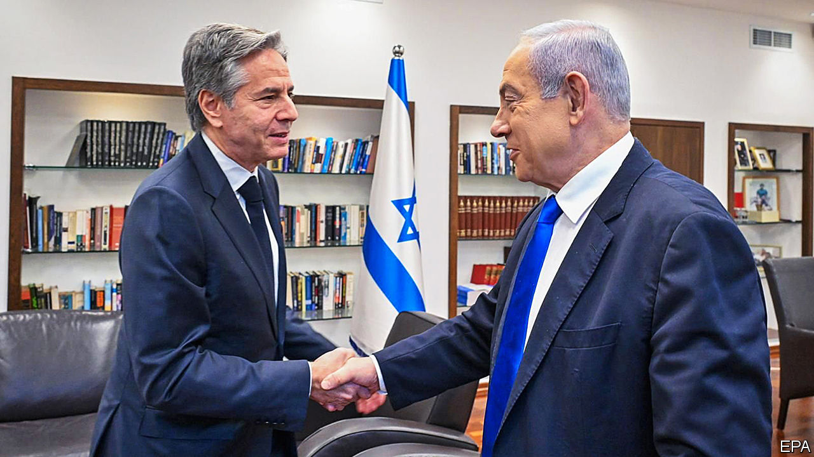
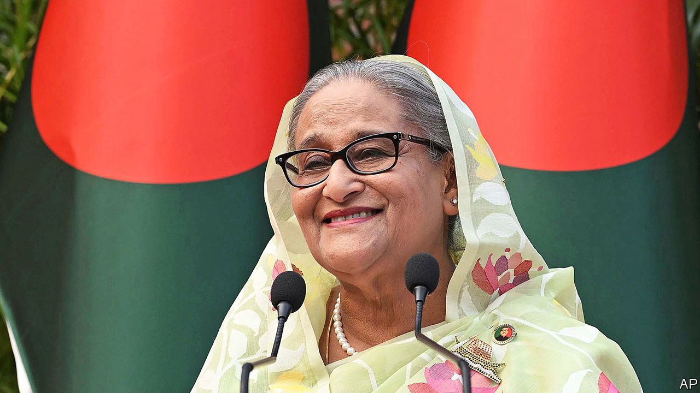

###### The world this week

# Politics 

#####  

 

> Jan 11th 2024 

In a further effort to stop  from escalating, Antony Blinken, America’s secretary of state, made his fourth visit to the Middle East since the fighting began in October. Tensions on Israel’s border with Lebanon have been rising since the assassination of a Hamas leader in Beirut and a strike in southern Lebanon, believed to have been carried out by Israel, which killed a Hizbullah commander. Mr Blinken called on regional powers which have influence over Hizbullah (namely Iran) to “keep things in check”.

 ambassador to Britain said that his country was still interested in normalising relations with Israel after the war in Gaza, but that progress must lead to the establishment of a Palestinian state.

Hearings began at the UN , where South Africa has brought a case accusing Israel of committing genocide in Gaza. Mr Blinken said the charge was “meritless”. 

The Houthis, an Iranian-backed rebel group in Yemen, launched their largest attack yet on ships in the . American and British naval forces shot down 21 drones and missiles launched by the group in a single night. 

A $20bn mining project was set to begin development in , a west African country of 13m people with a GDP of just $16bn. It will involve building an iron-ore mine, railway and port.

America is negotiating with several coastal  countries to establish bases for surveillance drones to monitor jihadist activity. In 2023 it paused the flight of drones from its existing base in Niger after a coup there. 

 held talks on military co-operation with , just a week after the breakaway region of  announced a deal to lease a stretch of coast to landlocked Ethiopia for a port and naval base. Somalia has criticised the deal as an infringement on its sovereignty.

A state of emergency

 new president, Daniel Noboa, said the country faced an “internal armed conflict” after masked gunmen stormed a television studio in the city of Guayaquil during a live news broadcast. This came as violence swept the country following the disappearance of a notorious gang leader from a prison in Guayaquil, which also triggered rioting in prisons across Ecuador. Mr Noboa ordered the armed forces to “neutralise” Ecuador’s drug-trafficking gangs. 

A panel of three judges on a federal appeals court in Washington heard arguments over whether  is immune from prosecution for allegedly trying to overturn the election in 2020. Earlier, the Supreme Court said it would rule on whether Mr Trump should appear on the Republican primary ballot in Colorado following the state court’s decision to boot him off. But the Supreme Court won’t hear the case until February 8th, after the start of the primary season. Colorado holds its primary on March 5th. 

It emerged that, America’s defence secretary, had surgery to treat prostate cancer in December and had failed to notify Joe Biden or his staff. The revelation came after news that Mr Austin had been readmitted to hospital on January 1st and had again not informed the White House about his condition. 

 stepped down as the head of America’s National Rifle Association, a position he’d held since 1991. Mr LaPierre, who has for decades been the nemesis of gun-control advocates, resigned just before the start of trial brought by the state of New York accusing the NRA of corruption.

 Office of Trade Negotiations called on  to “stop using economic coercion to try to interfere” with the country’s general election on January 13th. This was after China threatened to end concessions that ease trade with Taiwan. The rhetoric has intensified between the two sides ahead of the poll. China accused Taiwan’s ruling Democratic Progressive Party of engaging in “dirty tricks”. 

South Korea’s parliament passed a bill that bans the farming and sale of . Anyone slaughtering a dog for food could face prison and a hefty fine, though there are no penalties for consumers who eat the meat. Once favoured as a cheap source of protein, dog meat has gone out of fashion in South Korea and other Asian countries as more people keep dogs as pets. 

 


Sheikh Hasina secured another term as prime minister of  when her Awami League won a general election that was boycotted by other parties. Thousands of members of the opposition Bangladesh Nationalist Party were arrested in the weeks leading up to the poll. The official turnout was 42%; the opposition said it was much lower. America said it shared the view that the election was not free or fair.

The president of the , Mohamed Muizzu, made a state visit to China, where he was called an “old friend” by Xi Jinping. Mr Muizzu became president in November and has pivoted to China following an election in which he campaigned to weaken the influence of India in the archipelago nation. 

Emmanuel Macron appointed Gabriel Attal as the new prime minister of . Elisabeth Borne resigned from the job following the debacle surrounding an immigration bill that passed only after concessions were made to the far-right National Rally. The popular Mr Attal is just 34 and gay, and comes from the class of MPs elected in 2017 when Mr Macron became president. But like Ms Borne, he will find it tricky trying to pass legislation in a parliament where his ruling coalition has lost its majority.

Charles Michel seemed set to step down in June as president of the , after he announced that he would stand in his native Belgium as a candidate for the European Parliament. Mr Michel has led the council, which sets the agenda for European Union summits, since 2019. Mario Draghi, a former Italian prime minister and former head of the European Central Bank, is being tipped to replace him. 

German farmers drove their tractors into Berlin to protest against government cuts to subsidies on diesel fuel. The march of the tractors was replicated throughout  causing traffic snarl-ups. Adding to the pressure on the government, data confirmed that asylum applications had surged by 51% in 2023, to nearly 352,000. The government has been toughening its position on migration as it loses ground to the far right in opinion polls. 

Around 1,000 towns and villages were left without power in, as temperatures plummeted to -15°C (5°F). The freezing weather damaged distribution networks and equipment in a power network system that has not fully recovered from Russian attacks last winter. Lengthy power blackouts are also afflicting . Residents near Moscow saw their heat and lighting go out as temperatures fell to -20°C. 

Compulsive viewing

A long-running scandal in  involving erroneous accounting at post offices came to the political fore. Hundreds of “sub-postmasters”, self-employed people who operate small postal offices, have been wrongly convicted of false accounting because of faulty software provided to them by the Post Office. A television drama has highlighted the case, enraging the public and prompting Rishi Sunak, the prime minister, to promise a new law to overturn the convictions and compensate the postmasters. 

