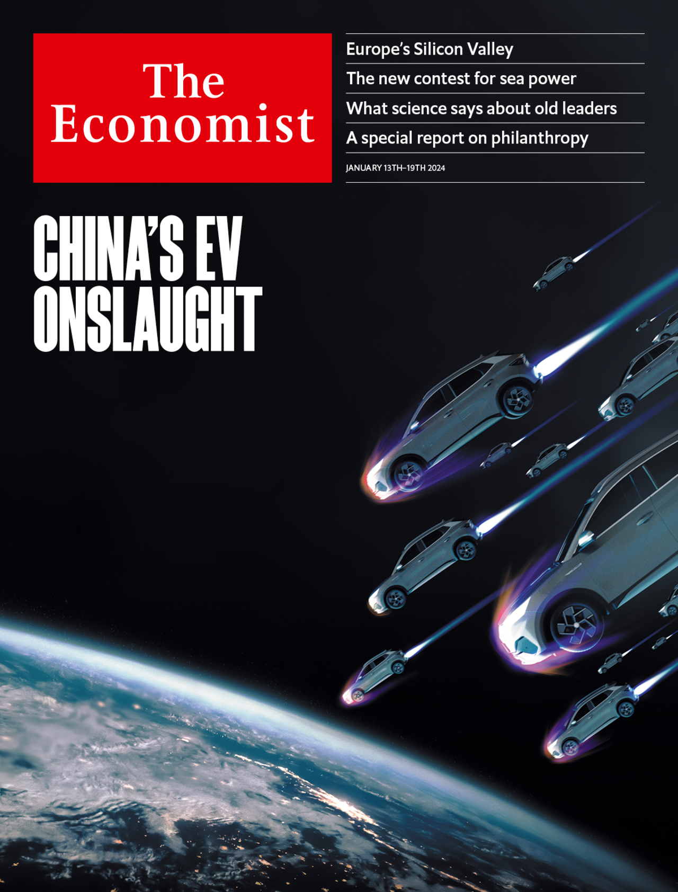
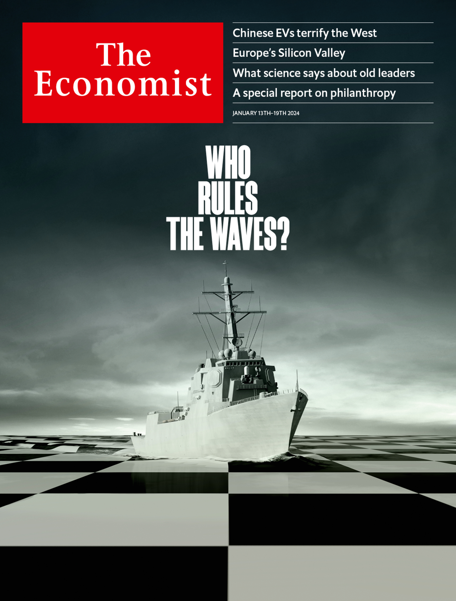

###### The Economist

# This week’s covers 

##### How we saw the world 

> Jan 11th 2024 

Our covers this week looked at the challenge from China’s astonishing progress in electric vehicles (EVs) and the growing tensions on the high seas.


One cover is based on a Briefing that shows how rapidly China has come to dominate EVs. Just five years ago its motor industry shipped only a quarter as many cars as Japan, then the world’s biggest exporter. This week the Chinese industry claimed to have exported more than 5m cars in 2023, exceeding the Japanese total. By 2030 China could double its share of the global market to a third, ending the dominance of the West’s national champions, especially in Europe.


In the leader we wanted to focus on the reaction this is likely to provoke in the West. The “China shock”, when about 1m American manufacturing workers lost their jobs to Chinese competition, has been blamed for everything from rising deaths among working-class Americans to the election of Donald Trump. It is also one of the reasons politicians enthusiastically embrace industrial policy today. 


The brief for our cover designers was to capture both sides of this story—China’s emergence, as well as the fear that the West is about to undergo a second China shock.

Inevitably, we began with pandas. An early sketch showed one of our furry friends lounging on the stripped-down chassis of an EV. Some of us loved this, but others remained confused. The problem is that it tells only half the story—that Chinese companies have made this technology their own. If anything, our cuddly panda obscures the reality of a looming trade war.

Our next idea was more aggressive. It showed a dragon with a tyre-track for a body—a detail some of us missed. When we worked up the final design we therefore added more texture to the tracks and the logos of some of the European marques likely to suffer. This cover also divided opinion. Some found it messy, others refreshingly vivid. Our reservation was that, by portraying a predator, we appeared to be endorsing the wild fears of Western politicians. In fact, our leader argues that value-for-money Chinese imports could bring great economic and environmental benefits. 

In the end we decided to use hyperbole to get that message across. A fleet of EVs invading from orbit is so over the top that readers should understand the irony. Many people will complain about the onrush of cars from China. But if Xi Jinping wants to spend taxpayers’ money subsidising global consumers and speeding up the energy transition, the best response is to welcome it.

 


: 

: 

: 


Our second cover was about sea power. In the Red Sea this week America and Britain hit back against Houthi militias, who have launched dozens of attacks on ships with drones and missiles, cutting container activity in the Suez Canal by 90%. The Black Sea is filling up with mines and crippled warships. The Baltic and North seas face a shadow-war of pipeline and cable sabotage. And amid tensions over Taiwan, Asia is seeing the largest build-up of naval power since the second world war.

To illustrate this, we thought about using several photographs. One showed a convoy of destroyers on exercises in the South China Sea—an impressive sight. Another we considered was a moody shot of a warship silhouetted by the setting sun.


However, our message is that superpower rivalry and the decay of global rules and norms are deepening geopolitical tensions. We thought we could do better. 

To convey that this drama is being played out at sea, we decided to turn the ocean into a giant chessboard. It is easy to identify where conflict could break out. Attacks by, say, Iran or Russia on pipelines, liquefied-natural-gas routes or data cables could be crippling. Spats over strategic islands could trigger confrontation in the South China Sea and Indian Ocean. And embargoes of economies more sophisticated than Russia’s or Iran’s could do enormous damage. A simulation by Bloomberg shows a blockade of Taiwan and Western countermeasures might cut global GDP by 5%.

We agreed on a design which showed the bow wave from the naval ship distorting the black and white squares of the chessboard. But there was a problem. The vessel we were using in our sketches—a Freedom Class Littoral Combat Ship—was so plagued with design and operational snafus that it became known as the Little Crappy Ship. It was hardly the emblem to herald a mighty new era of sea power. So for our final design decommissioned the LCS and procured an Arleigh Burke-class destroyer instead. To illustrate the dangerous waters that lie ahead, we relied on the workhorse of the US Navy.

 


: 

: 

