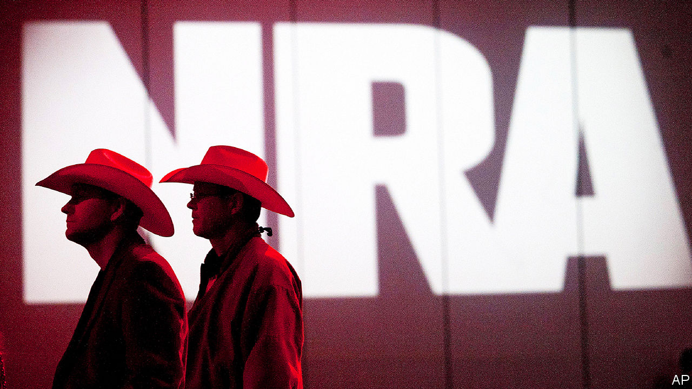

###### NRA on trial

# A lawsuit in New York may shake things up at the NRA 

##### Wayne LaPierre’s resignation is just the start 

 

> Jan 11th 2024 

“WAYNE’S WORLD” is how Monica Connell, a lawyer with the New York state attorney-general’s office, described how the National Rifle Association, better known as the NRA, operated for decades. On January 8th, during the opening statement of the state’s civil trial against the NRA, Wayne LaPierre, who has headed the gun-rights organisation since 1991, and two other former and current top executives, Ms Connell said, “this case is about corruption”. 

The lawsuit filed by Letitia James, New York’s attorney-general, accuses the NRA’s leadership of instituting a culture of mismanagement and negligence which benefited themselves, family, friends and certain vendors, and caused the organisation to lose more than $63m, much of it donated by gun-owners. The state alleges that Mr LaPierre and the others used NRA money on luxury travel, including private jets, and did not declare expensive gifts, including African safaris and yacht trips. And, Ms Connell said, Mr LaPierre retaliated against anyone who questioned him. Oliver North, a former NRA president pushed out in 2019, is expected to testify.

Ms James first filed suit against the NRA in August 2020, seeking to dissolve it. The organisation is chartered by New York state, where it was founded in 1871, in the wake of the civil war. As it is registered as a charity in New York, it is under Ms James’s jurisdiction and watchful eye. A judge blocked her effort to disband the NRA, but said she should pursue other avenues as, if proven, her allegations tell “a grim story of greed, self-dealing, and lax financial oversight at the highest levels”. The NRA unsuccessfully filed for bankruptcy in Texas. A judge there ruled that the organisation was solvent and had filed only to evade mismanagement allegations in New York.

The NRA, Mr LaPierre and the other plaintiffs deny any wrongdoing. Mr LaPierre’s lawyer said his client took private jets because of death threats. As for the yacht excursions, well who wouldn’t want to go on a yacht? The NRA, for its part, appeared to be distancing itself from Mr LaPierre. In her opening statement the group’s lawyer praised him as a visionary, but also stressed that “The NRA is not Wayne LaPierre.” 

The association was founded to improve marksmanship and training, and later also promoted safety. But, in large part because of Mr LaPierre, it has morphed into a powerful lobby for gun rights. It spent millions to help Donald Trump get elected in 2016. But it has struggled with falling revenue, falling membership and in-fighting.

Mr LaPierre announced his resignation on January 5th, citing health reasons. How much this will change is unclear. The executives who remain are LaPierre loyalists. The interim head is his spokesperson and one of his closest advisers. But if the NRA loses the suit there is a good chance that the people who put the organisation into this position will be removed by a state overseer. Stephen Gutowski, the founder of the, an independent publication focused on firearms policy and politics, points to the obvious irony: the lawsuit, which started out seeking to dismantle the NRA, may be “the best chance the NRA has for surviving”. ■


