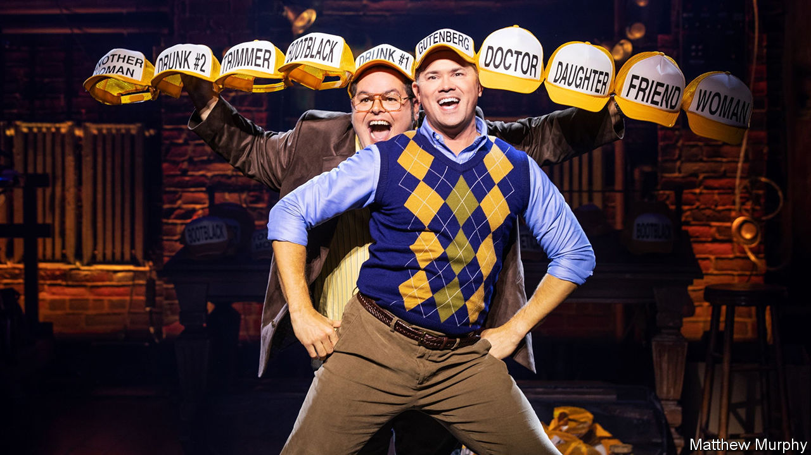
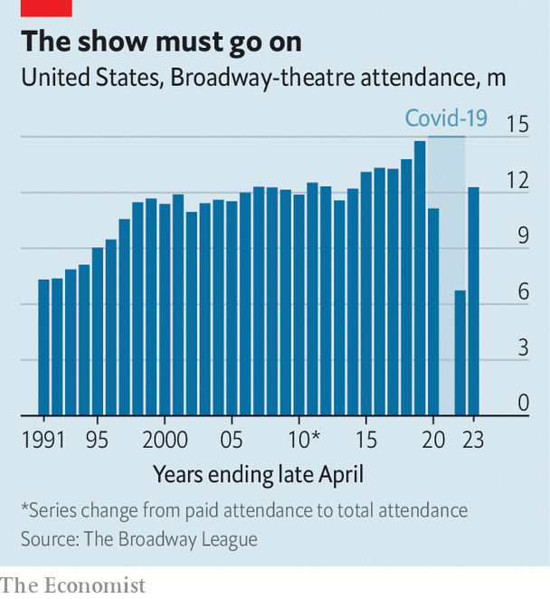

###### Ya got trouble

# Broadway is struggling to find its rhythm after the pandemic 

##### The Great White Way is looking slightly less great 

 

> Jan 11th 2024 

Times Square is a bit different these days. Although the ticket touts and Elmo impersonators still jostle tourists, something is missing: for the first time since the 1970s, there are no Andrew Lloyd Webber shows on Broadway. The musical-theatre titan’s latest Broadway offering, “Bad Cinderella”, flopped (much as the original production had done in London), closing after just 85 performances. And after 35 years, the chandelier fell on “The Phantom of the Opera” for the final time. Higher running costs after the pandemic took it to the point of no return. 

The disappearance of a classic old show and a prominent new one is part of deeper troubles facing New York’s theatre industry. The Great White Way has been struggling with rising costs and smaller audiences. Attendance numbers are down by 17% from before the pandemic (see chart), and box-office returns were down by 27% in real terms in 2022-23 compared with 2018-19 (theatre seasons start in the summer). The Broadway League, the industry’s trade association, does not expect audiences to return to pre-pandemic levels until next year or even later. 

 


The health of theatreland is something of a proxy for that of New York City more broadly. It is an indication of how many tourists and suburbanites have been drawn back into the razzle-dazzle—and how many are big spenders, willing to drop an average of $160 on a ticket. Mr Times Square, a veteran midtown ticket-seller who gives only his , looks crestfallen at the end of a recent Friday-evening shift. “It’s just harder to get people to spend money,” he says. “Broadway’s not doing well at all.”

Tourists have still not returned to New York City in pre-covid numbers and suburbanites come less often. Even New Yorkers fell out of the habit of going to the theatre, says Megan O’Keefe, a producer, and Broadway faces stiffer competition. “Television is really great right now—you can get great storytelling in a lot of places.” 

Producers’ profitability has also been hit by rising costs. “Hadestown”, which won eight Tony awards, had an initial investment of $11.5m in 2019. Now, one of the producers reckons, it would need to be closer to $18m. As with many industries, shipping, materials and labour are all more expensive. And unlike film or TV, shows can stop spending only when they close.

Theatre has never been a reliable business. True, some shows defy gravity: “Wicked”, a musical that recently celebrated its 20th anniversary on Broadway, has so far made $1.6bn in ticket sales. But most do not recover their initial investment, let alone make a profit. 

Before the pandemic about 20% of shows “recouped” their investment. “I don’t know anyone who’s looked” at the number of shows recouping now, says Oliver Roth, a Tony-winning producer. “I certainly haven’t—mostly out of fear.” Rather than resembling a bell-curve, with most shows being middling performers, the industry now looks more like a barbell: productions either thrive or flop. Only one production that started in 2023, “Prima Facie”, announced that it had recouped its costs by the end of the year, helped by being a one-woman show with Jodie Comer, who starred in the TV series “Killing Eve”.

That is typical of successful productions. They either have familiar stars, like Ben Platt in “Parade”, or familiar content, like “Back to the Future: The Musical”. Less formulaic productions stand little chance. “The Inheritance”, which opened on Broadway in 2019, was a two-part play telling the stories of generations of gay men in New York. A critical success, it won the Tony award for best play. “It was a risk that was worth contemplating then,” says Lee Seymour, one of the show’s producers. “There’s no way that show would have even a hope of working now.”

Come to the cabaret

A simple denouement may prove elusive. Many in the theatre world are looking for ways to cut costs, for example by sharing backstage resources. Others are hoping for an expansion of state and federal help, along the lines of a New York state tax credit that awards up to $3m per show. The magical answer, of course, would be another smash hit like “Hamilton” or “The Book of Mormon”. These shows attract new people to the theatre, some of whom catch the bug and stick around. 

Many shows are trying to fill that role—with exclamation marks, in the case of “Gutenberg! The Musical!” (pictured). Despite the testing climate, a slate of new musicals are opening this spring. On Broadway, there’s always the hope that something’s coming, something good. ■


