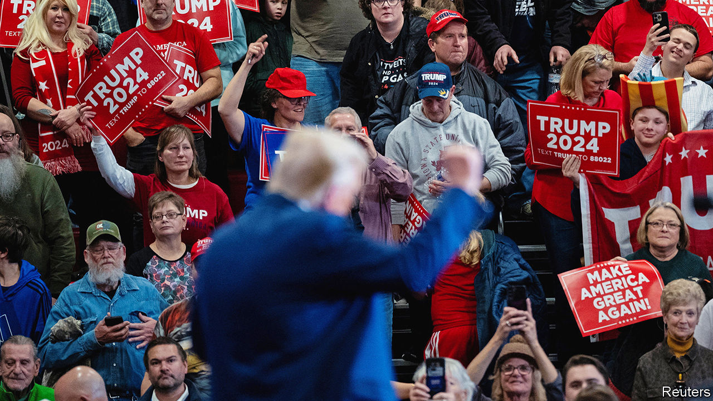
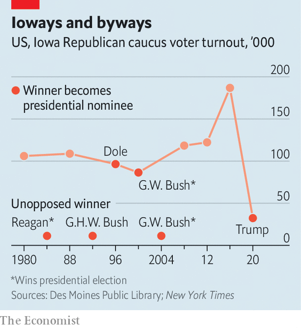

###### First dance, and maybe the last one too

# Donald Trump’s Iowa operation suggests his campaign will be formidable 

##### The former president lost the caucuses in 2016 and doesn’t intend to do so again 

 

> Jan 10th 2024 

KRISTI NOEM came to north-west Iowa to stump for Donald Trump on January 3rd, but the event doubled as a running-mate audition. “Worked with him when he was in the White House on tax cuts. Worked with him on policies, trade agreements,” South Dakota’s governor told the crowd. “Worked on foreign policy with him.” Despite Mr Trump’s absence, the event also featured many hallmarks of his rallies. Merch, including shirts with Mr Trump’s mugshot, was for sale out front. The MAGA faithful filled the room, even on a freezing Wednesday night. And hundreds went home with foam koozies (cup-holders) reminding everyone that Mr Trump was a BACK TO BACK IOWA CHAMP.

The former president won the state comfortably in the 2016 and 2020 general elections. Yet his current popularity makes it easy to forget that his first electoral foray in Iowa did not go well: despite leading in surveys ahead of the 2016 caucuses, he had an anaemic on-the-ground operation and finished second behind a better-organised Republican, Ted Cruz. This year a more methodical Trump operation is trying to project confidence but not complacency.


, scheduled for January 15th, makes organising more complicated. Rather than casting ballots at polls or by post, almost all voters must arrive on time and in person for caucuses, held in the evening at 1,657 distinct precincts. Speeches take place in support of candidates, and voters usually write their preference on a blank piece of paper. The campaign says it has trained 2,000 “caucus captains” to deliver speeches and recruit neighbours to attend the caucus and support Mr Trump. 

Polls show Mr Trump with around 50% of the vote in Iowa, 15 points short of his national lead, according to  of the Republican primaries. Ron DeSantis, the governor of Florida, and Nikki Haley, a former governor of South Carolina, are fighting for second place but trail Mr Trump by more than 30 points in the Hawkeye State. Ann Selzer, the most prominent pollster in Iowa, describes Mr Trump’s position as dominant “in every possible way you could define dominant”.

 


Winning in Iowa does not have great predictive value for the general election: only three presidents of either party have triumphed in contested races in Iowa and gone on to win the White House that year. In all three competitive caucuses from 2008 to 2016, the Republican winner did not become the party’s nominee (see chart). “We’re not supposed to pick presidents, and New Hampshire doesn’t either. What we are supposed to do”, says Jeff Kaufmann, the state Republican chairman, “is allow people to kick the tyres.” 

Beating expectations in Iowa would still be a boon for Mr DeSantis and Ms Haley, as both battle to become the main alternative to Mr Trump. The two went head to head on January 10th in the final pre-caucus debate, on CNN. All their rivals failed to reach CNN’s threshold of mustering at least 10% in polls—except for Mr Trump, who as usual declined to take part. Mr DeSantis and Ms Haley spent most of the time attacking each other, rather than Mr Trump. Hours beforehand Chris Christie, a former governor of New Jersey and the field’s fiercest critic of Mr Trump, withdrew from the race.

Like Mr Trump, the remaining candidates are backed by elaborate turnout operations. Ms Haley is relying on Americans for Prosperity Action, a conservative Super PAC, to knock on thousands of doors on her behalf. The DeSantis campaign argues that its turnout operation, built as the candidate visited all 99 of Iowa’s counties, is superior. Mr Trump has refined his database over multiple presidential runs.

Then there is the traditional advertising war: in 2023 Republican candidates and outside groups spent more than $100m blanketing the airwaves of Iowa (population 3.2m). The top spender was a group supporting Ms Haley with $25m in ads, followed by the nearly $18m spent by an organisation backing Mr DeSantis. Nationwide, it has been an expensive and nasty primary. Mr DeSantis has faced more than $44m in spending directed against him, more than double the $21m that Mr Trump has dealt with. Ms Haley’s opponents spent some $19m attacking her.

Mr DeSantis still maintains the most robust schedule in the state. He attended four events on the same day as Ms Noem’s visit, including at a crowded restaurant not far from the MAGA rally. Mr DeSantis developed a reputation as an awkward campaigner, but he has improved with time. “No one’s hustled more in Iowa. No one’s taken more questions from voters in Iowa,” says a DeSantis campaign official. “He has connected with these people, and that’s going to make a difference on January 15th.”

The Floridian’s closing argument: “Trump’s running on his issues. Haley’s running on her donors’ issues. I’m running on your issues.” Mr DeSantis brings up a topic—the border crisis, America’s debt, China’s rise, wokeism in college or the armed forces—and then makes the case for his own competence and Mr Trump’s ineffectiveness. Want a border wall? Mr DeSantis promises to make it happen and get Mexico to actually pay for it (with a tax on remittances, he claims).

Yet as Mr Trump’s l mounted in 2023, Mr DeSantis saw his polling decline nationally. Jon Mortenson, wearing a white-and-gold Trump caucus-captain hat at the Noem rally, says he didn’t support Mr Trump at the 2016 caucus but now was all-in: “Every time they come after him, it makes me more determined to vote for him.” On the campaign trail several voters, unprompted, brought up recent moves to disqualify Mr Trump from the ballot in two states.

“We’re already seeing the rally-around-the-flag effect from the Democrats’ overreach in Colorado and Maine,” says Jason Miller, a senior adviser to Mr Trump. “Never discount the ability of Joe Biden and national Democrats to help galvanise the Republican Party in support of President Trump.” Some 187,000 Republicans went to Iowa caucuses in 2016, and turnout could exceed that number this year. 

“Until you have the actual contest, and people actually go and cast their preference, you just don’t know,” says David Kochel, a longtime Republican strategist in the state. “Iowa and New Hampshire both have a tendency to surprise.” But Mr Trump was surprised in Iowa once, and is resolved not to be again. ■


