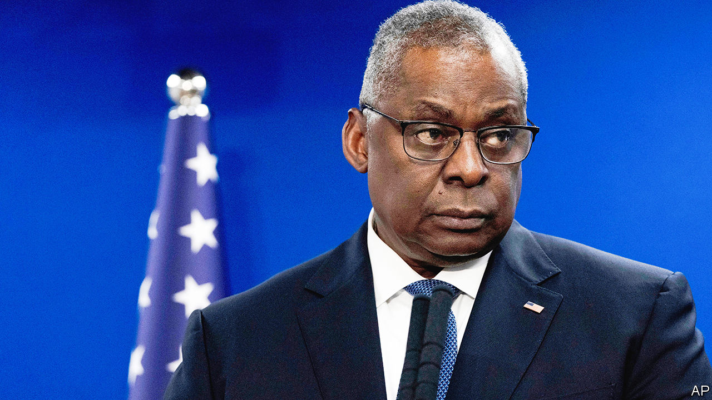

###### Hospital pass

# Joe Biden’s disappearing defence secretary 

##### Lloyd Austin’s medical absence prompts confusion and concern 

 

> Jan 8th 2024 

IT IS A busy time in the Pentagon. A vital  hangs in the political balance. The war in Gaza threatens to . America’s navy has been blowing up . It was thus a particularly awkward time for the country’s defence secretary to vanish for several days, unbeknown to Joe Biden, America’s president, or much of the Pentagon itself. 

Mr Austin, a burly and taciturn retired general who has been Mr Biden’s defence secretary for three years, was admitted to hospital on December 22nd for an elective procedure to treat prostate cancer. After experiencing “severe” pain on January 1st, he was taken to an intensive-care unit (icu) in Walter Reed hospital in Maryland, a military facility which treats American troops and presidents. For five days he was out of action, resuming work from his hospital bed only on the evening of January 5th. Mr Austin left the icu on January 8th but is thought to remain at Walter Reed. 

It is not unusual for cabinet secretaries to take medical leave. What is strange is the manner of Mr Austin’s vanishing act. Neither his initial treatment nor his complications were publicly disclosed. More important, Mr Biden, the commander-in-chief, Jake Sullivan, the national security adviser, and others in the White House did not learn he was in hospital until three days later, on January 4th. Nor did Kathleen Hicks, Mr Austin’s deputy, despite having been asked to assume some of his duties on January 2nd on her holiday in Puerto Rico (without being told why, it seems). 

General Charles “CQ” Brown, the chairman of the joint chiefs of staff, who serves as the president’s top military adviser, was informed on January 2nd—but apparently neglected to tell the White House. Congressional leaders, who oversee the Pentagon and control its budget, found out only on January 5th, the same day as army, navy and air-force chiefs who work under Mr Austin. Most of Mr Austin’s staff in the Pentagon were also out of the loop. 

The nature of Mr Austin’s ailment and treatment was not made public until January 9th, when Walter Reed hospital published details. Mr Biden himself only learned the details earlier that morning. The hospital said that Mr Austin had never lost consciousness or been placed under general anaesthetic during his second stint in the facility, and that he was expected to make a full recovery. 

The secretary of defence occupies a key role in America’s government. The formal military chain of command runs from the president to the secretary of defence, and from there to various commanders who oversee a particular area. The secretary also wields some powers delegated by the president, such as handling air- and missile-defence threats to America which might need a prompt response. Mr Austin is not formally required for nuclear launches—Mr Biden has sole legal authority—but in most cases the president would consult the defence secretary, among others, in a secure conference call. 

Mr Austin’s stint in hospital coincides with a particularly tumultuous period. On January 3rd America joined 13 allies in releasing a joint statement that hinted at possible military action against Houthis in Yemen. A day later American forces in Iraq conducted an air strike against an Iran-backed militia leader there (though CNN reported that Mr Austin was “alert and tracking” it). 

The Pentagon has scrambled to get its story straight. The department says that Kelly Magsamen, Mr Austin’s chief of staff, was unable to notify Ms Hicks and Mr Sullivan until January 4th because Ms Magsamen herself was unwell. Yet American defence secretaries have armies of staff around them. Nor does this explain why Mr Austin is said to have told colleagues that he was working from home. 

The unusual secrecy has provoked both bafflement and anger. The health of cabinet secretaries tends to be closely scrutinised. Mr Biden’s colonoscopy in November 2021 was publicly disclosed. In June 2022 the Department of Justice gave advance warning that Merrick Garland, the attorney-general, would undergo a procedure on his prostate. Mr Austin’s failure to inform the press was “an outrage”, wrote the Pentagon Press Association, a group of journalists, in a letter to the department’s press officials. “The public has a right to know when US cabinet members are hospitalised,” it argued. 

In a bipartisan statement, the Republican and Democratic leaders of the House Armed Services Committee said that Mr Austin needed to answer several questions as quickly as possible, including on the nature of his medical problem and the reason for the delayed notification. Two days later, on January 9th, the Republican-controlled committee launched a formal inquiry into the episode.

Mr Austin is an intensely private official, bordering on reclusive. In a statement on January 6th he offered a half-hearted apology. “I also understand the media concerns about transparency and I recognise I could have done a better job ensuring the public was appropriately informed,” he said. “I commit to doing better.” 

The White House insists it has confidence in the defence secretary, who oversaw Mr Biden’s botched withdrawal from Afghanistan in 2021 and has marshalled Western military aid to Ukraine in frequent meetings of around 50 defence ministers since April 2022. Mr Austin’s position may grow shakier if more holes are poked in his story over the coming days—and if calls for his resignation grow louder. For now, the world’s largest and most powerful armed forces are being overseen from a hospital bed in Bethesda. ■


