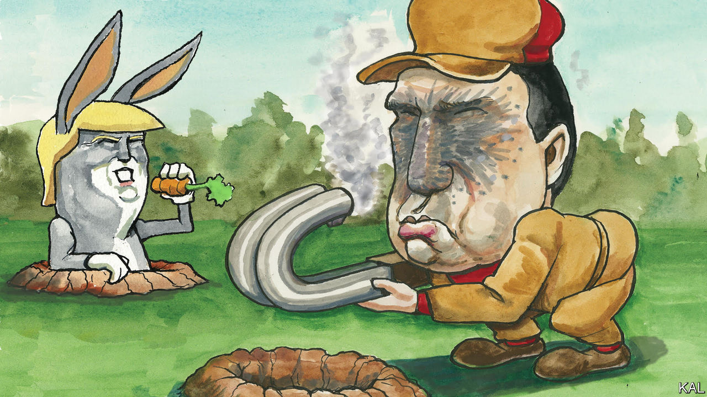

###### Lexington

# Ron DeSantis has some lessons for America’s politicians 

##### He is showing how hard it is to run for president in general, and against Donald Trump in particular 

 

> Jan 11th 2024 

“God looked down on his planned paradise and said, ‘I need a caretaker’—so God gave us Trump.” Thus intones the narrator of a video Donald Trump shared on his social-media platform, Truth Social, earlier this month. Amid the huffing and puffing, a mischievous, even puncturing note can also be heard: Mr Trump, as God’s chosen agent, will not only “fight the Marxists” but also pause to “eat supper”. After taming the “cantankerous” World Economic Forum, the gravelly voice deadpans, Mr Trump might “come home hungry” yet he will wait “until the First Lady is done with lunch with friends—then tell the ladies to be sure and come back real soon”.

Mr Trump was aggrandising himself, but he was also once again making fun of poor beleaguered Governor Ron DeSantis of Florida, aka, to Mr Trump, “Ron DeSanctus”, aka “DeSaster”, aka “Tiny D”. More than a year ago, Tiny D’s—ahem, Mr DeSantis’s—wife, Casey DeSantis, tweeted a video in which another thunderous male voice also described God looking down on “his planned paradise”. In that instance, God chose to create “a fighter”. Noble black-and-white images of Mr DeSantis illustrated baritone blather about defending what is “right and just”, without the slightest hint of irony. Solemn as it was, Mr DeSantis’s video was far sillier than the one Mr Trump celebrated. 

But Mr DeSantis was riding high back then, before he challenged Mr Trump for the Republican nomination. Just days after that tweet, as Republicans across the country struggled in midterm elections, Mr DeSantis was re-elected by 19 points. The  proclaimed him “DeFuture”: he had Mr Trump’s policy aims but not his baggage, his forcefulness but not his fecklessness, his killer ways but not his loser record. He was a college athlete, a navy veteran, a former prosecutor and congressman as well as a serving governor. And he was just 44, with a media-savvy wife and three children. He looked like a winner. On paper. 

Mr DeSantis may yet produce a surprise in the Iowa caucus on January 15th. His aides boast of their assiduous door-knocking. But polls show him struggling to cling to a distant second place behind Mr Trump. Mr DeSantis may never have had much chance of keeping his early mojo, particularly once Mr Trump’s indictments rallied Republicans to the former president. Yet lessons can be learned from his experience; not only by Mr DeSantis as his campaign moves ahead, but by future DeFutures and the donors who will be tempted to fall in love with them.

Mr DeSantis’s first mistake was to alienate the aide who revived his first campaign for governor, Susie Wiles. He wound up pushing a formidable operative who knew his every weakness into Mr Trump’s camp, where she is now a top adviser. Then he delayed entering the race for months, calculating that a productive state-legislative session would buttress his campaign but exposing himself to a classic Trumpist bombardment—from the left (for voting to cut entitlements), from the right (for wanting to raise taxes) and out of left field (for eating pudding with his fingers). 

Mr DeSantis attempted an unconventional campaign launch on Twitter, but it proved a carnival of glitches that mocked his image of competence. Perhaps most damaging, he conducted another radical experiment by outsourcing key decisions to a Super PAC, Never Back Down, which he and his campaign could not legally control. It burned through tens of millions of dollars until, last month, it backed down, with officials resigning or being fired after anonymous finger-pointing over bad decisions. 

The most basic political lesson of the DeSantis campaign, but the hardest to apply, is this: you can never tell. Recall, just since the 2016 campaign, such candidates as Rick Perry of Texas, Scott Walker of Wisconsin, John Kasich of Ohio, Jeb Bush of Florida, Chris Christie of New Jersey, and even Doug Burgum of North Dakota—they all looked good on paper, too. They were all accomplished serving or former Republican governors, a species of candidate with particular appeal to the mandarin class. In any era their candidacies may not have survived contact with national politics, but they certainly could not thrive in the Republican reality defined by Mr Trump’s sulphurous tactics and charisma.

You also cannot tell in advance because some candidates learn quickly, and others do not. Mr DeSantis has improved as a candidate, but not as much as, say, Barack Obama had by this point. Having tried for too long to duck combat with Mr Trump, Mr DeSantis has honed his own criticisms. He shows a bit of interest, sometimes, beyond mechanically asking a voter’s name. His voice has acquired inflection beyond the aggrieved whine that sliced through many of his debate appearances. His smile sometimes crinkles his eyes, rather than just exposing his clenched teeth.

Another Ron

But Mr DeSantis remains God’s fighter, a belligerent candidate unlike the Republican governors of the past 50 years who did go on to win the nomination—Ronald Reagan, George W. Bush and Mitt Romney. Mr DeSantis’s glower has made him a natural foil for Mr Trump. Compared with the politician of 2016, Mr Trump is himself a darker candidate. But he has delighted in playing the Road Runner to Mr DeSantis’s flummoxed Coyote, Bugs Bunny to his plodding Elmer Fudd. “There’s another version of Ron DeSantis where he really celebrates the American dream,” says Stuart Stevens, a Republican consultant who advised Mr Romney and Mr Bush, among others. “He’s a middle-class guy from Florida, went to Harvard, Yale: ‘I represent what is possible in America, and I want to make it possible for everyone.’ You would have liked that guy.” 

Mr Trump is now training his fire on a more adept politician, Nikki Haley. She was also a governor, of South Carolina. She has run a better campaign than Mr DeSantis and offered a sunnier contrast to Mr Trump. Yet even that alternative—any alternative—will probably not satisfy today’s Republican Party, either. ■


