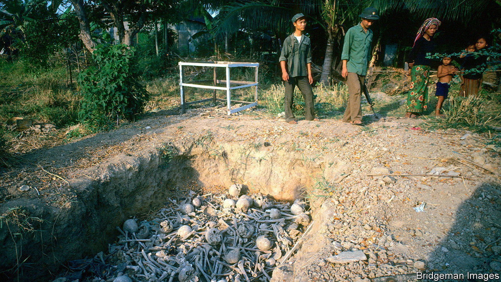

###### Killing fields

# Cambodia’s genocide is still hurting its people 

##### New research highlights the Khmer Rouge’s terrible legacy 

 

> Jan 18th 2024 

Remember the past but look to the future. That was the message Cambodia’s leaders gave to the 20,000 people who gathered in Phnom Penh, the country’s capital, on January 7th to commemorate “victory over genocide” day. Around 2m people (nearly a quarter of the population) were killed between 1975 and 1979 during the Khmer Rouge’s attempt at a great leap forward. Since that communist regime’s fall, Cambodia’s recovery has been impressive. Over the past decade annual growth has averaged 5.5%. Still, the effects of genocide linger.

More than 40 years on, the households and villages most ravaged by Khmer Rouge atrocities are among the country’s poorest, according to a new working paper by Rahul Mehrotra of the Geneva Graduate Institute, a university. To quantify the long-term impact of the genocide, he measures the wealth of a household in relation to its proximity to a Khmer Rouge mass grave. In areas with more mass graves, households are likelier to be in the poorest quintile of Cambodia’s wealth distribution. Few have access to piped water. This chimes with earlier studies. One published last year in the  , a journal, by Donald Grasse of the University of Southern California found that poverty rates in villages ruled by a radical faction of the Khmer Rouge were 4% higher than those controlled by a more moderate one. 

These effects are so deeply entrenched because, in the Khmer Rouge’s fanatical quest to establish an egalitarian society, educated Cambodians suffered especially. The loss of their lives and the forgone years of education among survivors set back subsequent generations. Decades later, men and women with median levels of exposure to the genocide, in terms of proximity to mass graves, receive 1.8 fewer years of education than they otherwise might. They are also likelier to work on farms than in factories or offices. These effects are most pronounced in families that lost members to the Khmer Rouge. 

Households near former Khmer prisons are also especially likely to be poor, according to Mr Mehrotra’s study. These enduring effects should serve as a warning to the current government. The ruling Cambodian People’s Party has banned the opposition, shut down independent news outlets and threatens activists. Cambodia’s economy might otherwise be doing even better than it is. Remembering the past is important, but learning from it even more so. ■

