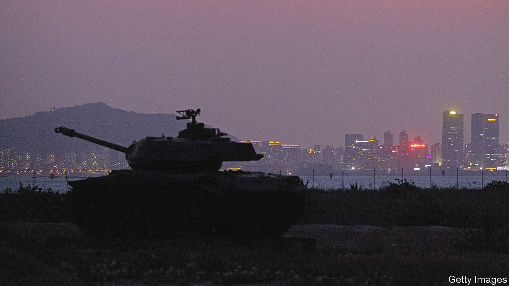
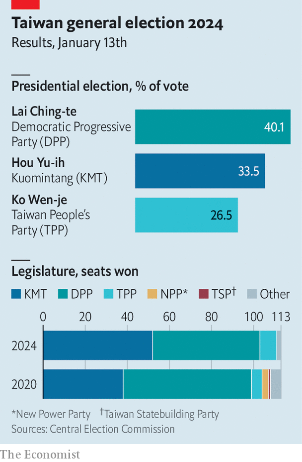
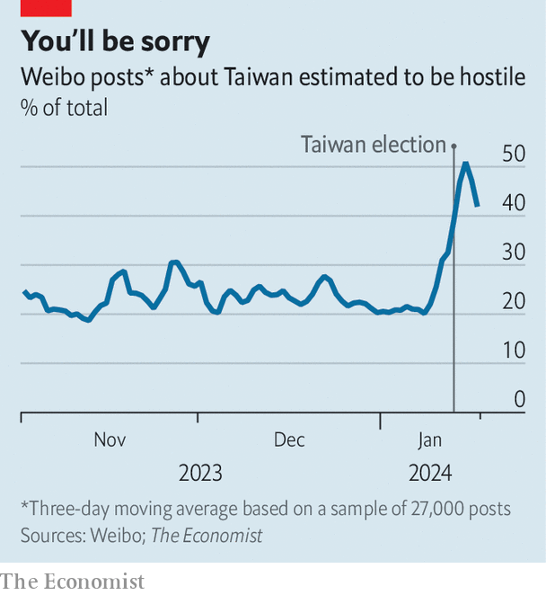

###### Democracy island

# Defying China, Taiwan elects William Lai Ching-te as president 

##### It will have to cope with China’s anger 

 

> Jan 18th 2024 

China has no say in Taiwan’s elections, but for months its officials had warned that Taiwan should not choose William Lai Ching-te of the Democratic Progressive Party (DPP) as their new president. Mr Lai was a separatist whose election would create a “dangerous situation of high winds and urgent waves in the Taiwan Strait”, a spokesman for China’s Taiwan Affairs Office threatened. On January 13th Taiwan’s voters elected Mr Lai anyway, ushering in an unprecedented third term for the pro-independence ruling party.

So far the Taiwan Strait has remained relatively calm. But Mr Lai may soon face storms at home. His party has lost its majority in the Legislative Yuan, Taiwan’s parliament. It will struggle to forge consensus on divisive issues like defence spending and strategy. China already seems to have identified such domestic divisions as Taiwan’s weak point. Its first statement responding to the election claimed that the DPP’s victory “does not represent mainstream public opinion” and promised that it would keep working with “relevant parties, groups and people” within Taiwan to promote “national unification”.

 


Most Taiwanese support neither immediate unification nor independence but the current state of de facto independence. Yet voters are divided over how best to safeguard it. Mr Lai won with 40% of the vote, a sign that a plurality want to continue along his party’s path of strengthening deterrence and relations with other democracies. Another third of the vote went to Hou Yu-ih of the Chinese Nationalist Party, or Kuomintang (KMT), who promised to lower tensions through trade and dialogue with China, based on rejecting Taiwan’s independence. A hefty 26% went to a third-party challenger, Ko Wen-je, of the parvenu Taiwan People’s Party (TPP).

“Taiwan is telling the whole world that between democracy and authoritarianism we choose to stand on the side of democracy,” Mr Lai told his victory rally on election night. But vows to defend democracy are no longer enough for many voters. Mr Ko’s supporters in particular were drawn to his focus on domestic issues like housing and wages. Many were young Taiwanese who said they disliked the two traditional parties’ “ideological” politics.

The DPP is already worrying about how to unite the country. From February the parliament will be split between the three parties, with TPP legislators a potentially decisive vote. The last time Taiwan had a split assembly and executive was under the DPP’s Chen Shui-bian, president from 2000 to 2008. The KMT-dominated parliament blocked Mr Chen’s proposed military budgets more than 60 times, eventually forcing him to cut defence spending from a proposed $19.6bn to $320m. During his campaign Mr Lai warned that opposition lawmakers might block his budgets.

That will alarm America, Taiwan’s main military partner. An unofficial delegation of former senior US officials visited Taiwan just after the elections. They met not only Mr Lai and the outgoing president, Tsai Ing-wen, but also Mr Hou, Mr Ko, and the KMT’s party chair, Eric Chu. Afterwards Laura Rosenberger of the American Institute in Taiwan said that America would continue to “work across the political spectrum” in the belief that all Taiwan’s parties want to do “what’s best for Taiwan, regardless of their political affiliations”.

China’s Communist Party seems to disagree. On January 15th its journal  published a speech by President Xi Jinping about the importance of winning hearts and minds among ethnic Chinese worldwide, including “patriotic unification forces” in Taiwan. On January 16th China’s Ministry of State Security published an article on China’s Anti-Secession Law, calling it a “sharp sword hanging high” over the heads of would-be separatists, and warning Taiwanese spies that the DPP might put their lives at risk. The , a Chinese tabloid, said China would try to rally Taiwan’s people, distinguishing “compatriots” from “secessionists”.

In the past, for being more outspoken in his advocacy of independence than Ms Tsai. But during the campaign he promised not to declare independence. Taiwan is already independent in effect, so has no need to declare it, the DPP’s leaders say. Mr Lai’s running-mate, Hsiao Bi-khim, the island-state’s former representative to America, is known in Washington as a firm but careful defender of Taiwanese democracy. Together they are rather unlikely to stray from Ms Tsai’s path of moderation.

That is little reassurance to the Chinese Communist Party, which also hated Ms Tsai. Since she came to power eight years ago, China has cut off communication with Taiwan’s authorities and increased military pressure on the island. In August 2022, China sent missiles over Taiwan and enacted a mock blockade around it after a visit from Nancy Pelosi, then speaker of America’s House of Representatives. China also sent balloons over the island and reimposed some tariffs on Taiwanese products in the weeks before the vote. But it did not make a major new show of force.

That may change in the coming months as China tries to isolate Taiwan internationally and divide it internally. On January 15th the Republic of Nauru, one of Taiwan’s few remaining diplomatic partners, said it was cutting ties with Taiwan to recognise the People’s Republic of China instead. China’s foreign ministry gloated.

 


Given the fuss China made over Mr Lai, some kind of symbolic military action seems likely. That would excite China’s online nationalists: an  analysis of posts on Weibo, a microblogging platform, found that hostile posts about Taiwan more than doubled after the election (see chart). Mentions of “motherland” rose five-fold; “Taiwan independence” jumped eight-fold. A potential flashpoint is May 20th, Mr Lai’s inauguration day.

Mr Lai did not quite manage to avoid controversy during the campaign. He caused a rumpus by saying he hoped, against precedent, to see a Taiwan president visit the White House one day. Such language makes American officials nervous. For its part, China will want to make Taiwanese citizens feel they have entered more dangerous waters by electing Mr Lai. The government in Beijing failed to scare Taiwan’s voters into ditching the DPP. It will now try to make them regret it. ■

