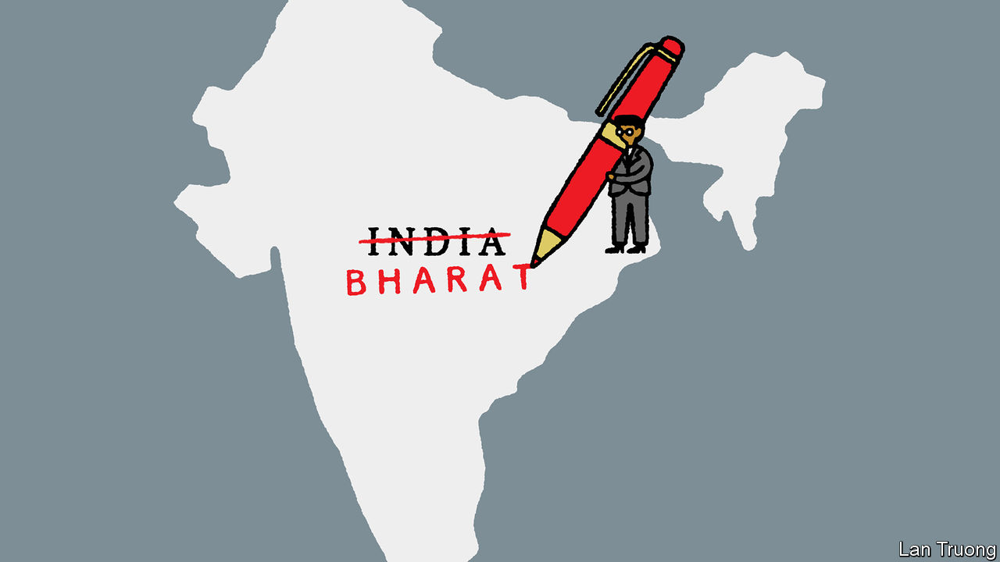

###### Banyan

# How Hindu is India’s foreign policy? 

##### A new book by the foreign minister explains diplomacy through the Ramayana 

 

> Jan 18th 2024 

The constitution of India begins: “India, that is Bharat, shall be a union of states.” Unable to agree on whether to use the English or Sanskrit name for the country, its authors included both. On the surface, the difference is no greater than that between Germany and Deutschland. But from the debates in the constituent assembly 75 years ago until today, India’s alternative names have been loaded with distinct meanings. One was imposed by a colonial power and is increasingly associated in India with an out-of-touch anglicised elite. The other is increasingly considered a true reflection of a proud, ancient civilisation. 

So it was significant when, at the G20 summit in Delhi in September, Narendra Modi, India’s prime minister, sat behind a nameplate that read Bharat, bolstering his credentials as a representative of the “real” India. In the same vein, a new book by Subrahmanyam Jaishankar, India’s erudite foreign minister, is called “Why Bharat Matters”. 

Mr Jaishankar deploys the Ramayana, one of two great Hindu epics, to illustrate the importance of allies, intelligence and a rules-based order. The Ramayana tells the story of Lord Ram, a noble king and avatar of the god Vishnu, who is forced into forest exile where he faces multiple travails, including the abduction of his wife, Sita, by the demon-king Ravana. For many Indians it is the ultimate story of the triumph of good over evil, and Ram the embodiment of honourable conduct. 

Mr Jaishankar’s previous book, “The India Way”, included a chapter that drew on the Mahabharata, the other great Hindu epic, and its lessons on statecraft. The central argument of that book was that India must resist pressure and chart its own course in a turbulent world. In the four years since it was published India has done so—in particular, by refusing to condemn Russia’s invasion of Ukraine even as it grew closer to the West in general and America in particular. 

India’s foreign policy must be based on “its own values and beliefs”, writes Mr Jaishankar in his new book, drawing “from the totality of its culture, heritage and traditions”. This is consistent with his previous volume, in which he lamented that “the standard American introduction to Indian strategic thought does not even refer to the Mahabharata”. He is right to stress the importance of understanding Indian culture. Whether or not they have actually read the epics, for many Indians the Mahabharata and Ramayana are at the heart of their conception not just of the cosmos but also of everyday conduct. 

Even so, the foreign minister’s efforts to assert the connection between Indian culture and policy become tautologous and hard to fathom. “India can only rise when it is truly Bharat,” he writes. And then again, after noting India’s increased global weight: “This is an India that is more Bharat.” Overall, he concludes, “with each passing day, it is becoming clearer that India matters because it is Bharat.”

It is tricky to know what to make of this—as the author concedes elsewhere. “Why Bharat Matters” is, as he explains in its opening pages, “a volume that is to be read between the lines”. Doing so suggests pretty standard realism, not Hindu mythology, is his guide. India’s foreign policy will be determined by its national interest, which will in turn be directed by the needs of most Indians. 

To Indians, Mr Jaishankar’s message is that their government will protect them from a dangerous world. He describes this as a corrective to the relatively weak counter-terrorism policies and idealistic internationalism of earlier Indian governments. Here, too, Mr Jaishankar’s mythological analogising can go overboard, such as when he describes “Ram Rajya” (the rule of the Lord Ram) as “the epitome of a rules-based order”. On January 22nd Mr Modi will breeze through the constitutional barriers between state and religion by consecrating a controversial new temple at the claimed birthplace of Ram in north India. For the one-fifth of India’s 1.4bn people not represented by what Mr Jaishankar calls the “totality” of India’s culture—which omits its Islamic, Christian, secular and liberal traditions—this will not be rules-based or reassuring.

Mr Jaishankar claims to describe two big policy shifts under Mr Modi. One, which is at least arguable, involves the replacement of an internationalist foreign policy with an India-first one. The other, the graduation from India to Bharat, is harder to grasp. But a third metamorphosis, also between the lines of the foreign minister’s tome, is indisputable. That is Mr Jaishankar’s development from a bureaucrat into a politician.■


