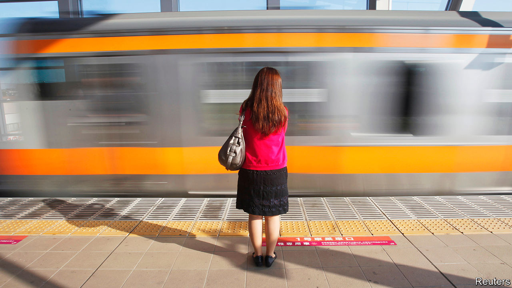

###### Housewives and work

# Married women in Japan are re-entering the labour market 

##### Legislators see them as the country’s hidden asset 

 

> Jan 18th 2024 

After graduating from college, Obora Shizue, now in her 40s, was building a solid career at an insurance firm. But after giving birth to her first child she became a full-time mother. “I wanted to keep working, but I suppressed those feelings,” she says. But unlike previous generations of Japanese women she was unwilling to stay at home. Eight years later, in 2015, she returned to work as a journalist.

Ms Obora represents a hugely important change. Female participation in Japan’s labour force used to be much lower than in other big rich countries. For decades most women quit their jobs after giving birth to their first child. Outdated tax and welfare systems, as well as cultural mores, underpinned this anomaly. But it is now becoming less pronounced. As Japan’s labour force ages and shrinks, women are playing a growing role in it. In 2022 the employment rate for women aged 25-39 surpassed 80% for the first time since records began. Meanwhile, the percentage of households with stay-at-home wives fell below 30%, another record.

A shift in cultural attitudes towards women and work underlies this change. As talent has become scarcer, working women are more prized. Japanese women’s high education levels make them well placed to take advantage of the shift: 53% of women go to university in Japan, compared with 59% of men. “Women are Japan’s hidden asset,” says Mori Masako, a former gender-equality minister.

But outdated family laws still serve as a barrier to women’s advancement. Japanese tax and welfare policies discourage married women from working. When “dependent spouses” earn less than 1.3m yen ($8,900) a year, they do not need to pay in to public-pension and health-insurance schemes. A government report published in October suggested that more than 1.1m working women were limiting their working hours and earnings in order to stay under that threshold. 

The ruling Liberal Democratic Party (LDP) is starting to take steps to tackle the issue. Last October the government introduced subsidies and other measures to alleviate the effects of the so-called “income wall”, which penalises women who go over the million-yen threshold. Experts reckon lawmakers will further chip away at the income wall next year, following a five-yearly review of the pension system. 

But such policy updates alone may not be enough to entice millions of Japanese housewives back to the workplace. Oshima Yasuko of Recruit Works Institute, a research outfit, reckons a bigger shift in corporate culture is needed. In a study in 2019, she showed that among housewives who re-entered the workforce some 30% soon quit because they found it difficult to balance work schedules with child-rearing and household chores. Re-entering the workforce after a pause is also hard because Japanese firms tend to look with suspicion on candidates with “blanks” in their résumé. Ms Obora, who suffered many rejections before landing her journalism job, describes how demoralising that can be. “I used to think if I become a housewife once, I’ll always be one.”

It would help if Japanese men and women shared their domestic burdens more equitably. In 2022 just 17% of men eligible for parental leave actually took it, compared with 80% of women. Among married couples, Japanese women spend five times more time doing chores than men (in Germany the gap is three times). When the government speaks of gender equality, “the emphasis always seems to be on making women do more,” says Mochizuki Rie, a former housewife who now works in marketing.

When Kishida Fumio, the prime minister, announced a plan last year to invest in “reskilling” for those on parental leave to support their transition to the workforce, many housewives complained that they were already overloaded with domestic work. “I used to think that being a housewife must be easy. I couldn’t have been more wrong,” says Ms Obora. Women such as her are part of a major, long-overdue socioeconomic change. More is required from both sexes to make it go faster. ■

