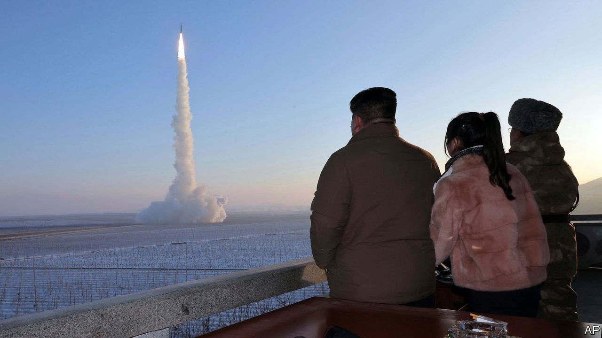

###### North Korean belligerence

# The Korean peninsula is as divided as ever 

##### But rumours of war are overblown 

 

> Jan 18th 2024 

Kim Jong Un, North Korea’s dictator, ended 2023 with war on his mind. Speaking to assembled party grandees on December 30th, he declared that the North and the South were now “two belligerents in the midst of war”. In early January he claimed to have no intention of starting a real conflict, but would have “no hesitation in annihilating” South Korea if it did.

Since Mr Kim’s bromance with Donald Trump, then America’s president, fizzled out after an ill-starred summit in Hanoi in 2019, such belligerence has become increasingly common. Hardly a month passes without Mr Kim testing fearsome weapons or threatening to annihilate South Korea. Yet a recent commentary published on the website 38 North by Robert Carlin and Siegfried Hecker, veteran North Korea-watchers , raised eyebrows by saying Mr Kim had made the “strategic decision to go to war”. That is hard to judge and perhaps overblown. Yet North Korea is certainly more threatening than ever and grows more dangerous by the day. 

Its war machine is getting stronger. In the past two years it has tested an unprecedented number of missiles able to fire nuclear weapons at South Korea and America. In November it put a military satellite into orbit, the first step towards building a network that would provide vital military information. Already in 2024 it has conducted artillery drills and a test of what state media claim is a solid-fuelled intermediate-range ballistic missile that is topped with a “hypersonic” warhead.

Accompanying this military build-up has been a hardening North Korean attitude towards the South. Reversing decades of policy, Mr Kim now claims that Northerners and Southerners no longer belong to a single Korean people and that talk of unification with the South’s governing “clan” is pointless. North Korean propaganda sites and radio stations targeting the South have gone dark. On January 15th Mr Kim ordered the closure of three departments that deal with the South. The Arch of Reunification, a garish monument to inter-Korean rapprochement straddling the motorway between North Korea’s capital and the demilitarised zone separating the two countries, will be torn down.

Yet none of this need suggest that Mr Kim really wants war. He is “more comfortable than ever”, notes Christopher Green of Leiden University in the Netherlands. China provides food and industrial imports to keep his country going. America, distracted by Ukraine, Israel and the Red Sea, pays it little heed. And North Korea’s new friendship with Russia is going swimmingly. On January 17th the two countries’ foreign ministers met to follow up on a pow-wow between Mr Kim and Vladimir Putin, his Russian counterpart, held last September. North Korean munitions have been sighted on the battlefields of Ukraine.

War would be costly and risky for Mr Kim, even in the unlikely event that America stayed out of it. Any victory would be pyrrhic. What could be more destabilising for his totalitarian regime than absorbing 52m people with a passion for democracy?

Mr Kim is probably sticking to North Korea’s pattern of using aggression to get leverage before eventual negotiations with America, says Go Myong-hyun of the Asan Institute, a think-tank in Seoul. Although America insists that denuclearisation must be on the table and North Korea clings to its nukes, neither side is keen to talk. But Mr Kim can afford to wait, perhaps for the return of Mr Trump. 

In 2010 North Korea shelled Yeonpyeong, a nearby South Korean island, killing four South Koreans. Robert Gates, then America’s secretary of defence, recalled in his memoirs how the South Koreans needed to be talked out of a “disproportionately aggressive” response involving artillery and air strikes, which he feared would trigger an escalation. Yoon Suk-yeol, now South Korea’s president, promised on January 16th to respond to provocations “with a punishment multiple times more severe”. Such an overreaction would be more likely to start a war than Mr Kim’s wild rhetoric about conquering the South. ■

