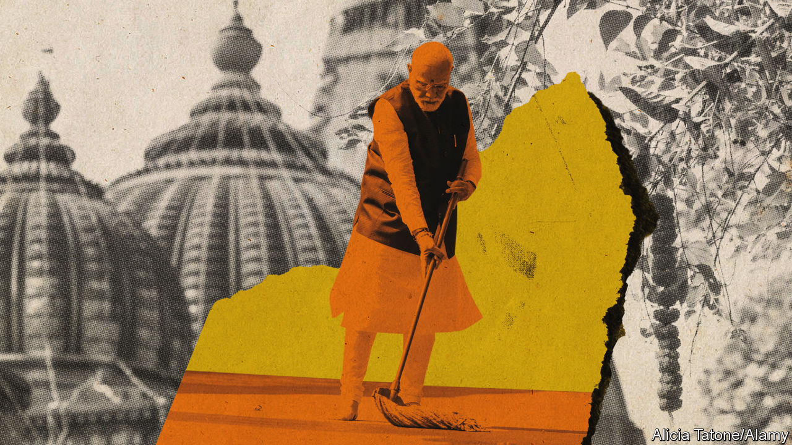

###### Invincible Indian

# Ram and the strongman: Modi looks unstoppable in India’s election 

##### But Indian democracy is stronger than it seems 

 

> Jan 18th 2024 

The CIty of Ayodhya is central to the story of Ram, one of Hinduism’s most revered deities. It is also central to the fortunes of India’s ruling Bharatiya Janata Party (BJP). Starting in the late 1980s, the BJP agitated for the replacement of a 450-year-old mosque in Ayodhya with a temple, because it occupied the spot where Ram had supposedly been born. In 1992 a mob worked into a frenzy by fire-breathing speeches by the bjp’s leaders did indeed destroy the mosque, prompting riots across India in which some 2,000 people, mostly Muslims, were killed. Since then, despite the bloodshed, the BJP has pledged at election after election to get the temple built. It is therefore hard to imagine a more triumphant moment for Narendra Modi, the prime minister, than the ceremony he will lead on January 22nd, when the long-awaited temple will at last be consecrated.

Unofficially, the consecration will also serve as the launch of the BJP’s campaign for the next national election, expected to be held over several weeks in April and May. Mr Modi has asked all Indians to celebrate the temple’s inauguration by lighting lamps, much as Hindus do on Diwali, a holiday that commemorates Ram’s triumphant return to Ayodhya after slaying the king of the demons. But only 80% of Indians are Hindu, and not all of them see the construction of the temple as a victory, let alone the 14% who are Muslim. Business tycoons and Bollywood stars will attend the consecration, to flatter Mr Modi, but most opposition politicians—and some Hindu priests—are staying away. 

 


To Mr Modi’s detractors, the fact that he would make the source of such bloodshed the centrepiece of his campaign is proof of his malign intentions. His blurring of religion, government and electioneering shows his disdain for India’s secular constitution and its strict campaign rules. Worse, they fear, if these abuses help propel the BJP to its third election victory in a row, as expected, Mr Modi will go further, and attempt to turn India into an authoritarian Hindu state.

But as true and troubling as it is that Mr Modi and his party deliberately stoke communal tensions and undermine institutions, Indian democracy is hardly a lost cause. The bjp is not as all-conquering as it first appears. Its vote share in a general election has never reached 40%, a mark its main rival, the Congress party, passed seven times in its heyday (see chart). Moreover, the bjp benefits as much from Mr Modi’s personal popularity and its superior electoral machine as from popular support for its ideology. And India’s institutions have survived worse abuses.

Amrit large

The bjp wants to create a national identity based on Hindutva, or Hindu-ness, that it says was suppressed for centuries by Muslim and British invaders. Hence the jamboree in Ayodhya, which is above all a rallying cry to the BJP’s electoral base. The guest list is dominated by leaders of the party and affiliated Hindu nationalist groups, including the Rashtriya Swayamsevak Sangh (RSS), a sort of pious cadet corps, and the Vishva Hindu Parishad (VHP), which launched the temple-building campaign. 

The ceremony concludes “500 years of continuous struggle for Hindus”, says Champat Rai, the VHP’s vice-president and general secretary of the trust building the temple. The event, he says, will send a clear message to Indian Muslims: “They should search for their roots: who were they four or five hundred years ago?” They were Hindus, he continues, and should “say that this land is our mother”.

But Hindutva is not the only thing the BJP cares about in Ayodhya. It is also boosting the local economy by pouring $9.6bn into development schemes, including a new airport and a new railway station. It has grand plans to turn the city into a tourist hotspot, with a Ram “experience centre”, a fountain park, some 60 hotels and “patriotic” wedding venues.

The city thus neatly captures the BJP’s sales pitch: that it is building a prosperous, confident new India by restoring Hinduism to its rightful place as the bedrock of society. The violence of 1992 was a “sad moment”, says Ayodhya’s BJP mayor, Girish Pati Tripathi. “But Indian civilisation has passed it. We’re moving forward. Why are Muslims worrying so much?” 

This blend of economic development and Hindu revivalism is an appealing formula for many, especially in Hindi-speaking northern and central India. Pollsters believe it will win the BJP another majority in the Lok Sabha, the 543-seat lower house of Parliament, either on its own or as head of a coalition. That would make Mr Modi India’s only prime minister to win three consecutive terms since the first, Jawaharlal Nehru of Congress. 

Mr Modi, who is 73, is another of the BJP’s strengths. The image he has cultivated—muscular, pious and avuncular—appeals across India. His humble origins as the son of a tea-seller strike a chord with poorer Indians. His nationalist rhetoric resonates with the aspirational middle class. His reputation as an adept, industrious administrator appeals to the wealthy. Many also applaud his efforts to raise India’s international status. Mr Modi’s popularity accounted for up to a third of the BJP’s votes in the most recent national election, surveys suggest.

No Meru accident

Mr Modi has not earned this reputation by chance, of course. The BJP carefully cultivates it, in part by strong-arming media to ensure positive coverage. In July a survey of Indian journalists showed that 82% thought their employers favoured the BJP. The party also enhances Mr Modi’s image by attaching his name and face to popular government programmes.

Above all, the BJP has a clear organisational edge. The party claims to be the world’s biggest, with over 180m members, including 100m “active” ones (China’s Communist Party has 98m). Verifying that is hard: a call to a toll-free number is all that is needed to join. Still, academics who study the BJP say it can mobilise vast cohorts of party workers and volunteers, many of whom also belong to other Hindu nationalist groups. Managing them using a dedicated website and smartphone app, it appoints several to oversee each of India’s million-odd polling stations, and even individual polling booths within them, with a party worker responsible for each page of the electoral roll. 

Among them is Sachin Nahar, a 39-year-old Hindu farmer in the central state of Madhya Pradesh. Like his father and grandfather, he joined the RSS as a child, attending weekly sessions of exercise and political discussion. He then volunteered as a BJP booth worker in 2013 and now oversees 30 voters. He regularly visits them in person, adds them to WhatsApp groups and ensures that they turn out to vote.

For Mr Nahar Hindutva is central to the BJP’s message. He reminds voters that Mr Modi has fulfilled many long-standing Hindu-nationalist demands, such as ending the special constitutional status of India’s only Muslim-majority state, Jammu &amp; Kashmir, and getting the temple in Ayodhya built. He and other BJP supporters in his constituency, which is 11% Muslim, are celebrating the temple’s consecration with daily marches during which they chant, “Jai Shri Ram” (“Victory to Lord Ram”). As for the future, he hopes—and tells voters—that the BJP will replace more mosques with temples and scrap special laws for Muslims regarding inheritance, divorce and other family matters. 

But the bjp arms him with more than talking points about communal disputes. It also provides a completely different means to target voters, by giving him a list of the beneficiaries in his district of various forms of government welfare. Under Mr Modi the government has rolled out new digital identification, payment and data-management platforms which allow most Indians to access public services and receive direct cash transfers from the state. Mr Nahar highlights this system in his outreach, crediting the prime minister.

The BJP is equally organised and efficient when it comes to social media. It claims only 20 people work in its National Digital Operation Centre, producing posts for its official accounts and trawling platforms for BJP-friendly content to promote. The heavy lifting is done by an army of volunteers (the party says it does not pay them), who help circulate official BJP content and create material of their own. 

These digital campaigners often use WhatsApp, even after Meta, its parent company, tried to counter disinformation by restricting mass messages. “We invite like-minded people to the group, they invite their friends, they make separate groups and invite more people, and so it spreads,” says Rathan Ramesh Poojary, a BJP media co-ordinator in Karnataka. He denies responsibility when volunteers advocate violence against Muslims: “We don’t support killing.” Still, he admits, “These guys support our ideology.”

The popularity of the BJP’s Muslim-bashing puts opposition parties in a bind. Most are reluctant to denounce Hindutva policies for fear of irking Hindu voters. In fact, some Congress leaders have embraced “soft Hindutva”—visiting temples, building statues of Hindu deities and schmoozing with holy men. So far, that has annoyed secular and non-Hindu supporters without luring many votes from the BJP.

But Hindutva presents problems for the BJP as well. Its appeal is much more limited in south India, where Islam arrived not by conquest but with proselytising merchants. Hindu reformist movements have more influence in that part of the country and fewer people speak Hindi, in which the bjp’s leaders deliver their fiery speeches. The BJP no longer runs any of the region’s states, having lost an election in May in Karnataka to Congress. And of the 130 seats representing South India in the Lok Sabha, the BJP holds only 29. 

That helps explain why the bjp is not really the overwhelming force it appears. Its share of the national vote in Mr Modi’s first election victory, in 2014, was only 31%. At the most recent national election, in 2019, it improved to 38%, still well short of a majority. If anything, Indian politics has become more competitive over the years, as Congress’s star has faded and other parties, including the bjp, have grown bigger. The bjp is just remarkably good at translating its plurality of the vote into thumping parliamentary majorities, aided by India’s first-past-the-post electoral system.

Were the opposition less divided and disorganised, the BJP would have much more of a fight on its hands. The most obvious problem is Congress’s ossified structure, epitomised by the dynasticism at the top. The party’s most prominent leader is the 53-year-old Rahul Gandhi, whose father, grandmother and great-grandfather all served as prime minister. He has recently become more confident, but has always seemed ambivalent about politics—not surprisingly, given that both his father and his grandmother were assassinated.

Yet Congress has hemmed and hawed about replacing him and, to the extent that it has done so, has plumped for an even less inspiring figure. In 2022 it chose a party veteran, Mallikarjun Kharge, as its first leader from outside the Gandhi family since 1998. He also heads the opposition’s 28-party Indian National Developmental Inclusive Alliance. At 81, though, he lacks the charisma and vigour to challenge Mr Modi. And both Mr Gandhi and his mother, Sonia, remain very much on the scene.

A similar dynamic plays out in the lower echelons of the party. Whereas the bjp is ruthless about sidelining unpopular veterans and picking candidates based on their electoral prospects, Congress is dominated by ageing stalwarts who resist both new blood and new tactics. That, in turn, causes bright young things to defect to the BJP, where their prospects for advancement are much better.

When Congress does appoint younger, more charismatic leaders and uses modern election techniques, it can do well. It won state elections in December in Telangana, for instance, helped by both a fresh face as local party leader and by the number-crunching of Sunil Kanugolu, an election-data specialist. But the party lost two other state elections held at the same time, in which local party chiefs of long standing declined Mr Kanugolu’s help. 

Congress is trying fitfully to reform. It has initiated a recruitment drive to expand its membership beyond the current 60m and launched an app for members, much like the BJP. It remains a contender, even in the Hindi-speaking heartland. Its average vote share in the three state elections there in December was 41%, not so far from the BJP’s 46%. In fact, it had led two of the three outgoing state governments, so could hardly be described as a long-spent force.

None of this, of course, excuses the underhanded methods Mr Modi uses to retain power. He has a troubling record of eroding democratic institutions. His government has harassed and jailed journalists and activists. It has undermined the independence of the judiciary and the Election Commission. Its investigative agencies have targeted opposition leaders. In December an astonishing 146 opposition MPs were suspended from Parliament. 

Opposition leaders are billing the coming election as a fight for the “soul of India” and a turning point in a global struggle between freedom and autocracy. They fear that Mr Modi wants to change the constitution to purge secular language and empower the executive. A revision of electoral boundaries, due in a couple of years, could facilitate that by expanding the Lok Sabha to around 750 seats, with most new ones going to the BJP’s strongholds in the north.

Opposition parties are attempting to fight back, in part by promoting themselves better. The digital id and payments system for which the BJP takes credit was in fact initiated under Congress; Mr Modi oversaw only the final stages of its roll-out but receives endless adulation for it. Schooled by such experiences, opposition parties are trumpeting welfare schemes run by state governments they control. 

Kailashings of failings

The opposition also decries Mr Modi’s failures, including the sudden withdrawal of most banknotes in 2016, the ditching of agricultural reforms after protests in 2021 and a botched response to the pandemic. Several of the BJP’s promises, to double farmers’ incomes, for example, and to boost manufacturing as a share of GDP, remain unmet. By some measures the economy has done  than under the previous Congress government. 

Another potentially potent line of attack is Mr Modi’s close relationship with a handful of Indian tycoons, especially Gautam Adani, whose conglomerate was accused a year ago of fraud and insider trading by a short-selling firm based in New York (Mr Adani denied the allegations). Indian voters dislike cronyism and punished the previous Congress government after a series of corruption scandals.

 


Yet the opposition has not landed many punches. That is partly owing to Mr Modi’s reputation for probity. Mainly, however, the opposition has not united around a single message or, critically, a single slate of candidates. Such a seat-sharing agreement could dramatically alter the electoral arithmetic, turning the BJP from the favourite to the underdog in many districts. But it would require strong, decisive party leaders, able to impose unpopular choices on the lower ranks. In Congress’s case, neither Mr Kharge nor Mr Gandhi fits the bill.

Some opposition politicians have concluded that, after 25 years of messy coalition governments from 1989 to 2014, India has reverted to the “dominant party system” of the prior four decades. Back then, Congress won big majorities and ruled with few constraints. It often passed laws and constitutional changes to empower the central government and so get its way. It sometimes resorted to abject authoritarianism. Most notably, Indira Gandhi, Rahul’s grandmother, cancelled elections, jailed critics and suspended civil liberties during the Emergency of 1975-77. 

The pessimists should remember, however, that India’s democracy managed to correct itself. Mrs Gandhi lifted the Emergency under pressure from courts, students and political allies. She lost the subsequent election, badly. And although Congress soon returned to power, it could not reverse a long-term decline caused largely by its over-reliance on charismatic, centralised leadership. That may be scant comfort for opposition parties facing another drubbing—but it should be food for thought for the BJP. ■


