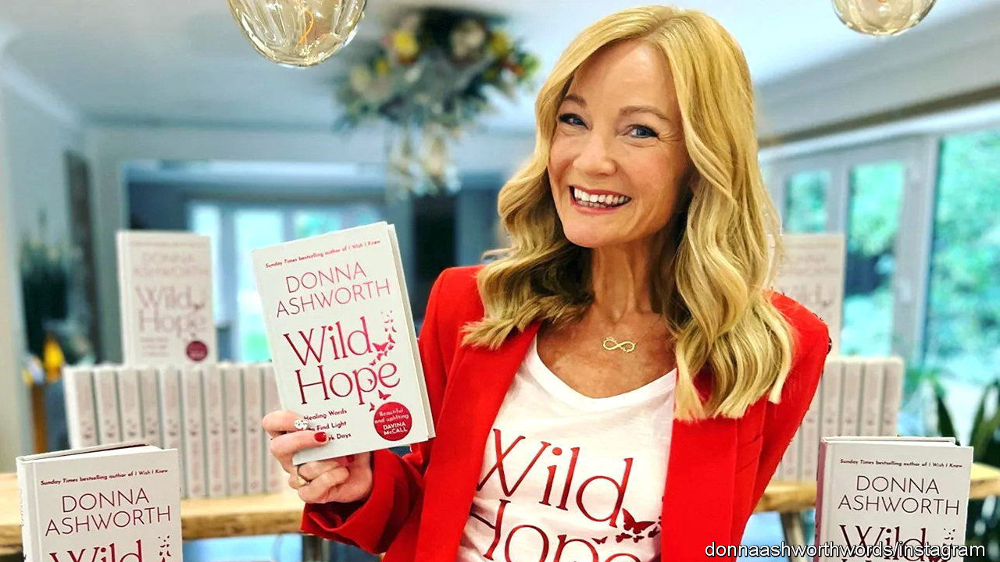

###### Getting verse

# Britain has seen an alarming rise in poetry sales 

##### Instagram poets are / behind a rise in revenue / and platitudes 

 

> Jan 15th 2024 

Donna Ashworth, a British poet, loves words. You can tell because on her website she calls herself “Donna Ashworth—Author and lover of words”, doubtless to distinguish herself from all those other authors who don’t like words. But Ms Ashworth loves so much more than words, for, as she says, “what are we here to do, if not love?” So she also loves our “magical” planet, and being kind, and wrinkles, and the child within us all and . 

It goes without saying that she loves motherly love. A mother’s love for her son is “like a beautiful black-hole”, which is not a line to run past an astronomer. Or a Freudian. She loves hope (“It is the light”), ageing and stretch marks (for they are “by Mother Nature’s paintbrush”). The overall effect feels less like poetry than as though ChatGPT has been asked to produce inspirational fridge magnets. 

But people love her back. Ms Ashworth’s writing is, as one fan says, “like a warm hug”, which is not something anyone ever said of Philip Larkin, a misanthropic English poet. Then again, people do not buy Larkin in their droves. In early January “Wild Hope”, the latest of Ms Ashworth’s eight books of poetry, reached number seven on the Amazon bestsellers list. It is one of a handful of books behind a rise in British poetry sales: 2023 was the highest since records began. Which is to say, still very low (at £14.4m, or $18.2m, according to Nielsen BookData). Britain may occasionally produce very good poets but Britons are not much interested in them, and they certainly don’t pay to read them. 

Poets used to be marketable. Lord Byron—often described as the first celebrity—could sell 10,000 copies of a poem in a single day; in the 20th century a book by John Betjeman could shift 2.5m copies. Modernism may be partly to blame for the decline, says Jonathan Rose, a professor of history at Drew University, since it aimed to make literature deliberately difficult and “frown[ed] on anything that…was relatively easy to appreciate”. High-minded imprints still publish poetry by clever sorts sounding glum and using words like “quixotic”. Almost no one buys them. 

Ms Ashworth does sell, and not just on paper. She is one of a number of poets for the Instagram age who market their work via social media (where she has 1.6m or so followers) and on websites. The poems may be of variable quality but the accompanying products are lovely. Ms Ashworth’s website offers a “Wild Hope” tote bag (£8), scented candle (£30) and hoodie (£58); the site of a Canadian poet, Rupi Kaur, offers not only books but a signed tapestry ($100); a T-shirt ($45) and a box of cards titled “Writing Prompts Self-Love”. Not a phrase you find in Virginia Woolf. 

The problem with Instapoetry is not that it is full of nice words. Poetry has always allowed for prettiness: who knows, or frankly cares, what “In Xanadu did Kubla Khan” means when it sounds so good? The problem is that it doesn’t feel true. Larkin gives the reader a shiver of pleasure not because his lines are nice but because they are spot-on. Perhaps Instagram account-holders do indeed look at their stretch marks and see “Mother Nature’s paintbrush”. It seems much more likely that they just think, “Damn”. 

Yet comparisons can also be unfair. As Ms Ashworth writes in a poem called “Youier”, imagine “if snow didn’t dare to fall / because rain was if planets did not glow / because stars were You should, she says, “stop all that folly”. And no one said a word than that. ■

 


