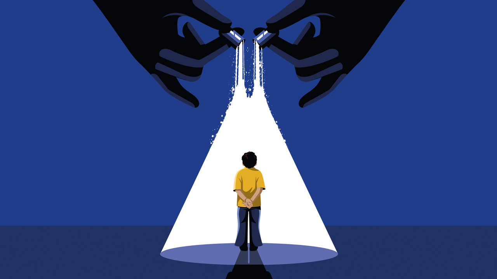

###### Notes on a scandal

# Britain tries to correct the treatment of gender-dysphoric kids 

##### But puberty blockers are still available from private providers 

 

> Jan 18th 2024 

“YOU ARE the expert in your gender experience.” So says GenderGP, a private provider of cross-sex hormones. This is a nod to the “affirmation” model of transgender medical care, which originated in America and uses a patient’s self-diagnosis as the starting-point for treatment. It is also, inadvertently, a nod to gender stereotypes. Humans are male or female and some have more of the traits that are traditionally associated with the opposite sex than others. A small number, some of whom feel great distress, believe these traits define their “gender” and take drugs or undergo surgery to make them resemble the opposite sex. 

If they are adults that is entirely their business. But GenderGP’s online “appraisal pathway” is also designed for children. The question, “What would you like GenderGP to help you with?”, is followed by a list of options including “puberty blockers”. These drugs, which are used to treat some cancers and precocious puberty (a rare condition), are now also given to children with gender dysphoria, the painful feeling of being in the wrong body. They are not licensed for this use, which means there have been no trials; anecdotal evidence suggests that, when taken in adolescence, they can cause sterility and anorgasmia. Britain is one of several countries trying to curb their use. 

The existence of outfits like GenderGP, which was founded by a British doctor and is based in Singapore, show how difficult this is, and not just because such private providers exist. It is also because gender ideology—the idea that a person’s innate “gender” can be more important than their biological sex—has taken deep root in public institutions. Until recently the affirmation model dominated the treatment of gender-dysphoric patients in the National Health Service (NHS). It has also influenced the way schools respond to such children. 

Britain is not the only place to have been affected. In January the un special rapporteur on violence against women and girls criticised the World Health Organisation (who) over plans to draw up guidelines on medical transitioning. Not one member of the committee appointed to do this represented “a voice of caution for medicalising youth with gender dysphoria or the protection of female-only spaces,” she said. The who later said its guidelines would not cover children.

Britain is trying to counter this ideology. In 2020 the nhs commissioned Hilary Cass, a respected paediatrician, to review the treatment of children and young people with gender dysphoria. Her final report is expected early this year. An interim report, published in 2022, made worrying reading. It suggested that a disproportionate number of patients at the nhs’s specialist youth gender-identity clinic in England, the Gender and Identity Service (gids) at the Tavistock foundation trust in London, were autistic or in care. gids, which failed to undertake proper record-keeping of its young charges, is no longer accepting new patients; it is in the process of being closed down and will be replaced by regional clinics.

Dr Cass said too little was known about puberty blockers’ effects, including on brain development. Although they are often described as providing a “pause button”, the vast majority of children who take them proceed to cross-sex hormones. These can cause myriad health problems. The nhs has since recommended that blockers should only be prescribed to dysphoric under-18s in trial conditions. 

This has prompted some doctors (including at least one who used to work for gids) to set up privately. No one knows how many children have obtained blockers this way; anecdotal evidence suggests that long waiting lists at gids have pushed an increasing number to go private. 

Treatment is only part of the problem, though. Action is needed outside health care to tackle what Maya Forstater, executive director of Sex Matters, a campaign group, calls a “school-to-clinic pipeline” of patients. Some schools have allowed pupils to change their names and pronouns, a process known as “social transitioning”, without their parents’ knowledge. Dr Cass warned that social transitioning was no “neutral act” but could affect “psychological functioning”.

In December the Department for Education published new draft guidance for schools. It is designed to counter the influence long exerted by trans-activist organisations, whose lesson plans have taught innumerable children that human beings can change sex. The new guidance makes clear that this view is unscientific and schools should not promote it. 

It says schools should work with parents rather than letting children change gender without their families’ knowledge. The guidance also makes clear that the law—and safeguarding—requires schools to maintain single-sex toilets, sleeping arrangements and sports. The guidance was welcomed by Labour’s shadow education secretary. Given that many Labour politicians once routinely repeated the talking points of trans activists, this shows a political shift is well underway. 

There is still a long way to go, though. In August nhs England published new guidance saying health-care professionals should consider sexual orientation, mental health and education when treating gender-dysphoric children. But when children turn 17 they are moved to adult gender services. That means that teens who have long identified as trans, and been on a waiting list for treatment, risk missing the nhs’s reversal of thinking and being prescribed cross-sex hormones. If they had been born a few years later their experience would have been very different. ■


