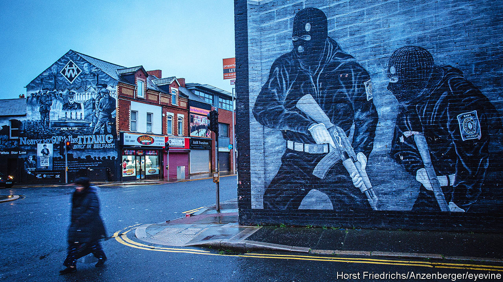

###### Still troubled

# Northern Ireland’s peace process is not over 

##### Compensation payments and amnesties cause fresh controversy 

 

> Jan 18th 2024 

More than 3,500 people were killed in Northern Ireland during the 30 years of violence known as . Although those killings stopped 26 years ago, the conflict has never truly ended. The 1998 Good Friday Agreement saw (pro-British) unionists accept that the political representatives of the Irish Republican Army (IRA), the largest terrorist group, would enter government. Nationalists accepted that Northern Ireland would remain British unless a majority of its inhabitants voted for their cause of a united Ireland. 

These political compromises have largely worked, but they came at the expense of victims. All paramilitary prisoners were released from jail, for example; anyone subsequently convicted would serve no more than two years in prison. Some thought that the passage of time would smooth these injustices away: as victims and their relatives died, the problem would fade. It has not. A sense of injustice does not die with an individual; families took up their cases through the civil courts or in media campaigns. Constant anniversaries of atrocities mean that the past is always present. Prosecutions of British army veterans have still been happening. The moral questions raised by the Troubles are powerfully alive.

One such question is over state compensation to victims of the violence. Although payments were made during the early years of the Troubles, they were often paltry: one bereaved family had their loved one’s life valued at just £44.62 (worth £403.29, or $511, now); another family got £90. But righting such wrongs is hard. Even the most basic question—who counts as a victim and who as a perpetrator—is a source of continuing controversy. 

Since 2006 the law has deliberately defined victims so broadly as to include a bomber blown up by their own bomb. On January 2nd Ian Jeffers, the province’s outgoing victims’ commissioner, proposed a payment of at least £10,000 to each close relative of those killed during the Troubles, including to the families of killers.

That date was already painful for Jennifer Jordan; on the same day 44 years earlier, her father had been murdered by the IRA. In all, she lost six relatives in the Troubles. She is incredulous: “What other country in the world would do that? You might as well say that the families of the 19 hijackers on 9/11 will get a payment for blowing themselves and other people up. It’s the same principle. How ridiculous is that?” 

Now 75, Ms Jordan says she wouldn’t accept the money if it was offered, regardless of who was to get it, because it attempts to put a price on the lives of her loved ones. But she accepts that some other victims think there can never be a fair compensation scheme and are wearily resigned to money being paid to murderers’ relatives. 

A second source of controversy is a “legacy law”, passed by the British government in September 2023, which in effect gives an amnesty to Troubles-era killers. The law created a body that will examine deaths and very serious injuries caused during the conflict and give “conditional immunity” to those who co-operate with it. All other bodies will be statutorily barred from investigating such cases; the law also ends all civil actions and outstanding inquests dating from the Troubles.

The law was driven more by the Tory government in Westminster than sentiment in Northern Ireland, where it is almost universally opposed. Several British army veterans, including soldiers accused of being responsible for the “” massacre of civilians in Londonderry in 1972, are now being hauled in front of the courts. Critics say that an amnesty for everyone is designed to make the threat of such prosecutions go away.

There is an enlightened case for such a bill. Only a handful of people will now be successfully prosecuted because of the passage of time. The police and courts are spending considerable resources on crimes from half a century ago. The amnesty requires killers to tell the truth about what they did, freed from the fear of prosecution. If justice is unlikely, truth would at least be something. That may be unrealistic, however. Is a killer ever going to admit, even to himself, the full ugliness of sectarian assassinations? Will a soldier really admit they deliberately targeted a civilian?

The law is now being fought over in the British courts; a second legal front opened up in December when the Irish government in Dublin launched a challenge to it at the European Court of Human Rights. That has enraged the British government, which in an undiplomatic statement accused Ireland, in effect, of hypocrisy since it has no stomach for prosecuting IRA killers in its territory. The statement highlighted the words of Michael McDowell, a former Irish attorney-general, who said in 2021 that there had been “a de facto moratorium on investigation and prosecution of IRA members” after 1998. Labour, which is likely to be in power within a year, has pledged to repeal the law on the grounds that it is wrong in principle and commands no support within the province. 

Tim McGarry, a comedian from Belfast, once joked that the definition of success in Northern Ireland was “passed off peacefully”. In that regard, the past 26 years has been thoroughly successful. Despite episodic rioting and killings, the violence of the Troubles is long gone. Northern Ireland has had  for two years because of a dispute about post-Brexit trade borders; a huge public-sector strike over pay took place on January 18th. But in the context of even recent history the province is in an enviable position. 

The unresolved injustices of the conflict are not about to reverse these achievements. But they do have a unique ability to poison the mood, especially if still-violent dissident republicans can stoke the idea that Britain is giving its soldiers an amnesty for their role in atrocities. And the ugly truth about Northern Ireland’s peace process is that an end to the violence involved buying off lots of nasty people and turning a blind eye to others. As a result, the people who had already been hurt the most are also the most likely to suffer now. ■


