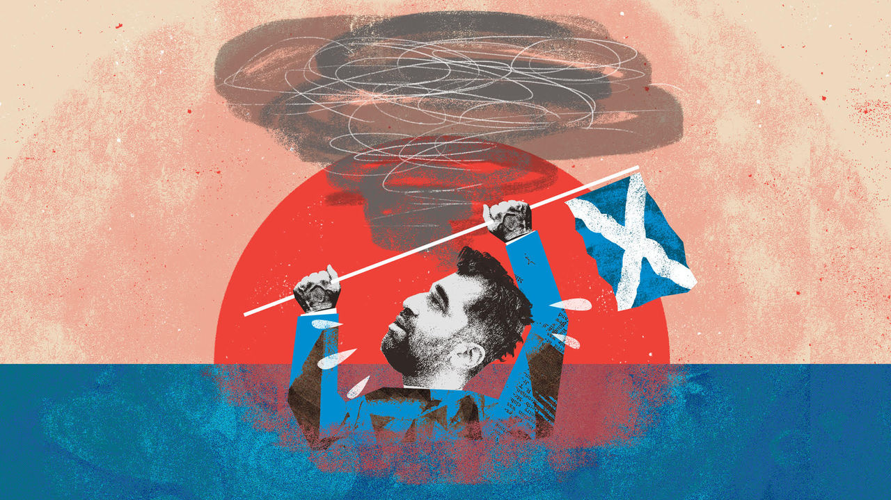

###### Bagehot

# Scottish nationalism’s left turn 

##### Humza Yousaf tries to fight off a resurgent Labour Party 

 

> Jan 18th 2024 

BIDENOMICS has many fans. The newest is Humza Yousaf, the first minister of Scotland. In a speech on January 8th he praised the Biden administration’s revival of industrial strategy and the “great force and clarity” of its vision. He noted approvingly the Inflation Reduction Act, a vast package of manufacturing tax breaks, and the CHIPS Act, intended to bring semiconductor-makers to America. Here was a blueprint for an independent Scotland. With oil revenues and borrowing powers, he said, a new nation would plough £2bn a year ($2.5bn, 1% of gdp) into green energy. 

As policy, this is . No one in the Scottish National Party (SNP) really thinks that independence is coming any time soon. Momentum has been stalled, first by a ruling in 2022 from Britain’s Supreme Court that a unilateral referendum would be unlawful and then by a party-finance scandal involving Nicola Sturgeon, Mr Yousaf’s predecessor. America can indulge in protectionism and splurge on subsidies because it has a vast domestic market and the world’s reserve currency. Scotland’s population is little larger than South Carolina’s, and nationalists can’t agree on what currency their new state would use.

As politics, however, it adds up. For Mr Yousaf is in trouble. The SNP’s monopoly on pro-independence voters is slipping: between May 2022 and November 2023, its share of those who voted “Yes” in the 2014 referendum fell from 81% to 69%. These voters are leaching to Labour, which presents itself as the surest route to an end to Conservative rule from Westminster.  has Labour holding a narrow lead over the SNP, which would mean heavy losses in an election. In the short term Mr Yousaf would then face the sack, say his SNP colleagues. In the long term a Labour government supported by a raft of Scottish Labour MPs would puncture nationalism’s most potent claim—that the union condemns Scotland to governments it doesn’t elect.

Mr Yousaf’s answer is to tack to the left, and dress the SNP up as more Labour than Labour. Sir Keir Starmer is on track for power come what may, the argument runs, but he is so compromised by fear of alienating English swing voters that he might as well be a Tory. Note, says Mr Yousaf, how Labour won’t reverse Tory welfare cuts and is already trimming back its own Bidenomics-inspired industrial strategy. Wince as Labour shuns the idea of rejoining the EU; gag at it refusing to support a ceasefire in Gaza. 

This is not just rhetoric. Mr Yousaf has kept a promise to trade unionists in last year’s SNP leadership contest that he would squeeze high earners. Income tax elsewhere in Britain falls into three bands, at 20%, 40% and 45%. Scotland now has six. A new 45% rate was introduced in a budget in December on incomes between £75,001 and £125,140; the top rate was increased from 47% to 48%. Anyone earning over £28,850 pays more in Scotland than they do elsewhere in Britain; the marginal rate on earnings of £100,000-£125,000 (adjusting for national-insurance contributions and tax allowances) is now 69.5%, compared with 62% in England. Other left-leaning measures pile up. Temporary rent controls, introduced as inflation rose, are to become permanent in spite of evidence they have not worked. New levies are planned on supermarkets that sell alcohol and tobacco. 

This agenda is justified by a notion of Scottish exceptionalism, which draws a cartoonish contrast between Scotland’s “social contract”, where the wealthier “are asked to pay a bit more”, and a supposedly crueller England. Such exceptionalism is also central to the pitch for independence, which Mr Yousaf says will be “page one, line one” of the SNP manifesto. Yet it is increasingly difficult to get the sums behind this social contract to add up. 

The Scottish government still depends on money from Westminster for much of its spending. The SNP boasted of having averted strikes by handing doctors the biggest pay deals in Britain; that will be hard to reconcile with next year’s tight budget settlement, says the Institute for Fiscal Studies, a think-tank. Free university places, one of the SNP’s crowning glories, will have to be cut back. 

The new income-tax increases are not going to change this picture materially. The 48p rate will fall on just 40,000 earners; a notional yield of £53m will become a nugatory £8m once behavioural changes are accounted for, reckons the Scottish government’s official forecaster. Banks and doctors’ groups warn of employees heading south. The underlying problem is a tax base that has grown more slowly than England’s since devolution, due to an ageing population and fewer people in work. Mr Yousaf has spent a lot of political capital on a hike that raises little real capital.

No more Celtic tiger 

Far from uniting all nationalist voters, Mr Yousaf’s leftward tilt has left many of his colleagues unconvinced. Nationalism’s success has been its heterogeneity and flexibility: socialists and libertarians parked their differences until after independence day. Alex Salmond, the first minister from 2007 to 2014, wanted to emulate Ireland and slash corporation tax. Ms Sturgeon, Mr Yousaf’s mentor, styled herself a Nordic social democrat, and displaced Labour as Scotland’s centre-left party after the 2014 referendum. But she was also assiduous in reassuring the aspirational “middle Scotland” of professionals and public-sector workers living in new-build estates that nationalism would not bankrupt them. 

Those voters deserted the SNP at in October. The free eye tests and prescriptions afforded by the SNP’s social contract are all very well if they are funded by fiscal transfers from London; paying substantially higher taxes than the English may be another matter. Relationships with business have become frosty; donations have dried up. Perhaps, says one nationalist, Mr Yousaf might have been able to sell his colleagues on a core-vote plan to outflank Labour if it had been more coherent and better executed: “You’re too kind in calling it a strategy. It’s a drowning man grasping at anything.” ■


