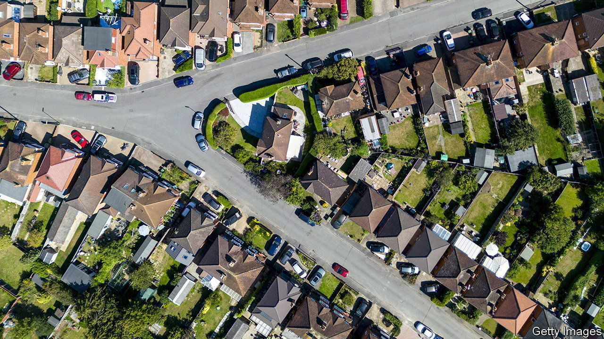
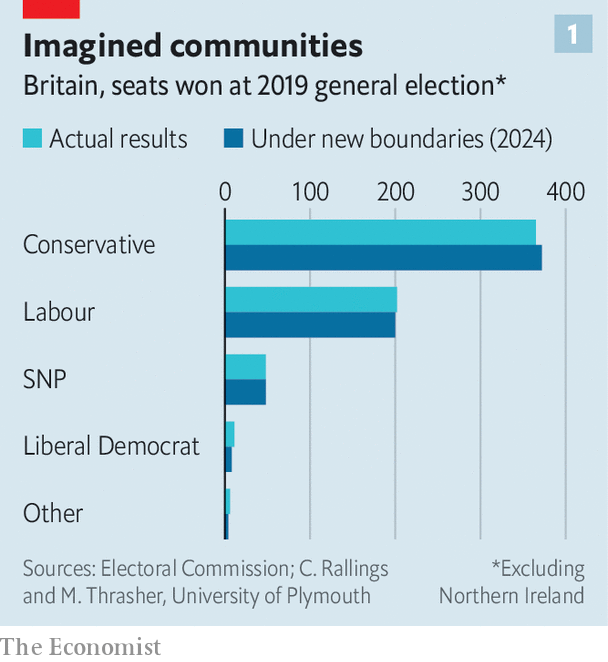
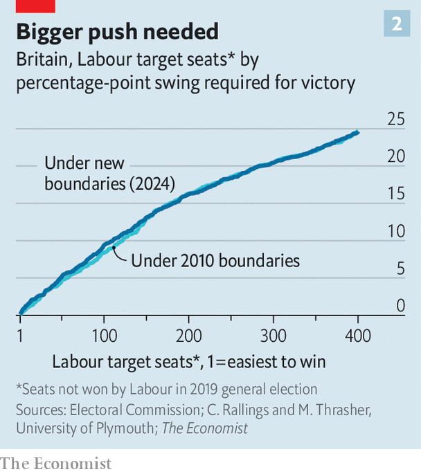

###### Constituency cartography

# The map for the next British election has been redrawn 

##### It makes Labour’s job of winning tougher 

 

> Jan 16th 2024 

Lines on maps matter—to security, to identity and to elections. In 2023 the boundaries of Britain’s 650 constituencies were revised for the first time since 2010. Unlike redistricting in America, the exercise in Britain is determinedly non-partisan. Its effects are not. New data released on January 16th cast some light on how these new boundaries will affect MPs’ prospects of re-election.

With a few exceptions the new boundaries follow a simple rule, laid down in 2020: to keep the number of electors in each constituency within 5% of 73,393, while staying faithful to geography. The process was run by  in each of Britain’s four nations. Political parties took part. But Glenn Reed, from the Boundary Commission for England, says that the consultations gave as much weight to the views of Joe Public as to, say, Tory campaign headquarters. He says that the borders of one constituency in Devon were amended on the back of one individual’s persuasive argument at a town-hall meeting. 

The changes are substantial. Greater absolute population growth in the south of England means that this region will have 15 more MPs at Westminster after the next general election. Wales will have eight fewer; Scotland two fewer. The equalisation rule means that most constituencies’ borders have been altered. Only 65 were spared the red pen. 

Outside Northern Ireland, where the differences from 2010 are marginal, the population of electors in the remaining 554 seats is, on average, 20% different from those inside the old boundaries. Fully 265 old constituencies have been split into entirely new areas. The 59,000 former constituents of Ogmore in south Wales, for example, have been scattered among five newly created constituencies, from Cardiff to the Rhondaff.

To see how the new boundaries affect parties’ prospects, psephologists have tried to work out how each of them would have fared if the boundaries had applied at the last general election, held in 2019. Colin Rallings and Michael Thrasher, both professors of politics at the University of Plymouth, have this week published such estimates on behalf of Britain’s three largest broadcasters.

 


The pair calculate that the Tories would have won seven additional seats in 2019 under the new boundaries, taking their total to 372 (see chart 1). The allocation of more seats in the south of England means they have notionally “gained” 11 there. The Labour Party, whose 202-seat total in 2019 marked its worst election performance since 1935, would have won two fewer seats overall. 

 


In theory the changes make it harder for Labour, now led by Sir Keir Starmer, to achieve a majority. The seats at the top of its target list have become a bit harder to win (see chart 2). Messrs Rallings and Thrasher calculate that whereas the party would have required a 12.0-percentage-point swing from the Conservatives under the old boundaries, it now needs a 12.7-point swing. That is equivalent to winning 4m more votes than in 2019. 

These are not the only changes to the electoral map. A law passed in 2022 means that British citizens who left the country more than 15 years ago can now sign up to vote in the constituency where they were last registered. The government reckons that an extra 2.3m people are eligible to cast ballots as a result; based on how many eligible overseas voters actually registered ahead of the election in 2019, that would mean perhaps 500,000 more people on the rolls. 

None of this is likely to dismay Sir Keir too much. According to ’s , the latest opinion polls imply a 14-percentage-point swing to his party since 2019; Labour’s vote will be more efficiently spread than it was then. A large poll released by YouGov this week suggested that the Tories would lose 196 seats if an election were held now, their worst result since 1997. The new boundaries may have given Tory MPs a little edge. It won’t make them less twitchy. ■


