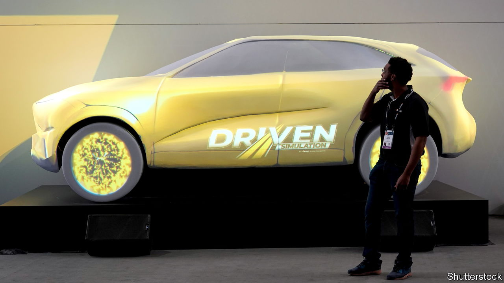
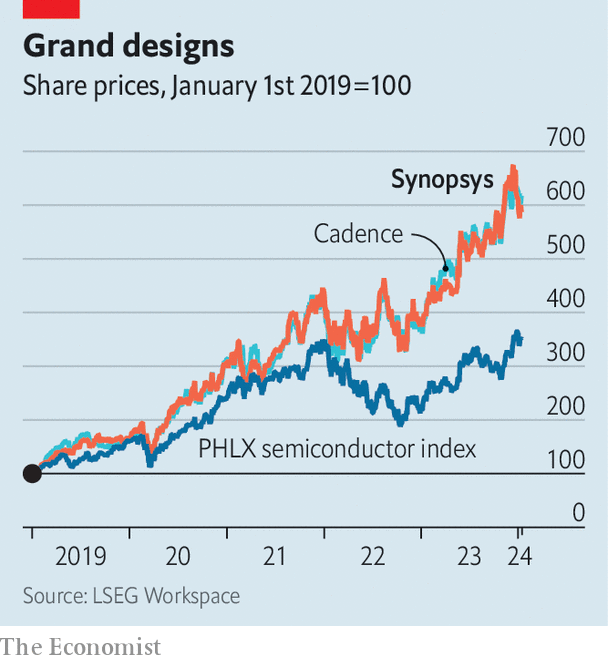

###### Big by design

# A $35bn mega-merger strengthens a quiet chip duopoly 

##### The purchase of Ansys by Synopsys is a bet on the ubiquity of semiconductors 

 

> Jan 18th 2024 

Tech dealmakers had a quiet 2023. S&amp;P Global, a financial-data firm, reckons that total spending on technology mergers and acquisitions reached its lowest level in a decade. Big tech mostly sat on the sidelines, as it fended off trustbusters. This year began on a louder note. On January 10th Hewlett Packard Enterprise, a business-software giant, snapped up Juniper Networks, a maker of telecoms gear, for $14bn. Less than a week later Synopsys, an American maker of programs for chip designers, splurged $35bn on Ansys, a computer-simulation company.

 


The megadeal shines a spotlight on an obscure but critical link in the semiconductor supply chain. Like many other of its links, this one, too, is highly concentrated. Yearly sales of chip-design software have grown by 12% since 2018, twice as fast as the chip industry as a whole, to around $15bn. Synopsys and its smaller American rival, Cadence, each capture around a third of this, reckons IDC, a research firm. Siemens, a German engineering giant with 15% of the market, is a distant third. The two American firms’ market values have almost sextupled in the past five years (see chart). They are worth nearly $80bn apiece. 

This growth looks likely to continue. Chipmakers such as Nvidia and AMD are racing to design better graphics-processing units (GPUs), which technology firms are hoovering up in order to train artificial-intelligence models. Big tech’s model-builders are themselves getting into the chip-design business, creating custom-made blueprints optimised for training their AIs and outsourcing manufacture to contract “foundries” like TSMC of Taiwan. This GPU race is shortening the time between releases of new chips—and more designs mean more licensing fees for the software firms. It has also reduced Synopsys’s and Cadence’s reliance on a few big chipmaking customers.

This reliance is diminished further by another trend. Although chip demand has lately been driven primarily by computers, smartphones and data centres, semiconductors increasingly pervade the economy, powering everything from cars to toasters. These products require silicon tailored to their needs. Ansys’s software, which simulates how electronic systems behave in the real world, can help with that. It enables system designers to craft the packaging of “chiplets”, as stacks of chips in modern processors are known. Sassine Ghazi, Synopsys’s boss, expects that Ansys’s broad customer base across industries, from carmaking to health care, will open up new markets for his company’s tools. The merged company will be able to offer them a complete service: Synopsys designs the chips and Ansys simulates the behaviour of systems that contain them. 

The deal still needs the blessing of regulators. Mr Ghazi points out that there is not much overlap between what Synopsys and Ansys do, so their merger would not increase concentration in his firm’s core market. Even though trustbusters have grown warier of such “vertical” mergers in tech, he remains confident. 

A bigger worry is China. Nearly 15% of Synopsys’s revenue comes from the country and growth there has outpaced that in any other region. Chinese chip firms buy nearly 90% of their design software from American companies, including Cadence and Synopsys. Security hawks in Washington increasingly want to keep American tech out of Chinese hands, lest it give China a boost in a bigger race: the geopolitical one for technological supremacy. ■


