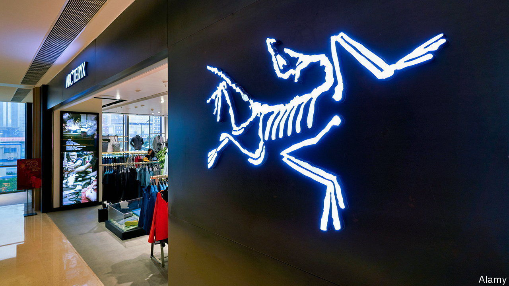
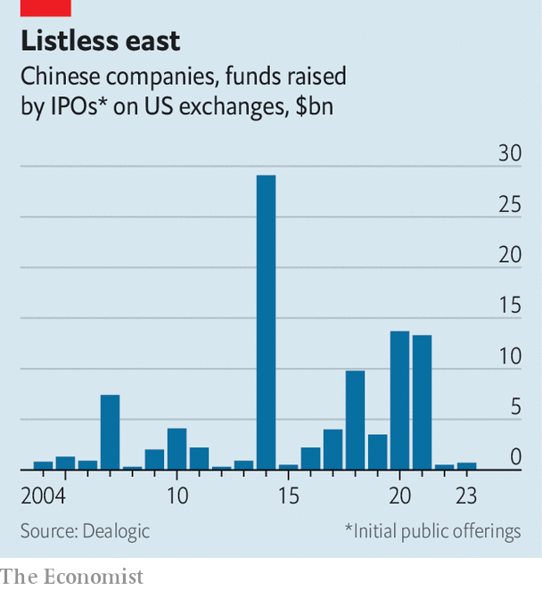

###### Amer’s American dream

# Can Arc’teryx’s owner revive Chinese IPOs in America? 

##### Amer and its Chinese parent, Anta, eye a $1bn New York listing 

 

> Jan 18th 2024 

Foreign acquisitions by Chinese buyers have a lousy reputation. The takeover of PizzaExpress, a British restaurant chain, by Hony Capital, a Chinese private-equity firm, ended up in restructuring. Financial collapse forced HNA, a Chinese conglomerate, to sell its stake in Hilton Worldwide, an American hotel chain, not long after buying it. Sanpower, a Chinese mall operator that bought House of Fraser, a British department store, succumbed to similar pressures.

An exception is the €5.6bn ($6.3bn) purchase in 2019 of Amer, the Finnish owner of brands such as Arc’teryx, Salomon and Wilson, by a consortium led by Anta Sports, a Chinese rival to Adidas and Nike. The year before, stiffening competition in sports goods all but wiped out Amer’s revenue growth. In the first nine months of 2023 sales swelled by nearly 30% year on year; a fifth came from China. Bankers hope that having scored a win for Chinese foreign buyouts, Amer can do the same for Chinese foreign listings. On January 4th Amer filed for an initial public offering (IPO) on the New York Stock Exchange. 

 


A few years ago, when Chinese firms were raising billions from foreign investors, it would have been an easy lift. Now it is enough to make a cross-fit champion buckle. In the West, politicians are looking askance at commercial ties to China. At home, economic growth may be in long-term decline and President Xi Jinping is becoming more ideological. Investors fear a repeat of Didi Global, a Chinese ride-hailing giant: in 2021, days after a $4.4bn New York debut, it faced a probe by its domestic regulators, lost much of its market value and was eventually forced to delist. IPO activity in Hong Kong, once the top offshore venue for such listings, is sluggish. In America, it is worse. In 2020 and 2021 Chinese firms raised a total of $27bn in New York. In the past two years they raised $1bn (see chart). 

Amer hopes to rake in as much all by itself. The company is in a sweet spot for foreign investors, says a banker. It is controlled by Anta, but most of its assets sit abroad. Its headquarters stayed in Helsinki. Retail is deemed safe from the whims of Chinese regulators. Having gone from stitching trainers for Nike in the 1990s to eclipsing its former client as the world’s largest sportswear firm by revenues, Anta is regarded as a national champion—and thus safer still. Salomon skis and Wilson tennis rackets are not the sort of strategic gear to set China hawks’ pulses racing (other than literally). 

Plenty of globally curious Chinese stars would love Amer to succeed. They include Ant Group, a fintech giant whose $37bn IPO in Hong Kong was halted by regulators in late 2020; ByteDance, the owner of TikTok, which is backed by KKR, an American investment firm, and SoftBank, a Japanese one; and Shein, a superfast-fashion firm which has filed for an IPO in America under pressure from American investors such as General Atlantic but may go public only after Amer. Didi, too, must one day re-list its shares in Hong Kong. Those firms’ foreign backers need them to float shares offshore to avoid trapping the proceeds within China’s strict capital controls. They will be watching Amer’s IPO closely. ■


