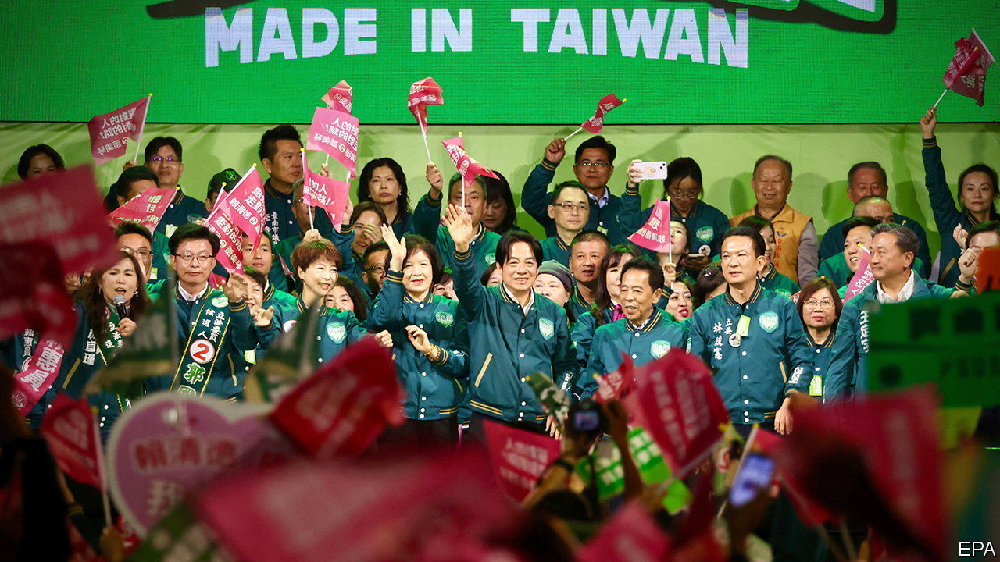
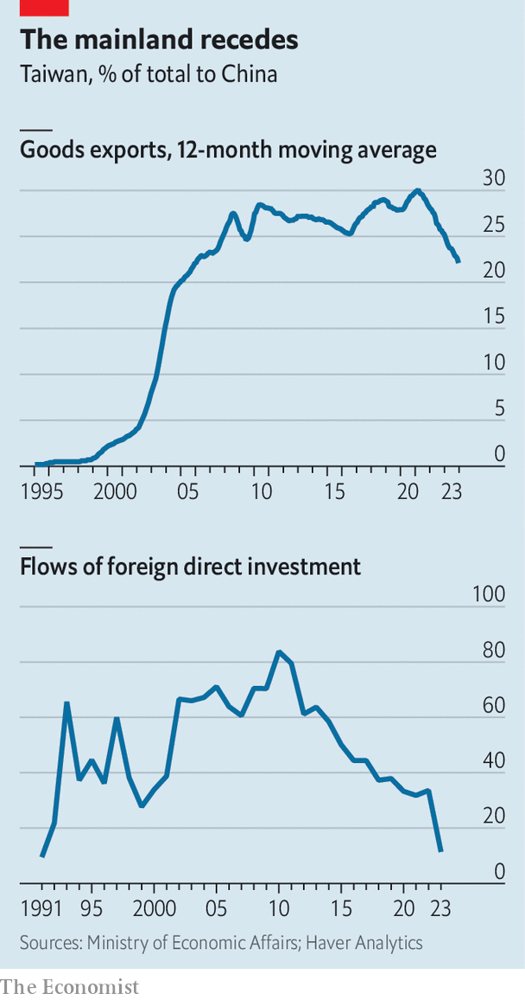

###### Cross-strait squeeze

# China may be losing its sway over Taiwanese business 

##### The election of a pro-independence president will intensify bullying from Beijing 

 

> Jan 15th 2024 

ON JANUARY 13TH William Lai Ching-te was  as Taiwan’s president. He thus secured a third term for his pro-independence Democratic Progressive Party (dpp). The vote will shape relations between self-governing Taiwan and China, which wants the island to be governed from Beijing. It will also affect the commercial relations between the two—and, because Taiwanese manufacturers sit at the heart of critical global supply chains, between them and the rest of the world.

For Taiwan’s big businesses, the cross-strait tensions are unwelcome. Taiwanese entrepreneurs have been building factories on the mainland since the 1980s. These used to make textiles and other cheap goods. Today many make sophisticated electronics, including chips. Chinese data suggest that in 2022 Taiwanese firms had assets worth $43bn in the People’s Republic; by comparison the figure for those from America, an economy 35 times the size of Taiwan’s, was $86bn. The real sum is almost certainly higher; Taiwan’s companies often channel investments via Hong Kong and other jurisdictions to avoid the scrutiny of their China-wary government. 

The Chinese Communist Party is likely to express its displeasure at the dpp’s victory by putting a squeeze on Taiwanese business. The corporate supporters of the first DPP president, Chen Shui-bian, who served from 2000 to 2008, faced regulatory scrutiny and investment restrictions from China, according to Taiwan’s Mainland Affairs Council, an agency dealing with cross-strait relations. In 2005 Shi Wen-Long, a petrochemical magnate and one of Mr Chen’s biggest backers, was forced into a humiliating public endorsement of a Chinese anti-secession law, which formalised military threats against the island.

Since the dpp returned to power in 2016 under Tsai Ing-wen, Chinese commercial pressure has increased. Far Eastern Group, a Taiwanese conglomerate, was hit by a fine in 2021, which Chinese publications tied to the political views of its chairman, Douglas Hsu. Shortly afterwards Mr Hsu issued a statement rejecting Taiwanese independence. Even businessmen friendlier to China have not been spared. In October Chinese state media reported a tax investigation into Foxconn, a giant Taiwanese contract manufacturer with vast operations in China. Taiwan’s National Security Council claims that the tax probe was a targeted effort by China to prevent Foxconn’s founder, Terry Gou, from dividing the pro-unification camp by running for president. In January China slapped tariffs on a range of Taiwanese chemical exports, a move widely viewed as another warning shot ahead of the election. 

In the past such bullying led companies either to back the independence-wary Kuomintang (KMT), which favours closer economic links with the mainland, or to stay out of politics altogether (the approach of TSMC, the world’s biggest chipmaker and Taiwan’s most valuable firm). This time corporate grandees, even those with exposure to the mainland, appear less cowed. Some have gone so far as to affiliate themselves with the dpp. Early last year Tung Tzu-hsien, who chairs Pegatron, a big contract manufacturer, became vice-chairman of the New Frontier Foundation, a dpp-associated think-tank. In the run-up to the election Frank Huang, chairman of Powerchip Semiconductor Manufacturing Corporation, endorsed Mr Lai openly.

Taiwanese businesses’ increased resistance to China’s strong-arm tactics has several causes. American tariffs on Chinese-made goods have made export manufacturing on the mainland less attractive, notes Chun-yi Lee of Nottingham University. Harsh policies such “zero-covid” lockdowns and arbitrary crackdowns on sectors such as consumer technology have further dented China’s appeal. The recent  of its economy is compounding the sense that Taiwan’s economic future may not be so bound up with the mainland. 

 


A shift is already visible in Taiwan’s trade and investment trends. The share of the island’s exports going to the mainland dropped to 22% over the 12 months to November, down from an all-time high of 30% in 2021 and the lowest in almost two decades (see chart). In 2010 over 80% of Taiwan’s annual outbound investment went to mainland China. In 2023 just 11% did. Firms like Pegatron and Foxconn are investing in places like India and Vietnam, which offer both cheaper labour and a chance to avoid the American tariffs. According to one recent poll, more Taiwanese business owners care about Taiwan’s admission to the Comprehensive and Progressive Agreement for Trans-Pacific Partnership, a trade deal between 12 countries including Australia and Japan, than the Economic Co-operation Framework Agreement, which a KMT government signed with China in 2010.

China’s ability to inflict pain on Taiwanese business is diminishing for another reason. More than 60% of the island’s exports to the mainland and Hong Kong are electrical machinery and equipment, including computer chips. Cutting off such products could damage Chinese buyers more than it does Taiwanese sellers. ■


