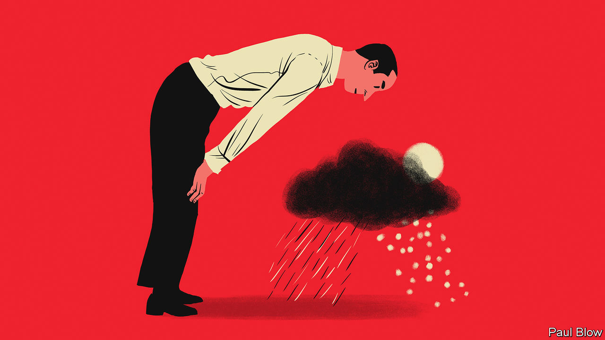

###### Bartleby

# Companies run to their own annual rhythms 

##### Seasonality in firms, from budgeting cycles to bonus rounds 

 

> Jan 18th 2024 

Seasonality is a big part of business. For some industries, seasonal patterns are a defining feature. Agriculture is one obvious example; tourism another. Western toymakers notch up a huge proportion of their annual sales in the run-up to Christmas. Construction is harder during cold weather, which is why that industry employs fewer people in the winter. 

Firms that are less obviously tied to the seasons can still be deeply affected by them, as a recent review by Ian Hohm of the University of British Columbia and his co-authors makes clear. An analysis of social-media posts on Twitter, now X, found that dieting-related tweets peak in the spring, as the season of body dysmorphia (ie, summer) approaches. Condom sales and online searches for pornography in America tend to rise in the summer and around Christmas. 

Even when overall demand does not vary greatly between the seasons, preferences change. Beef-eaters buy diced meat and roasts in the slow-cooking winter season and plump for steaks during the summer grilling months. Starbucks is among those firms that make seasonality a marketing event. The pumpkin-spiced latte is a reliable sign that autumn is on its way, along with falling leaves and glum faces at condom manufacturers. 

Seasonality also leaves a less obvious imprint inside organisations. Just as there are daily and weekly patterns of activity, from slumps in concentration during the late afternoons to the ebb and flow of hybrid workers coming to the office, so annual cycles leave their mark. 

One is occurring this week, with the World Economic Forum’s annual shindig in Davos. Public holidays aside, in no other week in the working year are so many CEOs of large organisations reliably away. The corporate world is briefly without a government, a concentrated version of Belgium in the early 2010s. This may well be Davos’s real contribution to improving the state of the world: with so many bosses stuck on a mountain for a few days, productive employees can get on with some work and lazy ones can relax. 

School holidays offer an obvious form of seasonality, although in that case people throughout the organisation are off. Mass absences make it hard to schedule meetings in Brazil in the period between Christmas and the start of Carnival; it is a similar story in August in Europe. 

These patterns of clustered absences show up inside organisations in big ways and small. Second-fiddle employees are more likely to get their chance to run the show; fewer big initiatives are likely to be launched when the holidays are in full swing. Employees without children are resentful that they are covering for colleagues on holiday; colleagues on holiday are resentful that they have children. 

There is some evidence that people feel more creative after returning from holiday—but you need to schedule that brainstorming session quickly. A paper from 2010 by Jana Kühnel of Goethe University and Sabine Sonnentag of Universität Mannheim reckoned that the benefits of a break fade within a month. 

Set-piece events mark the corporate calendar, too. Some are public: annual general meetings and shareholder letters, say. Others are internal. At many companies the annual budgeting process involves a gathering organisational effort, in which more and more people spend more and more time arguing about numbers that are certain to be wrong. It is almost a season in itself. A pre-pandemic estimate from APQC, a benchmarking organisation, reckoned that the median firm spends around 30 days on this effort; at plenty of firms, it takes an awful lot longer. 

Pay decisions are seasonal events, too. The time when employees find out their salary rises and bonuses sets off ripples of disappointment and happiness in all workplaces. In some, they are more like tsunamis. The bonus round on Wall Street, when bankers find out what they will get for their work the previous year, is under way now and is predated by months of internal wrangling and gossip. The actual date on which bonuses are paid matters, too—once the money is safely deposited in the bank, people are more likely to move jobs. 

There are other forms of corporate seasonality. The office Christmas party signals another wind-down in activity. Some firms shorten the workweek during the summer months. Yearly calendars are punctuated by sales conferences and leadership retreats. There is not much research on the impact of seasonality within firms. That they have their own annual rhythms is indisputable. ■


