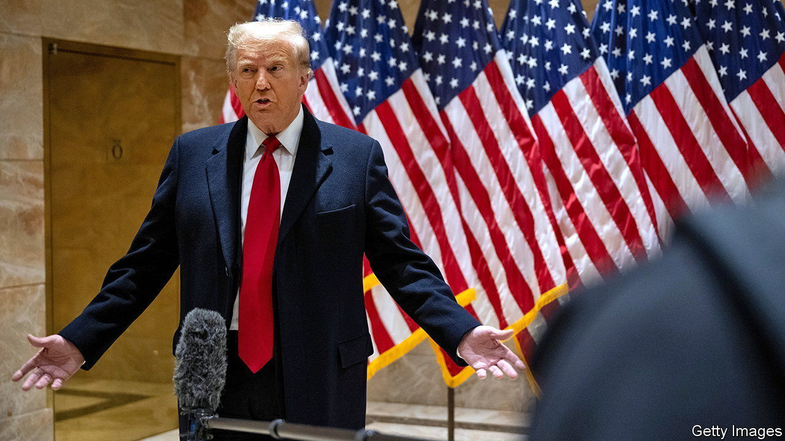
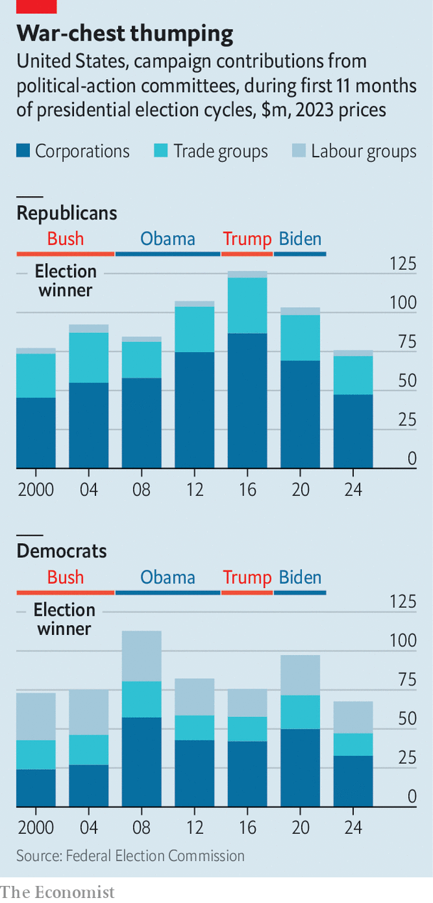

###### Hardly PAC-ed to the rafters

# Donald Trump’s populism is turning off corporate donors 

##### Republican fundraisers are in for a tough year 

 

> Jan 18th 2024 

“GO WOKE, GO broke,” intone Republicans fed up with socially aware American firms. But it is the politicians who are paying for their own ideological zeal. In 2000 and 2004 corporate political-action committees (PACs) gave them twice as much as they gave Democrats. After divvying up donations nearly evenly between the two parties in 2008 (perhaps thanks to a charismatic newcomer named Barack Obama), in 2012 and 2016 they favoured Republican candidates again, by a factor of nearly two to one. Company bosses, too, preferred conservatives. A paper in 2019 found that between 2000 and 2017 CEOs of firms in the S&amp;P 1500 index directed two-thirds of their giving to the right. 

In the 2019-20 election cycle, by contrast, corporate PAC donations to Republicans fell by a quarter, compared with four years earlier. One explanation is that donors were unhappy with the party’s populist shift away from trade, immigration and international co-operation. After Mr Trump’s supporters stormed the Capitol on January 6th 2021, dozens of firms halted donations to Republican lawmakers who voted against certifying Joe Biden’s 2020 election win. According to Jeffrey Sonnenfeld of the Yale School of Management, more than three-quarters of these firms were still withholding such donations a year later. 

 


Preliminary figures suggest this will be another disappointing year for Republican fundraisers. Data from the Federal Election Commission show that in the first 11 months of this presidential cycle Republicans got a third less from corporate PACs than in 2020 and half as much as in 2016 (see chart). Comcast, a cable operator, and Northrop Grumman, an armsmaker, have cut their cheques by a third since 2020. ExxonMobil, an oil giant, has halved donations. Top-spending trade groups, such as the National Beer Wholesalers Association and the National Association of Realtors, gave Republicans less than four years ago. 

The unspent money may not go to Democrats. According to End Citizens United, an advocacy group, 73 mostly Democratic congressmen have sworn off corporate PACs entirely, up from 56 five years ago. America Inc is always looking for friends in Washington. In the post-Trump era, it is finding itself alone. ■


