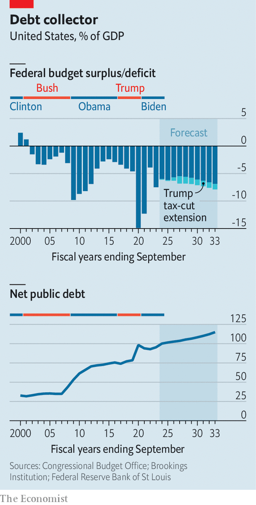

###### Fiscal Trumponomics

# Donald Trump’s tax cuts would add to American growth—and debt 

##### He has unfinished businesses in making his tax reforms of 2017 permanent 

 

> Jan 18th 2024 

OF THE MANY differences between Donald Trump and Joe Biden, perhaps the easiest to quantify has to do with tax policy. Mr Biden has long pledged to raise taxes on both the wealthy and companies. Mr Trump’s main legislative achievement from his presidency was a tax-cut package in 2017. Unsurprisingly, many corporate bosses prefer Mr Trump on taxes. The big economic question is whether they are being short-sighted and overlooking America’s fiscal health, which they also profess to care about.

When Mr Trump was elected in 2016, net federal debt was about 75% of GDP. When he left office in 2021, it was 97% of GDP. The Congressional Budget Office (CBO) forecasts that it is on track to hit an eye-watering 181% three decades from now. At that level the government’s annual interest payments are expected to exceed its combined spending on national defence, education and highways. That raises the risk of a financial crisis—hardly an ideal environment for business.

 


Critics of Mr Trump point to the debt trajectory on his watch as evidence of fiscal mismanagement and warn he would make things worse if elected for a second term. Many of his tax cuts are set to expire at the end of 2025 (the individual-income-tax rate for the highest earners will revert to 39.6% from 37%, for instance). If Mr Trump returns to office, he will try to make the cuts permanent. The CBO estimates that this would add $350bn or so to the deficit annually over the next decade, equivalent to 1% of GDP (see chart).

Yet this line of criticism misses two important points. First, the accumulation of debt under Mr Trump largely stemmed from the stimulus launched soon after covid-19 struck, which countered some of the economic drag from the pandemic. The comparison is unflattering for Mr Biden: he expanded the stimulus in 2021 when there was less need for extra fiscal support from the government, and this additional spending helped stoke inflation. 

Second, it is not enough to look at taxes alone. The interaction between taxation and growth lies at the heart of debt sustainability. “The overriding driver of our fiscal problems is that we don’t have enough growth,” says Stephen Moore, who helped design Mr Trump’s tax cuts in 2017. “We want to bring jobs and capital here, and yes, we can grow out of this.” Many economists dismiss such talk as hyperbole. After all, in the 2016 election, Mr Trump vowed that deregulation and tax cuts would unleash a torrent of economic growth; in reality America’s growth rate ticked up just slightly in the two years after his tax law went into effect, before covid erupted. But this extra activity did help to boost America’s fiscal revenues, offsetting some of the cost of the tax cuts. “Thinking you should tax away to a lower deficit is misleading,” says Tomas Philipson, an economic adviser in Mr Trump’s administration.

Mr Biden’s approach offers a counterpoint. He has called for a range of tax increases, including raising the corporate rate from 21% to 28%. “That may be counterproductive,” says Erica York of the Tax Foundation, a think-tank. Ms York and her colleagues estimate that Mr Biden’s tax proposals would lower America’s debt-to-GDP ratio but also shrink the economy by 1.3%, whereas Mr Trump’s tax cuts would, if permanent, push up debts but expand long-run GDP by 1.2%. It is not a simple trade-off either way.

A true clean-up of America’s finances would require reforms to big social programmes, especially income support for pensioners and state-provided medical insurance, which together account for nearly half of federal spending. Here, Mr Trump and Mr Biden look indistinguishable. Both are silent on serious changes to these programmes, because both are well aware how deeply unpopular any cuts would be. ■


