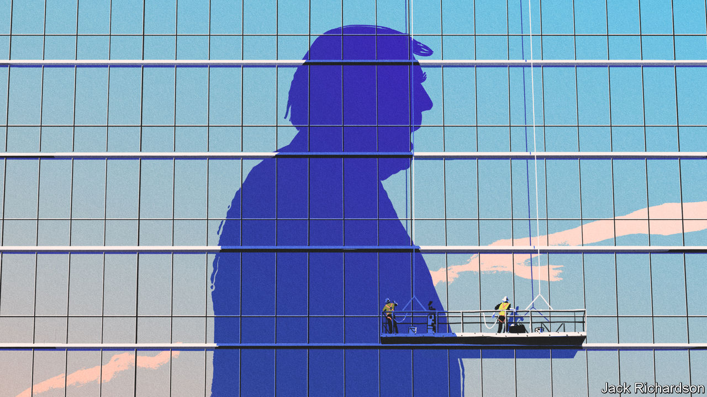
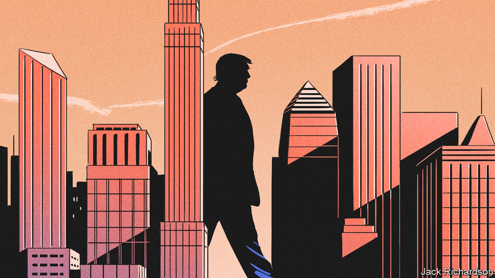

###### Duck and cover

# Many CEOs fear a second Trump term would be worse than the first 

##### Though they will only say so in private 

 

> Jan 16th 2024 

When Donald Trump left office three years ago, still huffing, puffing and plotting to  the results of the 2020 presidential election, the leaders of most of America’s biggest corporations were only too happy to see the back of him. They wore their moral outrage like a badge of honour. True, they had conveniently put aside their earlier scruples about Mr Trump’s suitability for the White House, bought off by generous corporate and personal tax cuts in 2017. True, many had cravenly turned a blind eye to his torching of environmental rules in support of a broad-brush regulatory bonfire. But his attempts to subvert American democracy, and the  by his supporters on January 6th 2021, were a step too far. 

With unusual unity, they huffed and puffed back. Manufacturers called the riots a “disgusting episode”. The Business Roundtable, a lobby group for big companies, called on Mr Trump to “put an end to the chaos”. Some prominent firms pledged not to provide financial support to the 147 Republican lawmakers who had refused to certify Mr Trump’s defeat.


Mr Trump’s  in the first bout of the Republican primary contest in Iowa on January 15th cemented his status as the party’s presumptive nominee. The polls suggest that in a head-to-head battle with President Joe Biden, he would win. But if there are murmurings of alarm about what a sequel to his chaotic presidency might mean for corporate America, this time they remain behind closed doors and off the record. Recently, Larry Summers, the pro-Biden former treasury secretary, urged CEOs to reject Mr Trump, noting that Italy’s markets did well in Benito Mussolini’s first few years in power—until they didn’t. Yet for the moment, most advisers and leaders of business associations counsel bosses to keep their heads down. Forget. The message is: duck and cover. 

There is rationale for lying low. For a start, with ten months to go before the elections, anything can happen. Health issues could force  out of the race (combined, Messrs Biden and Trump have had 158 years on Earth, nearly two-thirds the age of America itself). Mr Trump has not only his Republican rivals and Mr Biden to contend with,  across two state courts and two federal districts, which could cause havoc. 

Staking out the moral high ground from corner offices may also be counter-productive. It could backfire on those who attack Mr Trump in public, and bolster his anti-elite appeal. In office, he was quick to retaliate when attacked (preferred weapon, CAPITALISED TWEETS!). With trust in big companies on the wane in recent decades, it has become easier for populists to whip up an anti-business hue and cry. The head of a prominent business organisation ruefully admits that if he took a public stand against Mr Trump’s campaign proposals, “the former president would be delighted.”

In the past few years, as the relationship between big business and Mr Trump’s MAGA Republicans has soured, executives have learned the hard way the risks of sticking their necks out. A public-relations adviser to CEOs thought a year ago that it would be relatively easy for business to disown Mr Trump because of his legal travails. But then came the unofficial boycott of Bud Light, a beer, by right-wing culture warriors offended by its marketing campaign with a transgender influencer. The PR man realised the power of the mob to hurt the bottom line. “We are back to walking on eggshells,” he says—caught between progressive employees and customers demanding that firms take a stand against Mr Trump, and fear of the MAGA masses. 

Then there is Mr Biden. When pushed to express a preference, many businesspeople say they see him as a steadier pair of hands in policymaking and geopolitics. But they are fed up with his administration’s anti-business rhetoric (Gina Raimondo, the commerce secretary, is an honourable exception). That makes them more tolerant of Mr Trump. Of the two, Mr Biden is “hands down a bigger threat to prosperity”, says a billionaire financier. 

Even Mr Biden’s backers rail against the ”big is bad” stance of his trustbusters. Those trustbusters’ bite has not been as bad as their bark; many of their cases have failed in court. But the bark alone has chilled dealmaking, laments an investment banker. As for the risk that Mr Trump could “weaponise” administrative agencies against his corporate enemies, Neil Bradley of the US Chamber of Commerce counters that Mr Biden, too, has urged his administration to crack down on “junk fees” and price gouging in industries ranging from airlines to banking and health care. Mr Bradley draws few distinctions between either party’s economic populism.

Some business folk angrily dismiss efforts to draw parallels between the dangers of Mr Trump and Mr Biden. Calling it “whataboutism”, they quietly profess to be terrified by the prospects of a second Trump administration. In the first one, the former president may have pushed radical policies, but sensible conservatives in his administration, as well as his own predilection for chaos, got the better of him. Now he is , such as those at the Heritage Foundation, a pro-MAGA think-tank whose job, says one business leader, is “to prevent the amelioration of the Trump agenda”. 

In other words, Mr Trump has plenty of people in place to advance a plan that could shake up the economic framework on which American business has prospered for generations. The pillars of that plan of most immediate concern to corporate America are trade, migration, the fiscal deficit and public debt, and clean energy. 

A trade war is the most palpable worry. The self-described “” has floated the idea of imposing a baseline 10% levy on all imports. These would be raised, “an eye for an eye”, in retaliation against any country with a higher tariff. China is the main target. Businesspeople fear his goal is to terminate, unilaterally, trade with China, which would be a nightmare for any firm exposed to the country. Such a trade policy would be far more draconian than that of the Biden administration, which has kept Mr Trump’s tariffs but worked with allies such as Japan and the Netherlands to restrict export of strategic goods such as advanced semiconductors without cutting China off altogether. 

Some hope that Mr Trump is posturing. They take solace in the fact that Congress, not the White House, regulates commerce and that courts adjudicate trade law. Yet Kent Lassman, who contributed a bold essay in support of free trade to the Heritage Foundation’s pro-Trump “Project 2025” road map, thinks the former president means it, even if it disrupts America’s existing trade treaties. Mr Trump “is not changing his stripes”; his sense that everything is a deal and that America is victimised is stronger than ever. His chief advisers on trade, protectionist hawks such as Robert Lighthizer and Peter Navarro, “know how to play off of those beliefs”, Mr Lassman says.

 


Mr Trump’s threat to round up and deport millions of undocumented migrants has also alarmed businesses—not only for humane reasons but also because of a chronic worker shortage afflicting many American firms. In November America had 8.8m job openings. The number of unemployed is 6.3m. 

Mr Trump’s harshest proposals would be hard to implement. He made a similar mass-deportation promise on the campaign trail in 2016 but was frustrated by court challenges and other pushback. Still, any pickup in expulsions could hurt industries such as farming, leisure, retail and hospitality that rely on low-cost labour, executives say. However important it is to maintain strong borders, whipping up anti-immigrant fervour for political ends jeopardises legal migration. That hurts businesses’ ability to recruit skilled and unskilled workers alike. 

Government debt also looms large in CEOs’ minds. They praised Mr Trump’s Tax Cuts and Jobs Act, which reduced corporate-tax rates from 35% to 21%. But they fear that neither Mr Trump nor Mr Biden has credible plans to stop the deficit from . If Mr Trump pursues his most unorthodox economic ideas, there are fears that a loss of confidence could jolt the treasury market, pushing up borrowing costs and sending the dollar into a tailspin. 

Greenbacks and green leafs

Some think that is going too far. “The world has insatiable demand for US treasuries,” notes a pro-Biden Wall Street grandee. But a few corporate advisers raise the possibility that an unrestrained Mr Trump could trigger an American version of Britain’s bond-market sell-off in 2022, when investors lost faith in the economic stewardship of Liz Truss, a prime minister who was outlasted by a lettuce. “I have parliament envy,” the leader of a lobby group chuckles—unlike American leaders, he observes wryly, fiscally irresponsible British ones such as Ms Truss can be quickly forced out of office. 

America’s environmental trajectory under Mr Trump is another concern. The former president, like the current one, would be expected to double down on industrial policy. But unlike Mr Biden, whose signature effort has been the green-tinged Inflation Reduction Act (IRA), Mr Trump remains a climate sceptic who is likely to try to gut clean-energy programmes. In this case, he may face pushback from his own party. Many of the clean-energy projects predicated on funding from the IRA are in Republican-leaning states. Business, too, is likely to oppose a reversal of Mr Biden’s green agenda. Mr Bradley says that though industrial policy writ large remains “incredibly problematic”, government programmes that induce changes of behaviour are justified when technology is at an early stage, as with clean energy.

If Mr Trump’s policy proposals directly related to business do not inspire confidence, his efforts to undermine faith in the judiciary, rule of law, NATO and other alliances, including with Ukraine, raise big questions about America’s role in the world. Some executives shrug this off. A few weeks ago the head of an international asset manager met a group of American bankers and found them “shockingly sanguine” about the election. They told him that whatever the outcome, the system would hold; that stockmarkets had done well under both presidents; and that the American economy was in such rude health that it could survive even electoral shenanigans. “Maybe their point is that business has transcended politics in America,” he says. He adds pensively: “Maybe they are right.”

Or maybe they aren’t. Michael Strain of the American Enterprise Institute, a pro-business think-tank, says that Mr Trump’s populism makes political violence in America more likely this year. That would hurt business. The head of a global risk-advisory firm says that uncertainty over Mr Trump’s geopolitical agenda will haunt multinationals, making it hard for them to decide, for example, whether or not to allocate resources to China or perhaps even Russia. Any sense that he is weakening the rule of law and the sanctity of contracts and treaties would ripple around the world. “Things like the rule of law are gossamer concepts that disappear just like that,” says a New York financier. 

His colleague, an expert on geopolitics, says that American businessmen rarely step back to consider how much the country’s global influence, including the hegemony of the dollar and the defence of maritime shipping routes, underpins their companies’ prosperity. Ron Temple, chief market strategist at Lazard, an investment bank, says the gap between right and left has widened in America, amplifying policy variability and becoming too important a factor for business to overlook. “There is almost a sense of complacency, married with entitlement, combined with presumptuousness,” he concludes. If anyone is likely to shake corporate America out of such numbness, it is Mr Trump. ■


