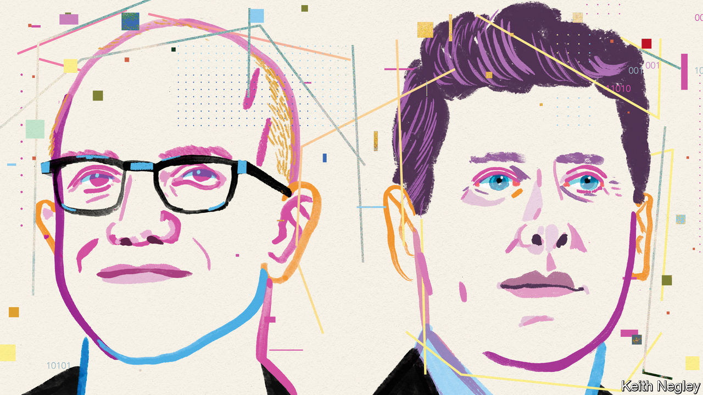
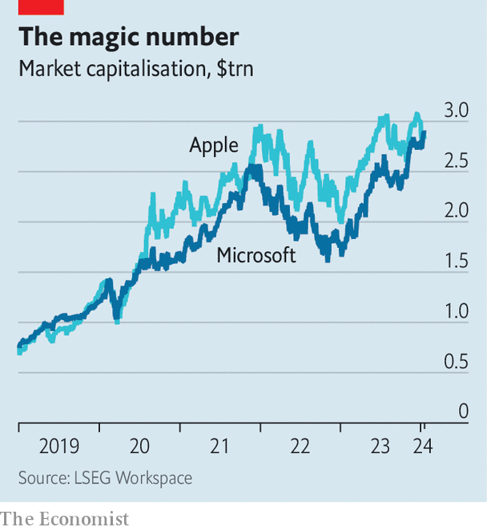

###### The Sam and Satya show

# The bosses of OpenAI and Microsoft talk to The Economist 

##### Tech’s best bromance reflects on regulation, the future of AI and how to control superhuman intelligence 

 

> Jan 17th 2024 

One reason the world’s corporate elite  each year is to check in on important relationships, be they with critical suppliers or big-spending clients. This year many are wondering about their relationships with  and , the startup behind ChatGPT. The companies are the world’s most prominent purveyors of artificial intelligence (AI), which has the business world giddy. OpenAI exclusively licenses its technology to Microsoft. The software giant is busy injecting it into products from Word to Windows. 

The relationship between the two companies is also under scrutiny—including in recent weeks by EU and British antitrust regulators. In November Sam Altman, OpenAI’s boss, was fired by his board, only to be reinstated days later. Satya Nadella, Microsoft’s chief, whose company reportedly owns 49% of the startup, supported Mr Altman during the ordeal. The kerfuffle left many wondering about risks to what Mr Altman has called the “best bromance in tech”. When the pair sat down with  in Davos on January 17th, they were upbeat and, for the most part, singing from the same hymn sheet. Their partnership is “great” and “unbelievable”. They often remarked on how much they agree. 


 


One concurrence was that the tie-up boosts competition. “You can look at the vertically integrated option and you can look at our partnership, and you can decide which is more pro-competition,” says Mr Altman. Another was that 2024 will be a big year for AI. Microsoft’s huge bet on the technology this month helped it to dethrone Apple as the world’s biggest firm (see chart). It is closing in on a value of $3trn. Its next quarterly earnings will give the first hint of how much corporate customers are willing to spend on AI. 


Although some observers have been underwhelmed by the progress made by OpenAI’s latest model, GPT-4, Mr Altman hints at new capabilities, such as greater ability to understand and produce audio. Mr Nadella says models will get better at all tasks, from writing essays to churning out computer code. “I really think the magic of this is the generality,” says Mr Altman.

The general-purpose nature of AI is why Mr Altman thinks of the technology as “a new computer”. Mr Nadella sees it in similar terms. He argues that “since the PC, we have not had […] the real driver of getting more things done with less drudgery.” Microsoft’s supply-chain team already use AI to help model the impact of their decisions, without having to wait for the finance department at the end of the quarter.

AI’s ability to replace skilled workers, such as accountants, raises concerns about its effect on jobs. A new IMF paper suggests that people with a university degree are most exposed to disruption but also best placed to reap the rewards. Both Messrs Nadella and Altman are convinced that AI will create more new jobs than it destroys. Mr Nadella thinks it may make the labour market more dynamic, by allowing people to learn new skills and switch jobs faster. That, he says, will cause some wages to go up and others to be “commoditised” (in other words, decline). 

Disruption will be all the more dramatic with the advent of artificial general intelligence (agi), which, if it is achieved, would be able to outperform humans on most intellectual tasks. AI doomers think this could engender economic chaos or even a robot apocalypse. Nonetheless, producing AGI is the stated goal of OpenAI. Mr Altman describes progress towards this aim as “surprisingly continuous”. He likens it to the evolution of the iPhone, where no single new model represented a big leap but the jump from the first version to the latest one has been extraordinary. For that reason he expects the fuss caused by the first AGI to be short-lived. “The world will have a two-week freakout and then people will go on with their lives,” he says.

Neither Mr Nadella nor Mr Altman will say when AGI might come around. Mr Nadella believes that by the time it does, its use will be regulated: “Nation states are absolutely going to have a say on…what is ready for deployment or not.” Mr Altman broadly agrees, but is a bit more circumspect. Regulators, he notes, will have to weigh the risks and capabilities of AI—as with aeroplanes, which create enormous benefits despite occasionally crashing. Likewise, AI’s “tremendous upside” means that halting progress would be a mistake. Safety is not a binary question of using or not using a technology; it is “the many little decisions along the way”. He points to the launch of GPT-4, which was pushed back by seven or eight months.

Mr Altman, ever the techno-optimist, insists that “technological prosperity is the most important ingredient to a much better future”. Mr Nadella, a corporate veteran, strikes a more businesslike note. He talks about the 20 meetings he had earlier in the day with executives from a range of industries, talking to them “about something that they are doing where I can have some input”. He is, in other words, firming up Microsoft’s relationships—as befits a big boss in Davos. ■


