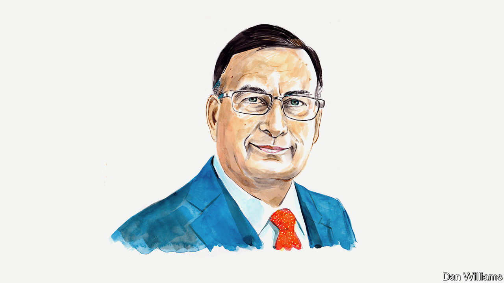

###### Pakistan’s election

# A former ambassador argues that Pakistan needs a new political compact 

##### Free and fair elections are just the start of what’s required to bring stability and prosperity, says Husain Haqqani 

 

> Jan 16th 2024 

PAKISTAN’S NEXT general election, scheduled for February 8th, is unlikely to resolve problems rooted in the country’s troubled history. Carved out from the Muslim-majority portions of British India, Pakistan has spent the best part of its life competing with India. In the process, the country has developed nuclear weapons and boasts the world’s sixth-largest standing army. But it has faced repeated economic failures and persistently poor human-development indicators.

Pakistan’s greatest failure, however, has been in developing a workable political system. For more than two decades after its creation in 1947, the country struggled to agree on a constitution and failed to hold general elections. The first ostensibly free and fair election, held under military rule in 1970, in response to huge pressure from civilians, led to civil war and the transformation of the country’s eastern wing into the independent state of Bangladesh. Ten more elections since then have either been disputed by the loser or resulted in governments that could not complete their terms.

Pakistan’s army, which does not trust the country’s politicians and has its own views on how the country should be run, has assumed power in four coups. The generals believe that the military has kept Pakistan’s disparate nationalities and ethnicities from tearing each other apart. But the military’s direct, and often indirect, intervention has not ended political chaos; indeed, it has caused much of it.

The army wants the final say on foreign policy and national security, and most politicians seem willing to concede that. Military-backed efforts to create dyarchy, or dual control, which allows generals and politicians to play well-defined roles in running the country, have not worked. Politicians initially favoured by generals have eventually turned on them, complaining of military meddling in all spheres of policy.

Pakistanis have not abandoned their desire for democracy, but Pakistan’s political class has failed to make democracy work. After each election, whoever is popular at the time takes up office, tries to silence their opponents, reportedly enriches their family and friends, and refuses to compromise with other politicians, until being toppled and, in most cases, jailed. There is little regard for democratic norms between elections: critics of the government and the businesses of opposition politicians are targeted by the police, security services, tax authorities or others, often on flimsy grounds.

Politics in Pakistan is not about alternative policies or visions; it is deeply personal and factional. Some factions, or parties, have evolved into dynasties while others are propelled by the populist rhetoric of a charismatic celebrity. Leading politicians often ignore parliament and show little regard for a free press, especially while in power.

In his tenure of three years and eight months as prime minister, Imran Khan attended just 38 (9%) of the 442 sittings of the National Assembly. His predecessor, Nawaz Sharif, did only marginally better, by turning up at 13.4% of parliamentary sittings. The attendance of most MPs in recent years has also been poor and continues to decline.

Politicians complain about repression while out of favour with the army but target their rivals for similar treatment upon gaining power, usually with the generals’ blessing. This pattern has become more blatant in recent years. In 2018 Mr Khan and his supporters saw nothing wrong with the military allegedly manipulating elections in his favour and against Mr Sharif. This time around, Mr Khan is at the receiving end of military-backed persecution, which has the tacit support of Mr Sharif and other opponents of Mr Khan. 

Almost everyone in Pakistan, including the army’s current chief, publicly agrees that the military should have no role in politics. However, an election that is free and fair but offers voters a choice between one of Pakistan’s political dynasties and a conspiracy-minded populist like Mr Khan will do little to address the country’s serious economic and security problems. Tough decisions, such as expanding the tax base and making peace with India, cannot easily be addressed in a polarised polity. They require a measure of national consensus.

Economic realities require Pakistan to sell off or shut down state-owned enterprises that have been losing money for years, including the national airline and various transport and energy concerns. Swathes of the economy including agriculture, real estate and retail that pay little or no tax need to contribute more, to reduce Pakistan’s swelling debt and deficit: between now and 2026, Pakistan needs to repay $78bn in external debt, a tall order for an economy whose annual GDP is around $350bn. In addition to expanding its tax base, Pakistan would benefit from opening up trade with India, for which normalisation of diplomatic relations is a precondition.

Jihadist terrorist groups, encouraged or tolerated as part of sub-conventional warfare against India, have become a security threat to Pakistan. They benefit from the narrative of persecution that has become part of Pakistan’s psyche and is advanced by populists who blame conspiracies by India, Israel and America (or Hindus, Jews and Christians) against Islamic Pakistan for the country’s problems.

Action against the jihadists, and countering their narrative, is as important as economic reforms and shifts in foreign policy. None of these major initiatives is possible while Pakistan’s politicians are tangled in a game of oneupmanship or in confronting the army.

If Pakistan is to become a functioning democracy and address its complex, long-running problems, free and fair elections should not be the end but the beginning of the country’s journey. Pakistan needs a grand bargain between its generals and its politicians, as well as among the politicians, to determine political ground rules, to establish mechanisms for enforcing them and to end the prevailing “winner takes all” game of power.

Barring that, Pakistan will continue to lurch from one crisis to the next, and another election will make little difference. ■


