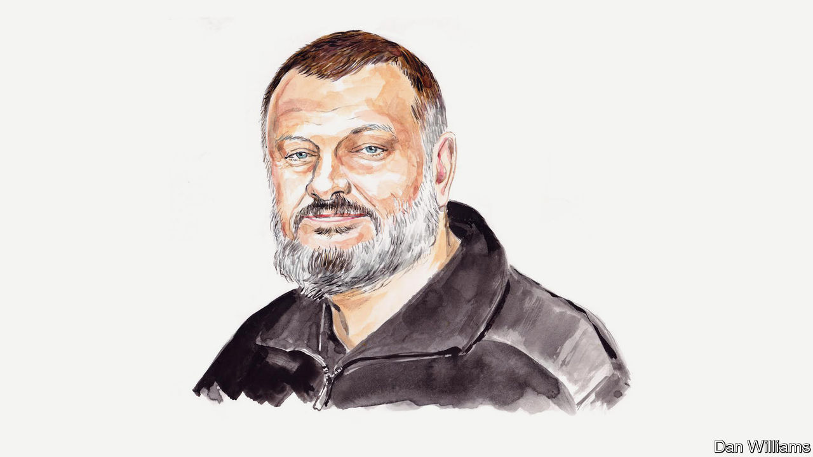

###### The war in Ukraine

# Ukraine’s chief spy argues that its security deal with Britain is a game-changer 

##### Russia can be deterred if other Western countries offer similar assurances, says Oleksandr Lytvynenko 

 

> Jan 19th 2024 

THE AIM of Russia’s war in Ukraine—to destroy Ukraine’s Defence Forces—remains unchanged. Despite an enormous advantage in resources, Russia has not been able to accomplish this task for almost two years. Along with the heroism of the Ukrainian military and the rallying of the population around the state, Western support has played a key role in this. It is this support that strengthens the global dimension of the war and makes it impossible for Russia to achieve its Napoleonic goals.

These goals include, first and foremost, the annexation of Ukrainian territories that have been proclaimed “historical Russian lands” by the political leadership in Moscow; and the creation of a political entity that depends fully on Moscow to govern those Ukrainian lands that cannot be directly annexed. 

Vladimir Putin, Russia’s president, hopes that victory over Ukraine will help him regain control over the former Soviet republics on the principles of Russian imperialism that both preceded and have followed the communist era. The Kremlin understands that if Ukraine falls, it will be easier to reclaim other former Soviet republics. If Ukraine stands, it is a matter of time before Russia loses influence over the South Caucasus and Central Asia. 

By attacking Ukraine, Russia believes that it is concurrently at war with the West. Mr Putin is hoping for a domino effect. He believes that if the West, and above all the United States, suffers a crushing defeat in Ukraine—a second such humiliation in just a few years after the disorderly exit from Afghanistan—it will rapidly lose global influence. 

Revisionist states, which have their eyes fixed on Ukraine, would see this and conclude that their time had come. As a result, within a few years a new, multipolar world order would be established, where the most important issues would be resolved by a number of competing major powers, including Russia. Xi Jinping, the leader of China, the West’s strongest competitor, is watching the war closely and drawing his own conclusions.

Russia knows that the victory it covets over Ukraine would have a global effect. Russia also understands that it cannot achieve its goals there without disrupting the global order.

Over the past two years Moscow has created a coalition whose members include North Korea and Iran, as well as a number of less overtly active participants from the global south which hope to benefit from rising geopolitical tensions. This coalition is largely informal, but its impact is keenly felt: it provides political and material support for Russian aggression, supplying artillery shells, drones and other military hardware and technology. Beyond the military realm, it devotes much energy to economic, cyber and information warfare and other subversive actions. Its goal is to destabilise the global order. 

Russia and its accomplices enjoy a great privilege. They are fighting with brute force to create a new global order, while many in the West are primarily seeking to use soft power to preserve the old one that emerged from the cold war. It has long been known that those who rely on force to bring about the new have a significant advantage over the supporters of the old, who, by and large, voluntarily impose restrictions on the means of achieving their goals.

At the same time, if Russia fails to defeat Ukraine on the battlefield, its global goals will be significantly undermined. Strengthening Ukraine’s defence and security capabilities and ensuring the resilience of society and the state is the easiest and cheapest way for the West to stop Russia and other revisionist states. 

Today, Ukraine is able to repel Russian aggression with adequate Western military and economic support. That support will remain effective if it is prolonged (until the Russian aggression stops) and comprehensive (encompassing political, economic, military and intelligence support as well as help countering cyber-warfare and disinformation).

The most recent example of this approach is the signing of the Agreement on Security Co-operation between Ukraine and Britain on January 12th. Excluding the Baltic states, which are now part of the EU and NATO, this was the third agreement of its kind between a former Soviet republic and another country. The first two—between Turkey and Azerbaijan in 2021 and between France and Armenia in 2023—have had some impact on the South Caucasus but were not game-changers.

The agreement between Ukraine and Britain could prove much more significant. It is the first of its kind to touch the core of the former Russian empire; Mr Putin considers Ukraine to be an integral part of “historical” Russia. It is the first between Ukraine and a major power which enshrines emerging geopolitical reality in a legal agreement. It marks the deepest shift so far in the West’s approach to the Russian concept of its “spheres of influence”. The subdued reaction of the British media to the agreement shows how normal and routine Anglo-Ukrainian defence and security relations have become in the public mind.

Now, as it has done throughout history, Britain can serve as a model for others. The deal signed on January 12th can pave the way for similar pacts with other Western countries. Eleven of them are at various stages of negotiating such agreements with Ukraine. The G7 Joint Declaration of Support for Ukraine, signed at the NATO summit in Vilnius in July 2023, is clearly bearing fruit.

Agreements on security co-operation are gradually moving Ukraine into the Western security space, without requiring the presence of Western troops on Ukrainian soil. They accustom the world to Ukraine’s participation in the alliance. Such agreements create the basis for Ukraine’s accession to NATO, which was decided on back in 2008 in Bucharest. This is the best security guarantee not only for Ukraine but for the whole of eastern Europe.

By signing the security agreement, Britain has taken a step in deterring the Russians. When others follow suit, their combined efforts will have a big impact on Russia’s war of aggression and on its future ambitions. To secure victory, Ukraine needs such joint efforts. The long road is made up of many steps.■


