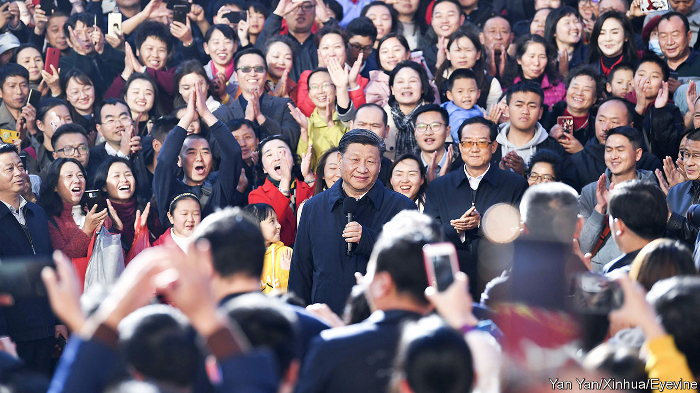

###### Survey says

# China’s leaders are less popular than they might think 

##### A clever new poll unearths more discontent with Xi Jinping than had been assumed 

 

> Jan 16th 2024 

CHINA’S LEADERS have no qualms about using intimidation and force . But the Communist Party also claims that it deserves to rule because it governs well and has the support of the public. Officials point to decades of impressive economic growth—and to opinion surveys that researchers at Harvard University conducted between 2003 and 2016. In the last such survey, over 90% of Chinese people expressed satisfaction with the party. “Such high approval ratings are beyond the wildest dreams of American politicians,” boasted Hua Chunying, a foreign-ministry spokeswoman, in 2020.

Gauging public opinion in China is hard. Foreign firms are generally banned from carrying out surveys. Chinese pollsters tend to avoid sticky subjects, though some work with Western researchers (this was how Harvard conducted its study). No matter who is asking the questions, respondents may not share their actual views for fear of reprisal. So researchers at the University of Southern California tried to get around this problem by using a survey method called a “list experiment”. Their findings, published this month, suggest that the Communist Party has fewer fans than previously thought.

The researchers divided participants in their survey (conducted online) into two groups. Those in the first were shown three anodyne statements, such as “I consider myself a sports fan”. Those in the second were shown the same three items plus one sensitive statement, such as “I support Comrade Xi Jinping’s leadership”, or “China’s system of government is better than any other I can think of”.

Respondents in both groups were then asked how many statements they agreed with, without having to identify them. This allowed them to express their political opinions indirectly. By subtracting the average of the first group from that of the second group, the researchers were able to estimate the share of respondents who agreed with the sensitive statement.

The results suggest that when the survey was conducted in June and November 2020 between 50% and 70% of Chinese people supported the party. (This is an upper bound, say the researchers, because concerns about online surveillance may still have spooked some respondents into giving positive responses.) Around half of respondents did not agree that China’s system of government is best. Nearly 40% said they were “afraid of the consequences” of protesting against the state. Support for Mr Xi was between 65% and 70%.

His approval rating has probably fallen since then. Mr Xi’s “zero-covid” policy angered many Chinese, who grew tired of the constant testing and lockdowns. When the government at last dropped its pandemic controls at the end of 2022, analysts predicted a big rebound in economic activity. But consumers remain gloomy and many young Chinese are struggling to find jobs.

Even if it has fallen, Mr Xi’s rating could still be the envy of Western politicians. A paltry 33% of Americans approve of the job President Joe Biden is doing, according to a recent poll. Still, the results of the study might concern China’s leaders. The Communist Party relies on the (circular) presumption that the public thinks that it is overwhelmingly popular. If disgruntled citizens believe they are in a small minority they are less likely to discuss political issues, let alone resist the party. But if they believe there are many others like them, dissent could snowball, says Erin Baggott Carter, an author of the study.

There is no sign that China’s Communist Party is about to face a revolution. But party officials are keen students of history. They are haunted by the collapse of communist regimes in eastern Europe, where opposition movements grew quickly once people realised their anger was widespread. Mr Xi has ordered his propagandists to “adhere to the correct guidance of public opinion”. They might point to a different survey, conducted in November by Edelman, an American consultancy. In that one 85% of Chinese expressed trust in their government. That was second best among the 28 countries surveyed. The firm did not use a list experiment. ■


