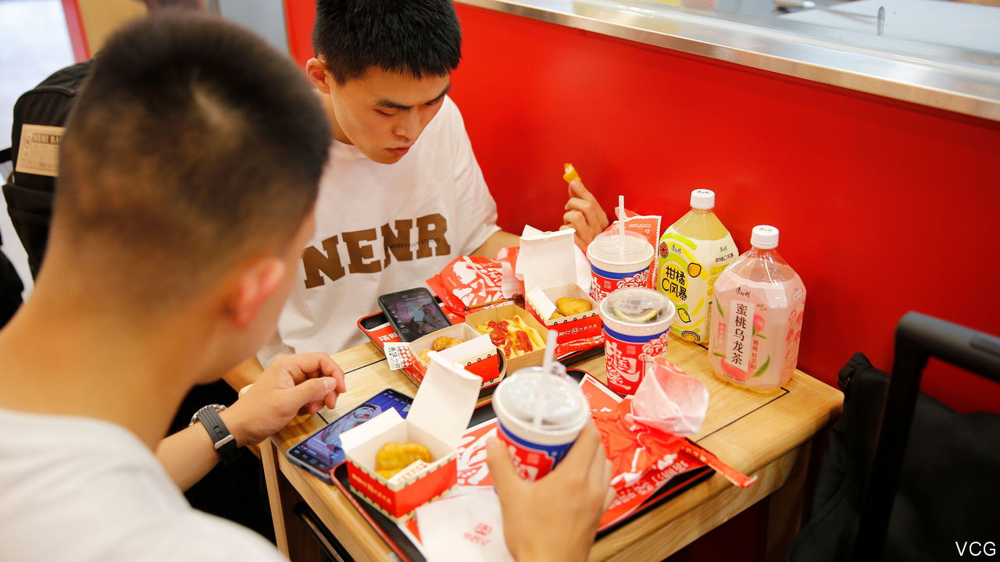

###### Step aside, Ronald

# How China is making the burger its own 

##### Duck, pork, tofu—what will it be? 

 

> Jan 18th 2024 

AT FIRST GLANCE, the burger appears like any other. But on closer inspection, something is different. Pressed between the buns is not a patty of minced beef, but morsels of roasted duck. The buns themselves are wrinkled and slightly charred. They are hand-rolled and made using traditional pastry-making techniques, says Tastien, the fast-food chain serving up this meal. If duck isn’t your thing, other options include fish-fragrant shredded pork and mapo tofu. Though not technically a hamburger, Tastien’s ads declare, “The Chinese hamburger is here!”

It appears to be popular. Last year Tastien added nearly 3,500 stores, for a total of around 6,700 in China. That is more than McDonald’s, which has 6,000, according to GeoHey, a Chinese analytics firm. KFC (11,000) and local brand Wallace (18,000) still lead the fast-food industry.

McDonald’s and KFC brought burgers to China. When the first KFC opened in Beijing in 1987, customers queued up to get a taste. Back then the fast-food chains targeted well-off Chinese. But as incomes rose, such meals grew more affordable. Still, a big part of Tastien’s success is its prices, which are well below those of Western fast-food chains.

Founded in 2012, Tastien started out making pizzas. It began selling burgers in 2017. Two years later it claimed to be the creator of the Chinese hamburger, though it was hardly the first to offer such a thing. Still, the patriotic marketing has gone down well. Tastien received a 120m yuan ($19m) investment from Chinese venture-capital firms in 2021. Until recently, it has focused on smaller cities where it faces less competition from Western chains.

Now it is taking on rivals in big cities like Guangzhou and Shanghai. And the competition is growing. Local fast-food chains such as Running Panda and Chuzheng have also attracted sizeable investments. Many of these smaller chains offer burgers similar to Tastien’s and have adopted marketing strategies that emphasise their Chinese origins.

Chinese burgers are part of a wider trend, called  (new Chinese style), which sees companies infusing elements from traditional Chinese culture into their products and branding. The label “Chinese style” has been attached to everything from coffee to fried chicken. There is a political tinge to the fad. Companies are capitalising on the nationalist tendencies of young people.

This type of marketing is no guarantee of success. Tea-houses in China date back hundreds of years, but some that have opened recently under the “Chinese style” banner are still struggling. So too are some vendors of steamed buns, which originated in China long ago. It is perhaps less of a surprise that Chinese-style ice cream has not taken off. The label can often seem like a gimmick, attached to products that have little to do with traditional culture. One might say the same about burgers. Good thing Tastien’s are cheap. ■


