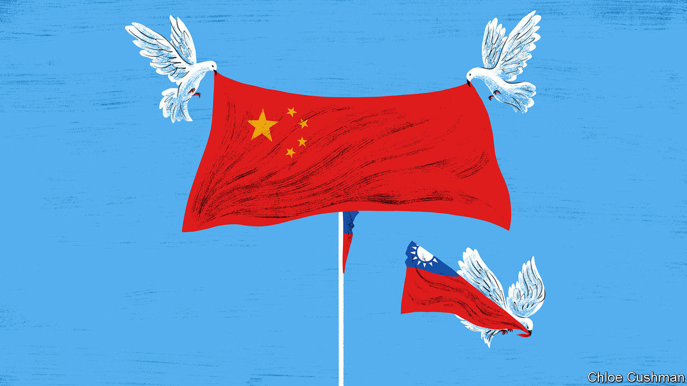

###### Chaguan

# How China’s public views Taiwan’s elections 

##### Ordinary Chinese express no eagerness for war, but back threats of force 

 

> Jan 18th 2024 

As China’s rulers tell it, the Communist Party must control Taiwan to make the whole country safe and strong. “Unification brings strength while division leads to chaos,” says the State Council, China’s cabinet. “This is a law of history.”

Actually, the party’s obsession with Taiwan is a political choice. After 1991 China signed a series of treaties fixing its borders with the Soviet Union and Russia, in effect ceding over a million square kilometres of Chinese territory grabbed by Russia in the 19th century. No law of history forbade that decision to forget past wrongs.

Taiwan is different because it represents a direct affront to the Communist Party. That dates back to 1949 when the island became the home-in-exile of the Nationalist regime defeated by Mao Zedong and the People’s Liberation Army (PLA) in the Chinese civil war. If Xi Jinping could take Taiwan, he would be the final victor of a war that Mao could not end. In contrast, letting the island slip out of China’s grasp would undermine the party’s legitimacy, or so Chinese scholars claim.

Political self-interest, then, explains decades of investments to build up the PLA, with a focus on deterring America from coming to the island’s rescue. It explains, too, threats to use force should Taiwan declare formal independence. Those are political calculations. They make the world more dangerous than it needs to be.

Still, there is another self-serving choice by China’s leaders that arguably keeps the peace in the Taiwan Strait. That choice involves telling the Chinese public—despite much evidence to the contrary—that most Taiwanese long to be part of China, but are thwarted by separatists egged on by America, Japan and other hostile foreign powers. This is a gambit. Mr Xi enjoys more room for manoeuvre as long as lots of ordinary Chinese believe that Taiwan may one day embrace “peaceful reunification”. 

The tactic can be seen at work since Taiwan’s presidential election on January 13th was won by the Communist Party’s least-favoured candidate, . Mr Lai’s win marks the third presidential term in a row for the Democratic Progressive Party (DPP), which emphasises Taiwan’s separate, democratic identity. Yet since that victory, mainland propaganda outlets have downplayed its significance and played up the DPP’s poor showing in parliamentary elections held the same day. Chen Binhua, a spokesman for China’s Taiwan Affairs Office, assured the Chinese public that the elections show that the DPP “does not represent mainstream public opinion” in Taiwan. Rather than stoke anger, party media dug up soothing past comments by Mr Xi about the need to woo “patriotic”, pro-unification forces on the island.

It is unclear how angry China’s public is even ready to be, after years of being told that most Taiwanese are their blood brothers. When researchers from the South China University of Technology and the National University of Singapore polled Chinese people in nine cities in 2019, they found almost 40% ready to rule out unifying Taiwan with the mainland by force under any circumstances. 

A paper for the , published in 2022, records the survey organisers’ surprise that support for keeping force on the table as an option was highest among the well-educated and those knowledgeable about Taiwan. Qi Dongtao, a lead author, suggests that well-informed Chinese may not be war hawks as such, but simply more aware than regular folk that Taiwan is not about to submit peacefully to Beijing.

To sample the post-election mood, Chaguan flew south to Xiamen. The Chinese port city enjoys close economic and cultural ties to Taiwan—and would be on the front line in a war. Serving as a reminder is Hulishan Fortress, whose weathered cannons point at an outlying Taiwanese island, Jinmen, just 27km (17 miles) offshore. In the Mao era, the PLA shelled Jinmen. The fort acted as a military radio base. Now a museum, it hosts tourists who tended to flee when asked questions about politics. Those who stuck around offered strikingly diverse views.

A middle-aged woman from Tianjin, strolling on the beach below the fort, expressed confidence that most Taiwanese support unification. She did not know the election results but had recently seen online reports about islanders travelling to an ice festival in the city of Harbin, in China’s frozen north. “We should promote this kind of contact,” she enthused. That said, she supported threats of force as an option, venturing that “toughness” by China’s leaders should balance “softness” towards Taiwan’s people. 

Talking of war and peace, in a fort

Up in the fort a retired man from Ningbo, a coastal city, stood taking pictures of Jinmen through the mist. The photographer disclosed that his own father served in China’s navy and was killed in the Taiwan Strait in the late 1960s. His family’s loss makes him long for peace, he said, adding that China needs to become more appealing, economically, politically and culturally, if Taiwan is to choose unification. Yet his patience co-exists with a belief that force cannot be ruled out. “If we promise to give up the threat of force altogether, and promise that in front of the world, then the island would just declare its independence, right?” he asked.

A university student from Shanghai saw Mr Lai’s victory as a sign of trouble ahead, but called the election the will of Taiwan’s voters. “Among my generation, I know few who want a war. Whereas some older people may hope that we can recover Taiwan by force one day,” he worried.

The student was not wrong. A former rural official from the province of Jiangsu was encountered briskly climbing the fort’s stone steps with his granddaughter, though he turns 85 next month. Every place wants to be ruled by its own king, he declared, and Taiwan has been separate for too long. “We have to reunite with Taiwan by force.” Indeed, if the PLA were not powerful, Britain would not have given Hong Kong back, the old man added with a glare. Having laid down that law of history, off he marched. ■


