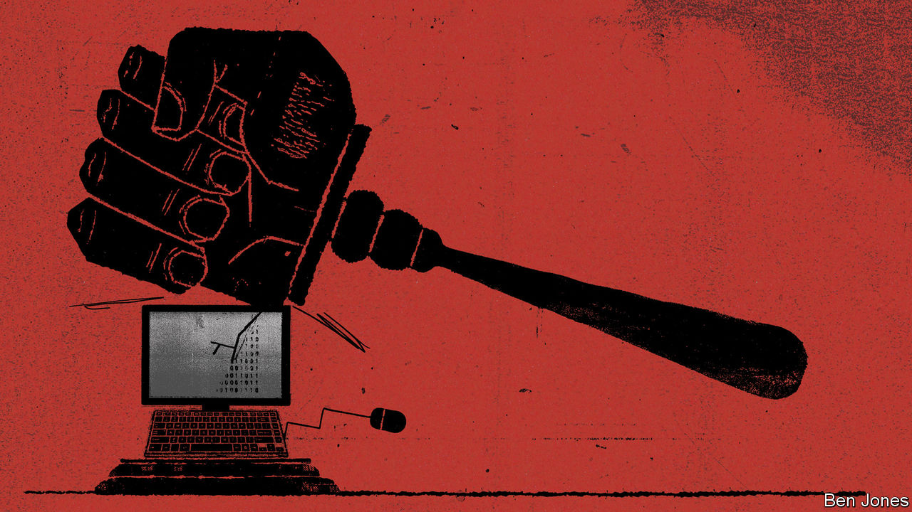
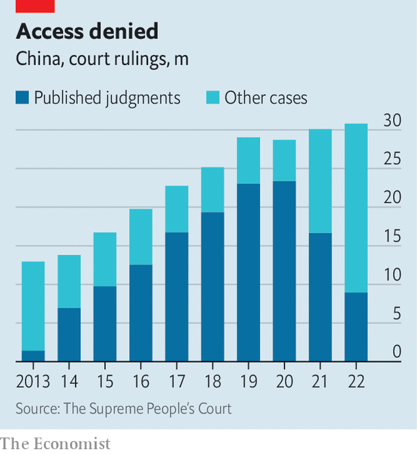

###### Crime and punishment

# Why China’s government is hushing up court rulings 

##### Xi Jinping’s fresh attack on the rule of law 

 

> Jan 15th 2024 

OVER THE past three decades China’s legal system has been gradually improving, albeit from a low base. The Communist Party still dominates the system: Xi Jinping, China’s leader, considers judicial independence a dangerous idea. Suspected criminals who end up in court are found guilty 99% of the time. But analysts reckon the quality of judges on the civil and commercial side has got better and corruption has decreased. The World Bank has a rule-of-law measure that uses indicators like property rights and judicial independence. In 2006 China was in the bottom third of countries. By 2022 it was in the top half.

Better pay for judges and harsher punishments for misconduct have helped. But one crucial change has been more transparency. A decade ago China’s courts were ordered to upload all but the most sensitive of their rulings to a database called China Judgments Online, which was open to anyone. The platform grew to contain over 140m decisions. This unprecedented window into the system was a boon for civil-society groups, which could refer to cases in their campaigns to, say, protect the environment or defend women’s rights.

 


But the era of transparency seems to be ending. In December the supreme court admitted that the pace at which rulings were uploaded to China Judgments Online had fallen (see chart). Some judges have reportedly been told that they no longer need to upload cases at all. “Judicial transparency doesn’t mean we need to post all judicial information on the internet,” said the court. It suggested that China Judgments Online raised privacy and security concerns. An alternative database will be launched this year, but will be accessible only to court officials and police.

Transparency does not guarantee fairness in a justice system. In 1980 China televised the trial of Mao Zedong’s widow, Jiang Qing, who stood accused of persecuting thousands of people during the Cultural Revolution of the 1960s and 1970s. Prosecutors assembled evidence and called witnesses. The public, wrote one of the judges, could “see for themselves what was meant by the rule of law”. But the verdict was never in doubt. The Communist Party needed a scapegoat for the chaos of Mao’s rule. Jiang received a death sentence, later commuted to life imprisonment.

More recently, the increased visibility of China’s court system has improved the quality of justice. But it has also caused embarrassment. Similar offences often yield differing rulings. Some decisions, such as judges denying the victims of human-trafficking a divorce from their buyers, are cruel and absurd. A more accountable government might acknowledge such problems and promise to do better. The Chinese government, though, seems to have tired of providing fodder for activists by putting its failings on display. 

That this experiment in transparency is ending comes as little surprise. China has been growing more opaque in other ways, too. Last year foreigners lost access to parts of a database called China National Knowledge Infrastructure (CNKI), which contains around 95% of Chinese academic articles and a host of other documents. The firm that runs CNKI cited cyber-security rules. In August the government stopped releasing the unemployment rate for city-dwellers aged 16 to 24 after it rose to 21.3%. In January officials began calculating the rate differently, producing a lower number, and started releasing it again. Analysts at banks have been warned against publishing bearish views on the economy.

The gutting of China Judgments Online will have as big an impact as any of these moves. Lawyers used the database to find precedents that could strengthen their arguments. Those who specialise in helping citizens sue the state—a tricky task at the best of times—complain that almost all such cases have vanished from the database. With a bit of persuasion, court officials might provide relevant rulings. But that could involve paying backhanders. An informal market for judgments that are no longer publicly available has reportedly sprung up on social media. Lawyers warn that less public scrutiny of decisions could also lead to more corruption. 

Activists at home and abroad may be most affected by the changes. They had employed the database in a variety of ways, such as exposing how the government uses vague offences like “picking quarrels and provoking trouble” to criminalise dissent. Many related cases have been removed. So have others that expose the party’s brutality, including those resulting in a death sentence (China does not reveal how many people it executes). Cases involving sensitive terms, “freedom of speech” for example, have also disappeared. 

The government’s efforts to contain scandals extends to the database. In 2022 a woman was found chained by the neck in a freezing outhouse in Jiangsu province, provoking public outrage. After issuing a series of contradictory statements, officials admitted that she had been sold into marriage. Embarrassed, the government limited access to the woman’s village and censors deleted news reports about her plight. Many cases related to human-trafficking appear to have been removed from China Judgments Online, too.

Cases involving wildlife-trafficking have also gone missing from the database. With many people believing that the covid-19 virus jumped from animals to humans at a market in Wuhan, that is perhaps no surprise. Other deletions are more puzzling. Cases to do with “stealing or insulting a corpse” can no longer be found. Researchers believe the government is deleting anything that could be embarrassing.

If the decline in transparency leads to more corruption, the party will not fight it in the open. It has a parallel system for dealing with graft, managed by the Central Commission for Discipline Inspection (CCDI). Since assuming power in 2012 Mr Xi has increased the CCDI’s resources and authority. In 2023 alone it punished over 400,000 officials. Only a tiny fraction of such cases are ever revealed to the public.

One of Mr Xi’s favourite slogans is , or “governing the country according to law”. He is not referring to the rule of law in the Western sense. Rather, he wants the party’s rule to become more professional and predictable. That, he hopes, will give it more legitimacy. 

But lawyers believe that the decline in transparency will have the opposite effect. In response to their criticism, the supreme court has pledged to be more open. Few believe it. Some lawyers, such as Han Xu of Sichuan University, argue that by reducing the public’s access to cases the supreme court is itself breaking laws that require courts to disclose their judgments. With the court setting such a bad example, he asks, “How can we cultivate people’s belief in the rule of law?” ■


