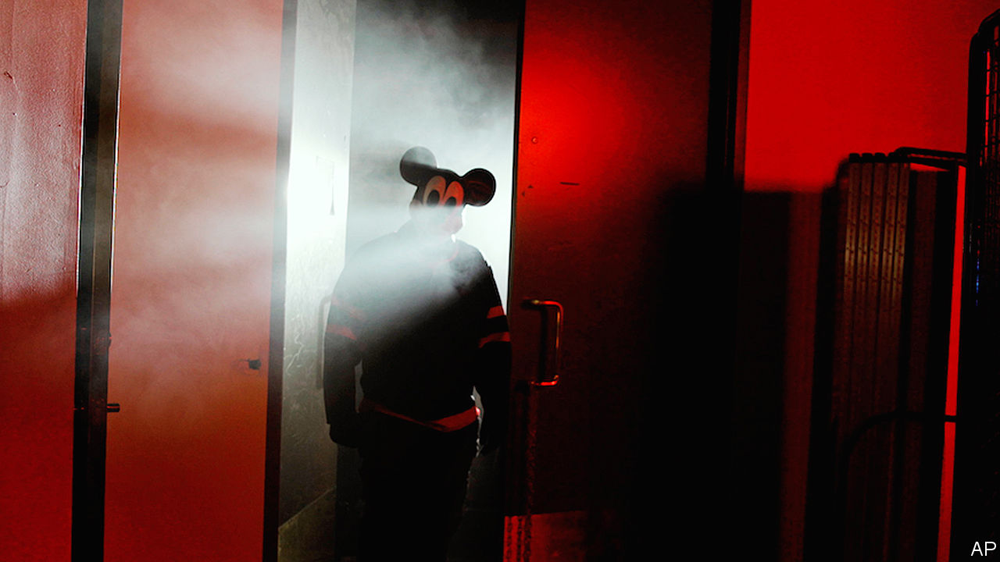

###### Copy wrongs

# A new book looks at the past and future of copyright 

##### Whether it benefits creators or fuels inequality depends on who you ask 

 

> Jan 18th 2024 

 By David Bellos and Alexandre Montagu. 

IF WALT DISNEY were still alive, he would be dismayed at the new film role given to his signature character, Mickey Mouse, as a slasher hunting teenagers in an old arcade. The trailer for “Mickey’s Mouse Trap” was released on January 1st. That is the day the copyright of “Steamboat Willie”, the short film that introduced Mickey Mouse’s character in 1928, expired. This early version of Mickey is now . 

Even before the arrival of a murderous mouse, the field of copyright has been full of dramatic turns, as a new book, “Who Owns This Sentence?”, recounts. That is because “copyright is an edifice of words resting on a long and complicated string of metaphors and double meanings,” write the authors David Bellos, a professor at Princeton, and Alexandre Montagu, a lawyer. Over centuries artists, authors, lobbyists, publishers and public officials have defined and redefined the meaning of copyright, with debate and legal changes happening beyond the public eye.

 Initially an author’s right to their creative output was a question of honour. Hermodorus, a student of Plato, published notes he took from Plato’s lectures without permission, which incensed the philosopher. Privileges, a precursor to copyright, emerged in the 15th century in Venice, where authorities gave skilled craftsmen a seven-year monopoly over luxury goods they produced. Among those who profited from Venice’s system was Johannes of Speyer, an apprentice of Johannes Gutenberg, maker of the printing press. 

Authors and artists did not always benefit. Powerful publishing syndicates treated books like property and profited from selling the works of , ,  and others. Britain’s Statute of Anne, the first copyright law regulated by government and the courts instead of private parties, came into effect in 1710 and gave authors rights to their works for a limited time (though booksellers and publishers could buy the books before the copyright expired and claim to own the rights perpetually). But it was a decision by the House of Lords in 1774, reasserting term limits for copyrighted works, that fully established copyright in Britain and served as the beginning of modern copyright law in the West.

Mr Bellos and Mr Montagu argue that copyright has gone from a right that favours creators to something more akin to a privilege for the rich and powerful. Two major legal developments led to this. First, in the early 1900s a skirmish over printing posters for a travelling circus redefined the meaning of authorship to include employers of artists. In other words, companies could own copyrights. Second, in 1976 the meaning of literary works was adjusted so that computer software was included.

Intellectual property is now among America’s chief exports. About a third of the 50 richest people in the world derive their fortunes—in whole or in part—from copyrighted goods. Some creators have benefited handsomely (, for example, sold his music catalogue to Sony for a reported $550m in 2021). But many have not. “Copyright is the elephant in the room when it comes to understanding the origins of the wealth gap in modern societies,” the authors write.

Today the newest frontier of copyright is , which allows people to create images, prose and sounds based on prompts. Artists have called AI “vampirical” because it scrapes pre-existing content for training. 

Some writers and artists, such as Sarah Andersen, a cartoonist, have taken AI giants to court over copyright infringement. “We’re not necessarily fighting for AI to go away, but if our work is going to be involved in these systems, we would like to be credited,” Ms Andersen says. She also argues that artists should be compensated and be able to opt out of having their work used to train AI models. 

Publishers are in legal tussles, too, including the , which in December sued OpenAI (the maker of ChatGPT) and Microsoft for copyright infringement, after talks between the news publisher and tech companies failed. Others are more optimistic. Some news groups, including the Associated Press, have signed deals to share story archives with OpenAI. 

“Who Owns This Sentence?” does not predict how the future is likely to unfold. That is because no one is quite sure. “Things are up in the air,” Pamela Samuelson, a professor at the University of California, Berkeley School of Law tells . Copyright law could slow down the work of AI companies. Or AI could upend the current copyright system and claim new victims, like Mickey’s new incarnation does on his rampage. ■


