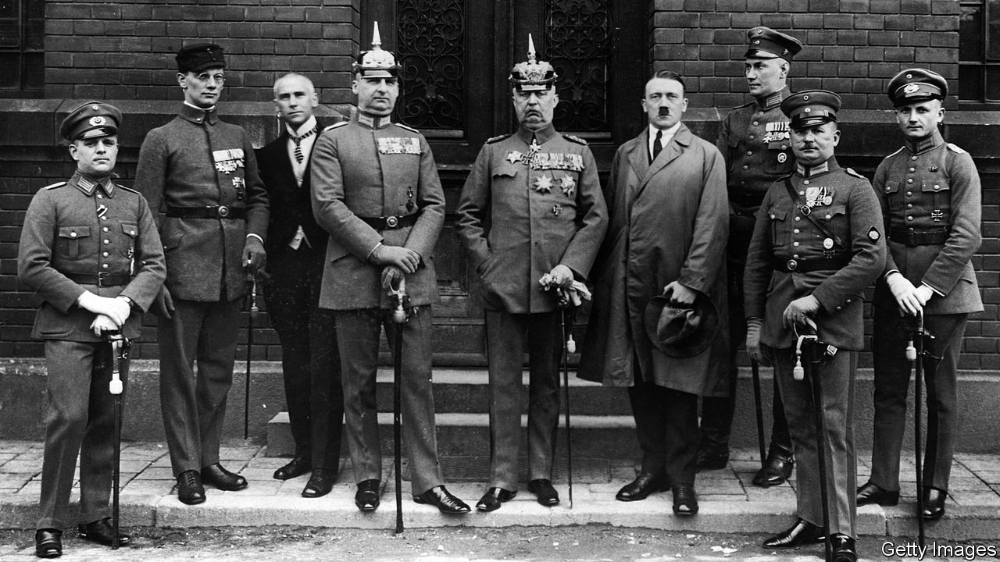

###### Diary of a bad year

# A tougher sentence for Hitler in 1923 could have changed history 

##### A new book looks at a consequential year in German history 

 

> Jan 18th 2024 

 By Mark Jones. 

The young murderers were out for more than blood. By gunning down Walter Rathenau, the Jewish foreign minister, in June 1922, they were hoping to spark a crisis that would lead to the destruction of the , the German government formed after the first world war. The heavily armed, virulently antisemitic terrorist network that Rathenau’s killers belonged to, called the Organisation Consul, wanted to rise up and destroy the republic, avenging Germany’s  and subsequent humiliations. 

Rathenau’s death briefly became a rallying point for the republic, with people taking to the streets to oppose violence and the depleted German army demonstrating loyalty to the country’s young democratic institutions. But the trial of 13 men who had been involved in Rathenau’s murder ended in laughably lenient sentences. As Mark Jones, a historian, argues, it was a political and judicial failure that would have profound consequences. His book, “1923”, is a gripping narrative of the extraordinary year in which Weimar Germany was struck by successive blows, though it somehow survived for another ten years.

As 1923 dawned, much that could go wrong had. A bad harvest was a boon to already soaring inflation. In less than six months there had been a 24-fold drop in the value of the mark against the dollar, the result of Germany having funded its war effort almost entirely with debt. Instead, after the war, Germany had to pay , with most owed to France.

Germany’s unwillingness or inability to meet its liabilities led the French prime minister, Raymond Poincaré, to invade and occupy the industrial Ruhr in January. This was a calamity for almost every German other than potential putschists and contributed to the hyperinflation that rocked the country. By December 1923 a dollar was worth 4.2trn marks.

The occupation of the Ruhr and its consequences provided the small but growing Nazi party, led by a charismatic agitator, Adolf Hitler, with the opportunity to call repeatedly for a violent “masculine” response and to propagate the “stab in the back” myth about the treacherous politicians who had sought a truce in 1918. By the autumn Hitler, who was inspired by ’s march on Rome the previous year, was convinced that the “fascist moment” had come—and with it the opportunity to overthrow the government.

However, the “Beer Hall putsch”, as the coup attempt came to be known, failed. Hitler realised belatedly that Gustav Ritter von Kahr, the right-wing Bavarian state commissioner general who seized emergency powers and was also plotting the overthrow of the Weimar government, was using him. Kahr turned on Hitler, who lacked the backing of local army units and the state police and was too weak to prevail. A brief fight in the city centre with the police resulted in the Nazis fleeing, leaving behind 13 dead comrades. 

Despite Hitler’s high treason and the violence he unleashed against political opponents, Jews and the police (four of whom were killed), he was sentenced to a mere five years in prison. He was released after only eight months, during which he wrote the first volume of his manifesto and autobiography, . Mr Jones surmises that Hitler’s threats and knowledge of the anti-republican conspiracies in Bavaria led by Kahr helped him cut a deal. The trial gave Hitler a platform that turned him into a national figure.

Hitler had also learned a valuable lesson: to take power and harness the forces of the army and state he must first achieve electoral success. This is what he would achieve nine years later. Mr Jones concludes that the unwillingness to try Hitler at the Court for the Protection of the Republic, where he and other Nazis would have faced far more severe sanctions, “turned out to be one of the most costly errors in world history”. ■


