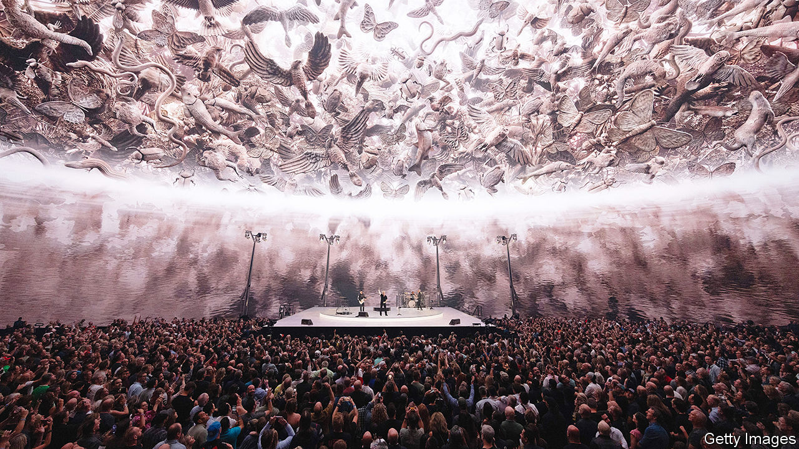
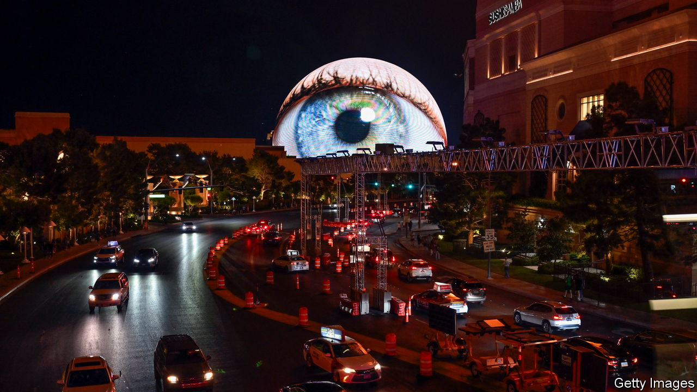

###### Live music

# Does Las Vegas’s Sphere reveal the future of concerts? 

##### The venue is dazzling. But copycats are unlikely to be built soon 

 

> Jan 12th 2024 

Nestled between hotels and conference centres, a short walk from the  strip, is a giant, wide-eyed emoji. Sometimes it is an enormous,  eyeball, a basketball or a whorl of flames. The Sphere, a remarkable new concert venue, is 366 feet (110 metres) tall and 516 wide; an LED screen spanning almost 600,000 square feet covers the exterior. 

Inside, enveloping the 17,500 seats, is another vast, ultra-high-resolution screen. This pleasuredome offers an experience unlike any other. It also raises questions about the future of live entertainment.

The high-tech arena was opened in September by U2, who remain in residence until March. The Irish band has a history of innovative concert design as well as corporate ventures, including a long partnership with Apple. Perhaps just as important, U2 is loved by middle-aged rock fans, who form the bulk of concertgoers in America and might shell out for a ticket. (Prices start at $140 and go up to $1,500.)

A celebration of “Achtung Baby”, an album released in 1991, U2’s show is an overwhelming phantasmagoria. The band plays on a stage shaped like a turntable while work by artists including Es Devlin and John Gerrard appears on the vaulting screen. During “Even Better Than the Real Thing”, there are animations of slot machines and  kitsch. For “Where the Streets Have No Name”, the crowd is transported into the blinding daylight of the high desert. During “With Or Without You” the ceiling teems with images of endangered local species such as the leaf-nosed bat. “It’s a show that’s about the venue that it’s in,” says Willie Williams, U2’s longtime production designer. “It’s about us all going to experience the venue.” 

 


From one angle, the Sphere represents a major development in an existing trend of the arts becoming more immersive. Exhibitions that turn the paintings of Monet or Van Gogh into interactive, room-encompassing installations , as have immersive theatre productions. Virtual-reality technology has improved significantly. 

From another angle, it is part of the evolution of the modern rock concert, which since the 1960s has combined light and sound to transport fans into another dimension. At a show your correspondent attended at the Sphere in October, there were moments when the experience was transcendent. (There is a quiet room, filled with bean bags, for the over-stimulated.) Yet viewers still took their eyes off the big screen to reach for the smaller ones in their pockets. At times the band seemed like an expensive soundtrack to the bright lights.

Is this the future of the concert? In the short term, no. The sheer cost of the Sphere—$2.3bn—means that the model cannot be easily reproduced. Its ostentation is also a barrier: Sadiq Khan, the mayor of London, recently vetoed a sister Sphere in the city, calling it “bulky, unduly dominant and incongruous”. Sphere Entertainment Company, the owner, hopes to build other iterations and is in “serious” talks for an arena in . But negotiations regarding Spheres in Saudi Arabia and South Korea have stalled.

Some artists and promoters are said to be wary of developing shows that cannot be taken on tour to other, standard arenas and of letting the venue outshine the music. For now, at least, what happens in Vegas is staying there.

The Sphere does mark a bullish bet on the future of live music, however. The biggest acts have long had to make do with sports stadiums with dodgy acoustics, but this is a capacious, purpose-built venue. There seems to be plenty of demand for lavish productions by the biggest hitmakers: witness the billions of dollars in revenue made by Beyoncé’s “Renaissance” and Taylor Swift’s “Eras” . 

According to Luminate, an analytics firm, in 2023 consumers spent 91% more on live music events than the year before and attended 32% more concerts. Goldman Sachs predicts the market for live music will grow by 5% this year to reach nearly $40bn annually by 2030.

This growth is not just driven by pent-up demand from the pandemic. Youngsters, who prefer to spend their money on experiences than on items, consider concerts good value, even when they are pricey. “People still want to have that experience of liveness,” says Steve Waksman, a concert historian, regardless of whether, as at the Sphere, it is “mediated” through screens. To some, the Sphere may be more bewildering than beautiful, but one thing is clear: the future of concerts is as rosy as Bono’s trademark glasses. ■


