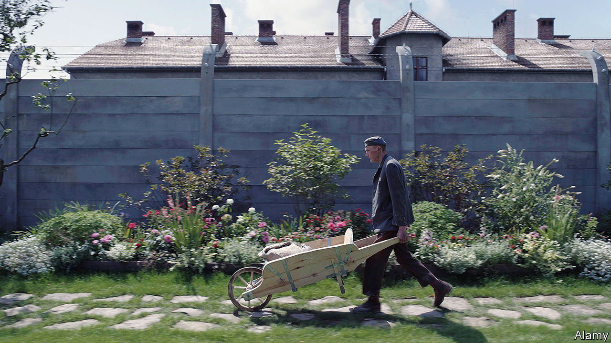

###### Back Story

# How should cinema tackle the horror of the Holocaust? 

##### Two very different new films rise to the challenge—up to a point 

 

> Jan 16th 2024 

A baby is crying, but whose: the one in the nursery or someone else’s child, beyond the garden wall topped with barbed wire? A dog is barking, but is it the family pet or a far more menacing animal? In “The Zone of Interest” (pictured), an ambitious new film by , the nursery and the dog belong to  (played by Christian Friedel), the commandant of Auschwitz. The wall divides his family home from the adjacent concentration camp.

Every director who grapples with the Holocaust—from Mr Glazer to Steven Spielberg, whose landmark hit “Schindler’s List” came out 30 years ago—faces a daunting, possibly insuperable challenge. They must attempt to convey the horror while knowing that their efforts are bound to be inadequate, and risk seeming disrespectful of the suffering. Different as they are in other ways, “The Zone of Interest” and another new release, “One Life”, offer similar solutions. Both succeed—up to a point.

“The Zone of Interest” takes its theme of domestic life at Auschwitz (though little else) from ’s novel of the same name. It is less a story than a map of a moral void. In the shadow of the crematoria Rudolf, his wife Hedwig (Sandra Hüller) and their five children live “how we dreamed we would”. They enjoy picnics, parties in the garden, looted clothes and bucolic swims in rivers that are only sometimes awash with human remains. Rudolf is sad to be transferred away, then thrilled to be sent back to  to oversee the murder of the Jews of Hungary.

Ghostly inmates tiptoe into this warped idyll to wash blood from his boots or spread ash on the flower beds. Terrible sounds—gunshots and heinous commands as well as barks and cries—drift over the barbed wire. But midway through the film you realise, with a complicated sort of relief, that the camera will not be going over the wall to show the barbarity first-hand. Watchtowers, the steam from trains, belching chimneys: the visual shorthand of the Holocaust is enough, the film seems to say. 

Whereas “The Zone of Interest” is arty (and an Oscar contender), “One Life” is as unflashy as its protagonist. He is not a mass-murderer but a rescuer: , a self-effacing stockbroker who helped spirit 669 mostly Jewish children from Prague to Britain on the eve of war. He embodies what you might call the banality of goodness, his feat requiring as much dogged paperwork as derring-do. James Hawes, the director, uses a dual time-frame. In sequences set in the 1930s Winton is played by Johnny Flynn, in the 1980s by Anthony Hopkins, wonderfully.

The climax restages Winton’s genuine appearance on “That’s Life!”, a British TV show, in 1988, which brought him together with some of the people he saved. Here is another big difference between these films. Like many feted Holocaust movies—not just “Schindler’s List” but “The Pianist” and the facile “Life is Beautiful”—“One Life” succumbs to cinema’s bias for redemption over desolation; for a happy ending, or at least survival, over oblivion. “The Zone of Interest” does not.

In the matter of the horror, though, the films are alike in their restraint. The most heart-rending scenes in “One Life” involve desperate partings on train platforms or old photos of lost children. There is vanishingly little violence.

The two films stand in tactful contrast to others that intrude into the gas chambers. Back Story’s reservation about them is as much a question of timing as content. Are such oblique tales an apt way to dramatise the Holocaust now? 

Its place in Western culture has become vexed. Commemorated in museums, memorials and memoirs, it can often seem inescapable. At the same time, as the Holocaust slips out of living memory it is widely misrepresented, even forgotten. It is a common touchstone in political disputes, not least for voices on both sides in the tragedy of . On the web it is material for risqué memes. , one in five young Americans think the Holocaust is a myth. 

In this context, the urgent job of storytellers is to remember—to insist on—the victims, not just the perpetrators or heroes. The recent film which did that best was “Three Minutes: A Lengthening”, a documentary that boasted neither stars nor avant-garde effects. It aimed to identify the people in a home-movie clip from a small Polish town in 1938. Almost all the gap-toothed Jewish boys and smiling girls soon perished, but the film does not dwell on that fate. What it mourns is not the horror, but the loss.■


