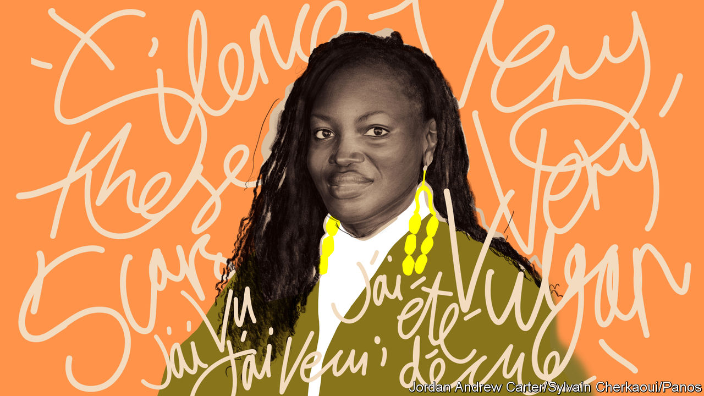
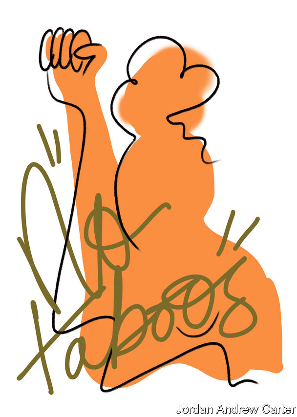

###### In your face

# The rise of foul-mouthed female slam poets in Africa 

##### One of the world’s most sexist countries is a hub for feminist poetry 

 

> Jan 12th 2024 

In a restaurant in N’Djamena, the capital of , a woman in a white dress picks up a microphone as a keyboardist gently plays. “I wanted to silence these scars that reminded me how I was broken, bullied, beaten and cut open alive,” she begins. Épiphanie Nodjikoua Dionrang is not only trying to entertain the audience but also to express her rage. 

In her poem, she addresses all the men who abuse women: “If one day life allows me, with my vagina I will piss on your face.” Her voice rises, and her hand gestures between her legs. “Yes,” she repeats, in case the men sipping sodas missed it, “with my pussy I will piss on your face.” 

Young Chadian women do not normally use such coarse, defiant language in public. Many are scared to speak out at all. Chad, a desert-covered African country, is poorer than  and nearly as sexist. Half of Chadian men and almost three-quarters of women think it acceptable for husbands to beat their wives sometimes for such transgressions as arguing or going out without asking, according to a survey in 2015. The same poll found that nearly one in three Chadian women had experienced physical or sexual violence from a partner at some point. A quarter of girls marry before they turn 15.

Chad is not an easy place for men either. Dissidents are routinely arrested and tortured. Mahamat Idriss Déby, the president, is an autocrat who  after his predecessor, who was also his father, was shot dead while fighting rebels. But grim as life is for everyone, it is especially bad for women. 

Far fewer women than men are visible in the dusty streets of Chadian cities. Men whizz around on motorbikes and throng streetside shops. Many women are stuck at home. If they go out, they are expected to conform. Roukhaya Mahmat Traoré, a soft-spoken 26-year-old, recalls that when she stepped into the street after shaving her head for health reasons, a man “immediately called me a prostitute”.

Ms Nodjikoua Dionrang, known on stage as Fanny’s D’Or, answers patriarchy with poetry—sometimes “very, very vulgar” poetry, as she puts it. “There are no taboos for me,” she says as she wolfs down fried plantain at a café, her huge Africa-shaped earrings swaying vigorously. “We must say things as they are.” 

She is a slam poet, a practitioner of an art form that originated in Chicago in the 1980s and is now conquering Francophone Africa. Slammers recite their rhymes competitively in front of lively, demanding audiences. For young people, it is a way to speak truths that might normally be silenced. For women, it is liberating. 

Ms Nodjikoua Dionrang first saw slam in 2014 when she was a student in . She was moved by the female poets, known as : “It was as if I was them.” At the time, N’Djamena was fast becoming a hub of. “Chad was taking the lead,” says Mirjam de Bruijn of Leiden University. In 2018 the city hosted the inaugural African Cup of Slam Poetry, with entrants from 20 countries.

Slam’s surprising strength in this conservative Muslim country owes much to Didier Lalaye, known as Croquemort. One of his poems, “Cousin de l’UE” (Cousin of the European Union), made slam popular almost overnight. In it, he rails against European ignorance of Africa. “They think that our fathers are all polygamous; that our grandfathers are cannibals,” he says. “They have Treblinka, the Gestapo and the Nazis. But they adore the genocide of the Tutsis and Hutus.” 

In 2013 Croquemort founded an annual festival called  (roughly: N’Djamena is burning with Slam). Another collaborator, Gabriel Kada, known as Bokal, helped Chadian slammers set their poems to music, a Chadian twist on the genre’s origins. Slam festivals, complete with light shows and live music, sound like literary rap concerts. The audience cheers, shouts and applauds wildly as poets drop lyrics. 

Most slam fans are young urbanites, including young women keen to push past society’s conservative expectations. The slightly literary bent helps reassure at least some wary parents that it is a passion worth indulging. Not all slam is angry—at times it is playful and funny—but it can often have the fury of an opposition rally. 

Croquemort sought female participants for the festival. In 2016 Ms Nodjikoua Dionrang signed up, performing a poem about surviving a near-fatal bout of appendicitis. She was the first female Chadian slam poet to compete. “I came third,” she smiles, “and, as I was the only woman, I was immediately declared the number one  in Chad!” She quickly became a fixture on the Chadian slam scene. 

At first she was not radical. That changed in 2020, when a friend in Togo stopped replying to her messages. Eventually she found out why. “She had been kidnapped, raped and killed,” she says. The police never found the perpetrator. “That was the biggest turning-point in my life,” she says. “That made me rage.” Many women “suffer this way. And nothing is done.” 

Ms Nodjikoua Dionrang’s slamming became overtly feminist. “Tell me, is being born a woman a curse?” she asks in one performance. “Can we live, constantly dreading the evening blows?” Her words became angrier, too. “Let all this stop, otherwise we will take up our axes and our machetes against these cowards,” she spits, her voice rising. 

Around this time she got to know Ms Mahmat Traoré. When asked what made her a feminist, Ms Mahmat Traoré takes a slow, deep breath. “I was abused by my older brother and my cousin for six years,” she says. Her brother told her that God approved of what he was doing. Ms Mahmat Traoré finds the idea absurd. “If God really existed, why was he allowing all this to happen to me?” she asks. 

In 2020 Ms Mahmat Traoré and Ms Nodjikoua Dionrang became activists as well as artists. They founded the Chadian Women’s Rights League, which campaigns against violence against women. It helps victims get medical and legal aid and publicly denounces alleged attackers. “I’ve had so many problems with the authorities,” says Ms Nodjikoua Dionrang. Officials at Chad’s ministry for women, who in theory have the same goals, “do not want me to say [blunt] things”.

She is not the only demanding a better deal for women. Many have suffered abuse. Ommel Gwladice Djiraibe, known as Djemi, began performing in public in 2018. The next year she appeared at “Slam et Eve”, a festival devoted to women performers. Her poems are bracing: “The one who was in charge of my education took it upon himself to rob me of my innocence; he enrolled me very early in the course of, ‘Come, I pee between your legs’.” She says that “slam is as therapeutic for the  as it is for the listener.”

 


Slam poets also test the limits of what conservative Chadians and the paranoid government will stomach. Many criticise female poets for talking about sex or abuse. “When they say ‘It’s not done for a girl’, that pisses me off,” says Djemi. She adds that many men also lust after  who speak frankly about sex: “Everyone tries to have sex with you.” Ms Nodjikoua Dionrang provokes extreme reactions. “Be careful. One day we are going to kill you,” she is often told on social media. On one occasion she saw a car full of men tracking her as she took a motorbike taxi home. 

“I’m not afraid of death,” she says. On stage, she throws her critics’ taunts back at them: “Yes, I am the one you called a dirty slut, less than nothing, easy woman, a prostitute and above all—and above all—whore,” she says, spitting the final French word,  Many women thank her for speaking up.

Fighting words

Pressure from the government has worsened since Mr Déby took power in 2021, says Croquemort. Financial supporters of slam festivals sometimes pull out. Permits for events are often denied. Radio stations refuse to play poets’ tracks. Self-censorship is on the increase, too, adds Croquemort. At other times the government tries to co-opt slam poets, inviting them to perform at official events but restricting what they can say. 

In October 2022 the regime delayed elections and brutally cracked down on the resulting protests, killing at least 128 people. Outspoken artists were targeted. “It was truly a door-to-door hunt,” says Croquemort. “It was clear at that moment that I could not be in Chad and express myself,” he says. 

He is now based in the Netherlands. With elections finally due in Chad in October, he worries about more repression. “No independent voice will be tolerated,” he says. Djemi, too, lives abroad: “by choice” one would not live in Chad, she says. Ms Nodjikoua Dionrang still writes poetry but, swept up in the league’s battles, she performs less often now.

Chadian slam lives on all the same. After a long pause precipitated by the covid-19 pandemic, was back in style in November. Slam still helps young people “become” and find an identity, says Ms de Bruijn. 

A dozen teenage Chadians gather for their debut slam performances after a three-day workshop. As the hall fills up, the young slammers shuffle around, eyes downcast, speaking little. Even as they are called up, their heads remain bowed. 

And then, suddenly, magic. Eyes light up, jaws jut forward and voices ring out. “Je suis venue; j’ai vu; j’ai vécu; j’ai été déçue,” begins one young , evoking the words of Julius Caesar to decry Chadian and African politics: “I came; I saw; I lived; I was disappointed.”

Young female slammers continue to shatter taboos. “STDs spread unchecked; no education, therefore no protection, that’s the thing,” declares Louange, a . “Sexual suffering that has no cure. Education is the key, but for her the doors are locked; an uneducated girl, condemned to break down,” she cries to applause. From the audience, Ms Nodjikoua Dionrang watches proudly. ■ 


