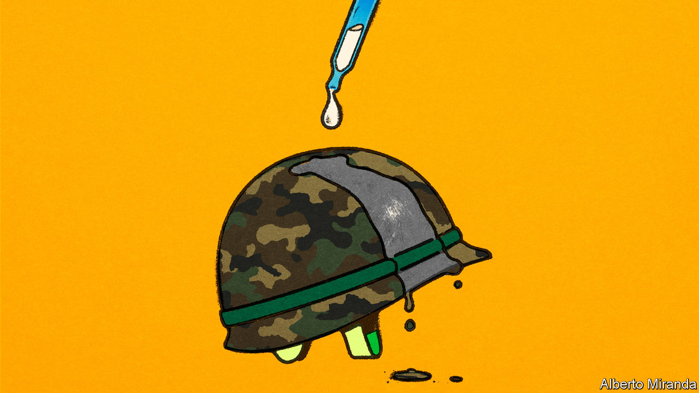

###### Trip out of hell

# A new therapy for Ukraine’s scarred soldiers: ketamine 

##### Psychedelics can help them to overcome trauma, and possibly to fight 

 

> Jan 15th 2024 

IHOR KHOLODILO should probably not have survived. The military psychologist and medic was evacuating comrades in early 2023 when his jeep was hit by a Russian tank shell. He was left barely able to communicate. Operations saved his heart and vision. But doctors were unable to correct his slur and stammer. He tried all kinds of radical therapies, but nothing helped. Then he met Vladislav Matrenitsky, a pioneer of psychedelic-assisted psychotherapy, who posed an unexpected question. Would he try ketamine?

Mr Kholodilo did not expect much, but the results were astonishing. After one session his stammer all but disappeared. Another five and he was almost back to normal. Gone were the nightmares and the fears about daily life. Ketamine therapy was not easy, he says, but it allowed him to resolve the trauma that caused his symptoms: “I returned to what you could call life…I felt light, just blessed.” 


Ketamine has been legal in Ukraine to treat mental illness since 2017. The therapeutic use of psychedelics has a long history, and was explored in America in the 1950s-60s. After the hippie movement it fell out of political favour, and for a while psychedelics were equated with narcotics like heroin. But in the past decade or so they have experienced a renaissance. 

Now the war is putting Ukraine at the forefront of the treatment. Dr Matrenitsky, who runs the country’s only clinic offering ketamine therapy, says he has handled nearly 300 patients suffering from depression, post-traumatic stress disorder (PTSD) or anxiety. A growing share are soldiers. 

A 40-minute session at Dr Matrenitsky’s clinic, on the top floor of a drab children’s hospital in north Kyiv, costs just 4,000 hryvnia ($105), although the clinic provides some soldiers with treatment free. A typical course runs between two and six sessions. The ketamine dose—0.5 mg per kilo of body weight—is administered by drip. A psychotherapist leads the patient through their trip. The aim, says Dr Matrenitsky, is to tap subconscious traumas: “What we are doing is turning the memories into a metaphorical journey.” He says about a third of his patients receiving ketamine enjoy “extremely good” results, and another third “reasonably good” ones. Bad reactions, usually panic attacks, are rare. That is the signal to stop the drip. 

The doctor says most soldiers on the front lines would benefit from his treatment. He blames stigma and a “Soviet” approach to military medicine for slowing access, and is lobbying to make it more common. Another goal is to expand the treatment to include banned substances like MDMA and psilocybin (the active molecule in magic mushrooms).

MPs and officials in the health ministry are largely sympathetic. Kseniya Vozsnityna, director of Forest Glade, a government military-rehabilitation centre, thinks a pilot project using MDMA and psilocybin could get the go-ahead within six months. In May her centre sponsored a conference on psychedelics in psychotherapy. But Ms Voznitsyna thinks psychedelics should be used sparingly, and never for active soldiers. “This is a therapy for difficult situations, medication-resistant PTSD, when the usual methods don’t work.”

Others disagree. Mr Kholodilo says Ukraine should be using psychedelics to improve battle performance. He sees two uses. The first he calls “decompression”, to prevent depression from developing in front-line fighters in the first place. The second would be a ritual to prepare soldiers for the possibility of death. “It’s foremost in the mind of any soldier heading to the front lines. It paralyses some of them.” A soldier who accepts the risk of death is a much more effective warrior, he says—and has a greater chance of surviving. 

The notion of using psychoactive drugs to help soldiers fight raises troubling moral issues. The army is still far from formally embracing ketamine therapy, let alone giving it to serving soldiers. But Ukraine’s armed forces are highly decentralised, and some units are apparently experimenting. Mr Kholodilo says he has already referred one elite special-forces unit for the treatment. “The soldiers were surprised at being able to return to the front lines so quickly,” he says. “They simply didn’t think it was possible.”■


