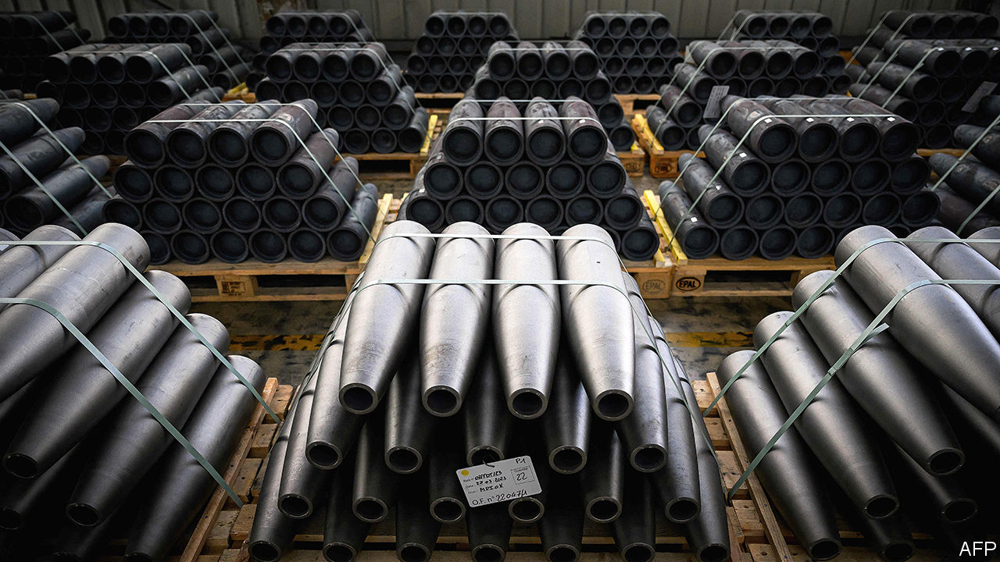
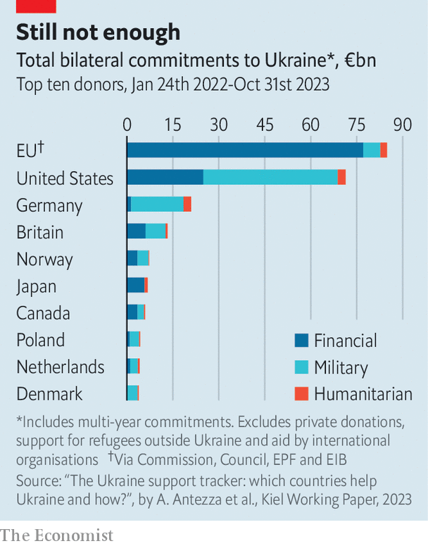

###### Shell-shocked

# Can Europe arm Ukraine—or even itself? 

##### More weapons production is a hedge against a Trump presidency 

 

> Jan 14th 2024 

WARS OF ATTRITION, which is what large-scale conflicts between militarily sophisticated adversaries such as Russia and Ukraine tend to become, are usually decided by which side has the better arms industry. Russia’s economy is nearly 14 times the size of Ukraine’s, but the combined resources of Ukraine’s allies are so much greater that it should be able to win. Yet as the conflict enters its third year, it is Russia’s defence industry that is slowly turning the war in its favour. 

Nothing shows the problem more starkly than . At the height of Ukraine’s summer counter-offensive, it was using some 7,000 a day, significantly more than the Russians. This has reversed: since last month, while Ukrainian forces have been rationed to 2,000 shells a day, the Russians have been firing five times that number. The West now faces a choice, said Jack Watling, an expert at RUSI, a think-tank in London, earlier this month. It can give Ukraine what it needs, “or cede an irrecoverable advantage to Russia”.


Both America and the European Union are having trouble delivering aid. In Washington, $61bn-worth of military assistance is held up in Congress. In Brussels, €50bn ($54bn) of financial support is stymied by the veto of Hungary’s pro-Russian leader, . Ukraine is worried that American hyper-partisanship and Donald Trump’s hostility will steadily throttle support from the Pentagon. That may leave the Ukrainians wholly dependent on Europe. 

 


So far, the Europeans have not done badly. The committed military aid of EU countries has surpassed America’s €44bn. Germany has given more than €17bn; the Nordic countries are digging deep, too. But the picture is patchy. France has contributed just €0.5bn, though its president announced on January 16th that more is on the way. Last March the EU said it would buy Ukraine 1m artillery shells over the course of a year, via the European Defence Agency. By last month it had supplied just 480,000, though the EU still insists the total will be met.

This month NATO’s Support and Procurement Agency said it would help EU members bulk-buy 1,000 Patriot air-defence missiles worth about €5bn. NATO cannot send lethal aid directly to Ukraine, but the order will free up members to transfer their own air-defence assets. The EU’s Act in Support of Ammunition Production (ASAP) programme, launched in October, will allocate €500m to ramping up shell-making. Yet it will take time to have any impact. On January 9th the EU’s internal market commissioner, Thierry Breton, proposed a €100bn fund to boost —not just to help Ukraine but to hedge against an American withdrawal from NATO if Mr Trump becomes president. But it is unclear whether anyone else supports the idea. 

None of these efforts meets the urgency of the situation. Russian military spending has increased by 68% this year, reaching 6.5% of its GDP. According to Estonia’s ministry of defence, Russian production of artillery munitions will rise to 4.5m units this year. Justin Bronk of RUSI reckons Russia is churning out 100 long-range missiles a month, more than double its capacity at the start of the invasion.

American and European shell production is also surging, but not fast enough. American production of 155mm shells is slated to reach 1.2m a year by 2025, a sixfold increase from last year. Sash Tusa, a defence analyst at Agency Partners, an equity-research firm, estimates European production will hit 1.25m. But unlike America, where munitions factories are government-owned, Europe depends on private firms, making increases less certain. 

Europe has four main munitions producers: Germany’s Rheinmetall, Britain’s BAE Systems, France’s government-owned Nexter, and Nammo, owned by the Norwegian and Finnish governments. After the cold war they concentrated on making fewer, more sophisticated systems. Tim Lawrenson of the International Institute for Strategic Studies, a think-tank, says they came to resemble artisans crafting small numbers of exquisite products. Before shifting to high-tempo production lines, they want governments to provide the certainty of multi-year contracts, says Jan Pie, who heads the ASD, the European defence trade organisation. 

“Our orders are already three times higher than they were in March 2022,” says Morten Brandtzaeg, the boss of Nammo. He says the increased production capacity is so huge that government must help industry share the risk. The most forward-leaning European producer has been Rheinmetall. It has committed to annual production of 700,000 artillery rounds by the end of 2024, and this year will open production and maintenance facilities in Ukraine for armoured vehicles. 

One way for Europe to move faster could be to relax technical specifications. Shells will rarely meet fine-tuned accuracy demands anyway when fired from Ukraine’s often worn-out artillery barrels (the country will probably need 2,000 new barrels per year). And safety regulations for long-term storage make little sense for shells that will be fired within days. In wars of attrition the need for quantity nearly always overrides quality. 

Churning out other kinds of munitions, particularly guided multi-launch rocket systems (GMLRS) and ground-based air defence (GBAD) interceptors, is even harder for Europe. Estonia’s defence ministry estimates Ukraine will need 8,760 GMLRS a year by 2025. Europe can make GMLRS and interceptors, but not at scale. The Estonians say annual production for some European air-defence systems is in single figures. Nico Lange, a former adviser to the German defence ministry, says that for Europe’s biggest missile-maker, MBDA, to set up new factories, governments must buy at least ten years’-worth of production. If investments were made now, he reckons the rockets might start arriving in 2026. 

Europe will struggle to keep Ukraine in the fight this year if American assistance dries up. In the longer term, with American support growing uncertain, the continent has no option but to rebuild its defence industry. “We have the technology, we must build the capacity,” says Mr Brandtzaeg. “We can’t not do this.” ■


