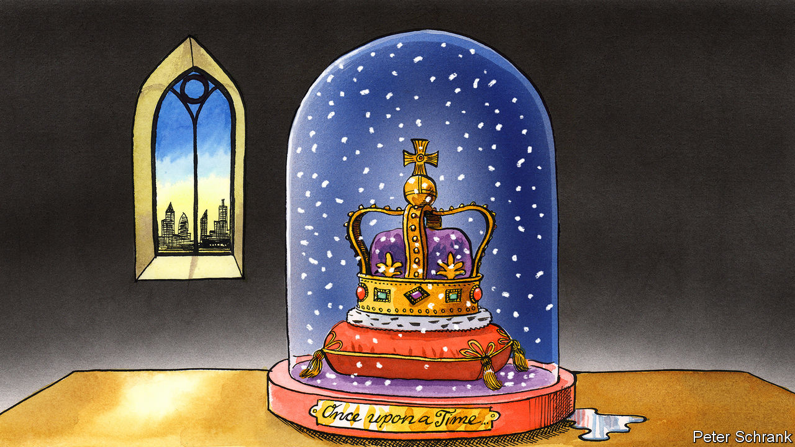

###### Charlemagne

# Europe’s monarchies are a study in dignified inanity 

##### Like the human appendix, their purpose today is unclear 

 

> Jan 18th 2024 

Francis II ascended the French throne after his father took a lance in the eye at a jousting tournament in 1559. A century earlier James III became King of Scotland after his father had found himself unwisely standing next to an exploding cannon. Other princes got promoted as the by-product of a brother’s poisoning or an uncle’s beheading—a pity, to be sure. The ascension of Frederik X to the throne in Denmark on January 14th was a staid affair by comparison. A fortnight earlier his mother, Margrethe II, startled her subjects by announcing that 52 years on the throne was quite enough. Unbeheaded, unpoisoned and seemingly unflappable, she convened government ministers to witness her signing the instrument of abdication, then invited Frederik to take her seat at the Council of State. After uttering “God Save the King,” the 83-year-old shuffled out of the room and off the royal scene. Outside, cheering crowds awaited a glimpse of their new monarch.

Every family has an heirloom which is too precious to throw away yet of little practical use. A dozen European countries have the constitutional equivalent. Kings, princes and one grand duke still rule over otherwise enlightened places mainly in northern Europe—think egalitarian Scandinavia, pragmatic Britain or no-frills Benelux. In an age of democracy none is elected; in an era striving for gender balance all now happen to be men; in these times of accountability many float somewhere above the law. They exude the mustiness of quill and parchment in an age of ChatGPT. Yet most monarchies have approval ratings their democratically elected counterparts might murder a parent for. Like the human appendix, Europe’s royal highnesses are essentially vestigial: they serve little obvious purpose, but few think there is much reason to excise them until they cause trouble.

Perhaps Charlemagne is being uncharitable to his fellow crowned heads. Sweden, Luxembourg and Spain (the only European monarchy south of the Alps, apart from tiny Monaco and Andorra) are hardly hothouses of tyranny. As emblems of the state, monarchs provide continuity: governments come and go, kings stick around for decades. Crowns, sceptres and royal uniforms with enough military medals to make a North Korean general blush add a little pomp to the polity. Such was the case for tolerating monarchs put forward by Walter Bagehot,’s greatest editor. In 1867 he posited that the state needs an “efficient” part, made up of ministers, but also a “dignified” one, to “excite and preserve the reverence of the population”. 

In Bagehot’s time monarchies were the political system  across Europe, as they had been since the Middle Ages. In the ensuing century, two world wars and the advent of communism got the better of most of the continent’s crowned heads (even if literal beheadings have become mercifully rare). Those that retained their thrones lost much of their power, and learned to adapt by becoming charity patrons, state banquet hosts and expert ribbon-cutters. Once separated from the commoners they ruled over, they came to join them, at least on occasion. “Bicycle monarchies” mostly replaced fusty aristo balls. The Dutch king has been a part-time pilot for KLM for over two decades. Princess Victoria, next in line to the Swedish throne, married her personal trainer.

Beyond providing employment for hatmakers and tabloid columnists, what is the point of monarchy today? Fans of the institution play up its role in attracting tourists, or opening doors to companies while on trade missions overseas. In times of crisis, a dignified royal can heal wounds, as King Harald V of Norway did by grieving publicly after 77 people were killed in a terrorist attack in 2011. In periods of instability they can provide a calming influence. Juan Carlos I of Spain is credited with cementing its return to democracy after 1975. The Belgian king is sometimes said to be one of the few things—alongside beer and the football team—keeping the place together. For many, monarchs symbolise a realm’s glorious history and serve as a way of co-opting a form of national superstition into healthy patriotism.

The case against monarchy is clearer. Elected figurehead presidents, as in Germany, are just as capable of public grieving as kings. What threats to democracy exist in Europe these days are not the sort that monarchs can do much about. There is something feudal about having unelected, often untaxed plutocrats at the heart of modern polities. And crowned heads enjoy more power, or at least influence, than is sometimes supposed. In most countries, including Britain, Norway and the Netherlands, the prime minister meets the monarch weekly to discuss affairs of state—an opportunity to sway policy in ways entirely opaque to the public. 

House of cads

The problem with royal families is not so much the royal as the family. Siblings with grand titles but no real job abound, and have a tendency to create trouble. The Belgian king’s brother once tried to partner with the regime of Libya’s Muammar Qaddafi, of all people, on a forestry project (it did not go well). The future Norwegian king’s sister claims she can talk to angels and relinquished her royal duties to run a quack medicine business with her fiancé, a self-proclaimed shaman from America. Juan Carlos, who stepped down in 2014, has in recent years been in self-imposed exile in Abu Dhabi, after facing investigations over Saudi bribes involving Swiss bank accounts and a disgruntled ex-mistress. And the less said about Britain’s Prince Andrew, the better. The dignified bit of the constitution is all too often the grubbier one.

Royals know they are on thin ice and act accordingly. Even if unelected, they serve at the pleasure of the people. Where is the fun in that? Being seen to flash their privilege is out: the Dutch king had to apologise after being caught jetting off to a Greek island getaway during covid-19. Frederik lost no time in pledging fealty to the Danish people as he ascended to the throne last week. Once upon a time, it would have been the other way around.■


